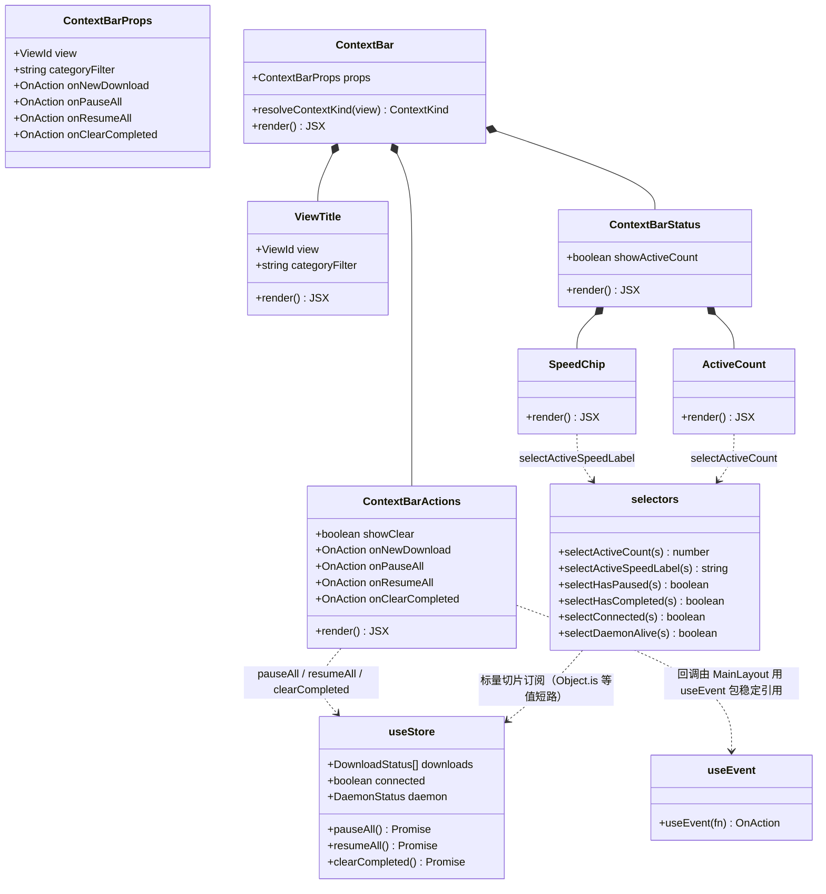
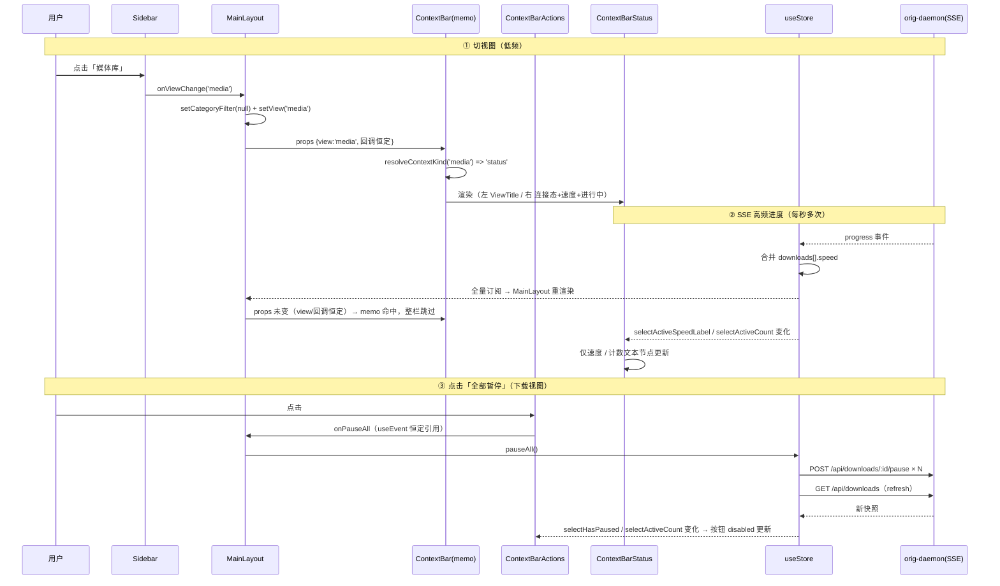
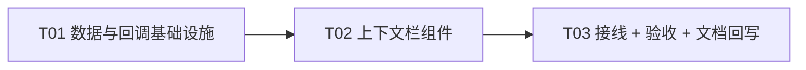

# BUG-083: 顶部下载工具栏仅在下载视图渲染，媒体库/TG 下整组消失（是否常显与占位）

- 状态: fixed
- 发现日期: 2026-09-20
- 模块: shell
- 严重程度: low
- 设计: 上下文栏方案（用户已拍板，2026-09-20；本文档含增量设计与任务分解）

## 现象

用户：「下载新建、暂停、继续按钮在顶部应该常时显示，那么在媒体库、TG 中是否需要显示？
这一栏是否需要占位？」

现状核对（`tauri-shell/src/components/MainLayout.tsx:124-213`）：

```ts
const isDownloadView = view === 'all' || view === 'downloading' || view === 'completed'
...
<header className="flex h-12 shrink-0 items-center justify-end gap-3 border-b ... px-4">
  {isDownloadView && busy && (<span ...>{formatSpeed(totalSpeed)}</span>)}
  {isDownloadView && (<div ...>新建 / 暂停全部 / 继续全部 / (已完成页)清空</div>)}
</header>
```

已确认的两个事实（回答"是否需要占位"）：

1. **`<header>` 本身是常驻的**——`h-12 shrink-0` 始终渲染，条件只包住**按钮组**。
   所以切换视图**不发生高度跳动**，额外"占位"在布局上没有必要。
2. 但在媒体库 / TG / 设置下，这一行是**完全空白**的（只剩边框和底色）；
   且 TG/媒体库各自在内容区内部另有一套头部/工具栏 → 出现"顶部一条空栏 + 内容区又一条"
   的双层观感。

## 根因

1. `isDownloadView` 把"下载语义的操作"与"这一行是否存在"**耦合成一个判断**：
   非下载视图时整组消失，行虽在却空着。
2. 媒体库/TG 的操作（导入、刷新、缓存管理）被放在各自面板内部，没有上行到这条常驻栏，
   于是该栏在非下载视图下**有高度无用途**。
3. 与 BUG-082 同源：`DOWNLOAD_MODULE_HIDDEN` 让下载视图本身也不可达，
   这栏在默认落地视图（媒体库）下**永远空白**。

## 复现

1. 启动应用（默认落地媒体库）→ 顶部操作栏整行空白；
2. 切到 TG → 同样空白，而 TG 面板内部另有一排自己的按钮；
3. 切到"全部文件"（需导航可达）→ 新建/暂停/继续出现。

## 设计裁定（用户拍板，2026-09-20）

**采用「改成上下文栏（推荐）」**：顶部那一行不再是固定的下载按钮组，而是随当前视图变化的
上下文栏。`h-12 shrink-0` 恒定渲染、高度固定，**不额外占位**（无跳动问题，加占位只是多个空 div）。

| 方案 | 做法 | 取舍 |
|---|---|---|
| **已选定** | 下载视图显示下载操作；媒体库 / TG / 设置显示「视图标题 + 右侧全局态」 | 改动小；内容区自带工具条仍在（双栏观感见待明确①） |
| 后续候选 | 把媒体库/TG 内容区工具条上行合并，内容区不再有第二条栏 | 观感最好，但两个大面板布局要跟着调 |

---

## 增量设计（架构师，2026-09-20）

### 1. 实现方案

**组件结构**：`MainLayout` 的 `<header>` 保持不动（`h-12 shrink-0` 定高常驻），把内联的
按钮组与 `isDownloadView` 判定整体抽出为一个 `ContextBar` 组件；`header` 只负责边框/底色/高度，
内容全交给 `ContextBar`。

```
<header className="flex h-12 shrink-0 items-center border-b border-border-subtle bg-surface/60 px-4">
  <ContextBar view categoryFilter onNewDownload onPauseAll onResumeAll onClearCompleted />
</header>
  └─ ContextBar（memo）
       ├─ 左槽：ViewTitle        —— 视图标题（所有视图都渲染）
       └─ 右槽（按 kind 二选一）
            ├─ kind='download' → ContextBarActions（SpeedChip + 新建/暂停全部/继续全部/[清空]）
            └─ kind='status'   → ContextBarStatus（连接态 + SpeedChip + ActiveCount）
```

**视图 → 内容映射规则**：

| view | kind | 左槽 | 右槽 |
|---|---|---|---|
| `all` / `downloading` / `completed` | `download` | 视图标题（`all` 且下钻时 `全部文件 · <分类>`） | 聚合速度 + 新建 / 暂停全部 / 继续全部（`completed` 追加「清空」） |
| `media` | `status` | 「媒体库」 | 连接态 + 聚合速度 + 进行中 N |
| `tg` | `status` | 「Telegram」 | 连接态 + 聚合速度 + 进行中 N |
| `settings` | `status` | 「设置」 | 连接态 + 聚合速度 + 进行中 N |

规则收敛成两个纯函数（`resolveContextKind(view)` / `TITLE_KEY[view]`），不在 JSX 里写散落的三元。

**边界情况**：

- `DOWNLOAD_MODULE_HIDDEN`（`Sidebar.tsx:30`）当前为 `true`，下载分支默认不可达 → 上下文栏
  实际恒为 `status` 形态。下载分支**必须保留**（该开关是可逆的，置 false 即恢复）。
- 全局播放器打开时（`MainLayout.tsx:134-145` 的 `absolute inset-0 z-40`）覆盖整个内容区
  （含上下文栏），本改动对其无影响，不处理。
- `busy`（`MainLayout.tsx:123`）仅被旧按钮组使用，抽出后可删；`active` / `paused` /
  `completed` / `totalSpeed` 仍被 footer 与 Sidebar counts 使用，**保留**。

### 2. 文件列表

| # | 文件（相对仓库根） | 改动 | 说明 |
|---|---|---|---|
| 1 | `tauri-shell/src/store/selectors.ts` | 新增 | 上下文栏的**标量/字符串选择器**（进行中数、速度文案、是否有暂停/已完成、连接态），集中派生以便叶子组件窄订阅 |
| 2 | `tauri-shell/src/hooks/useEvent.ts` | 新增 | `useEvent` 稳定回调钩子（引用恒定 + 取最新闭包）；仓库当前缺失（`hooks/` 下没有），AGENTS.md §5 与 BUG-026 要求 |
| 3 | `tauri-shell/src/i18n/locales/zh-CN.json` | 修改 | 新增 `ctx.*` 文案键（连接态、进行中、速度提示、栏 aria-label）；视图标题复用既有 `nav.*` |
| 4 | `tauri-shell/src/i18n/locales/en-US.json` | 修改 | 同上英文文案 |
| 5 | `tauri-shell/src/components/ContextBar.tsx` | 新增 | 上下文栏主组件（memo）+ `ViewTitle` 左槽 + `resolveContextKind` / `TITLE_KEY` 映射规则 |
| 6 | `tauri-shell/src/components/ContextBarActions.tsx` | 新增 | 下载视图右槽：聚合速度 + 新建/暂停全部/继续全部/清空，memo 化，回调全走 props |
| 7 | `tauri-shell/src/components/ContextBarStatus.tsx` | 新增 | 非下载视图右槽：连接态灯 + `SpeedChip` + `ActiveCount`；两个高频叶子各自订阅标量切片 |
| 8 | `tauri-shell/src/components/MainLayout.tsx` | 修改 | 删除 `isDownloadView` 与 header 内联按钮组（约 161-213 行），改为挂载 `ContextBar`；四个操作回调用 `useEvent` 包稳定引用 |
| 9 | `tauri-shell/verify/shot_context_bar.cjs` | 新增 | 验收截图脚本（四视图 top 栏 + 切视图高度对比），沿用 `verify/shot_*.cjs` 既有风格 |
| 10 | `docs/bugs/BUG-083.md` | 修改 | 本文档：回写验收证据、状态流转 |

### 3. 数据结构与接口

```ts
// src/components/ContextBar.tsx
import type { ViewId } from './Sidebar'          // 复用 Sidebar 的定义，不另建视图类型

/** 上下文栏形态：下载类视图给操作，其余给全局态 */
export type ContextKind = 'download' | 'status'

/** 稳定回调（由 useEvent 产出，引用恒定；禁止内联箭头 —— AGENTS.md §5） */
export type OnAction = () => void

export interface ContextBarProps {
  /** 当前视图（MainLayout 本地 state，低频） */
  view: ViewId
  /** 「全部文件」分类下钻值（null = 未下钻）；仅用于标题面包屑 */
  categoryFilter: string | null
  onNewDownload: OnAction
  onPauseAll: OnAction
  onResumeAll: OnAction
  onClearCompleted: OnAction
}

export interface ContextBarActionsProps {
  /** 仅 completed 视图显示「清空」 */
  showClear: boolean
  onNewDownload: OnAction
  onPauseAll: OnAction
  onResumeAll: OnAction
  onClearCompleted: OnAction
}

export interface ContextBarStatusProps {
  /** 是否渲染「进行中 N」（默认 true；语义见待明确②） */
  showActiveCount?: boolean
}

/** 视图 → 形态（唯一真源，禁止在 JSX 里散写三元） */
export function resolveContextKind(view: ViewId): ContextKind {
  return view === 'all' || view === 'downloading' || view === 'completed' ? 'download' : 'status'
}

/** 视图 → 标题 i18n key（复用 nav.*，不新增标题文案） */
export const TITLE_KEY: Record<ViewId, string> = {
  all: 'nav.all',
  downloading: 'nav.downloading',
  completed: 'nav.completed',
  media: 'nav.media',
  tg: 'nav.tg',
  settings: 'nav.settings',
}
```

```ts
// src/store/selectors.ts —— 全部返回标量或字符串，保证 zustand v5 的 Object.is 等值短路
import { useStore } from './useStore'
import { formatSpeed } from '../lib/utils'

/** 不修改 useStore.ts：DownloadState 未导出，用 getState 反推类型 */
export type RootState = ReturnType<typeof useStore.getState>

const isActive = (d: RootState['downloads'][number]) =>
  d.status === 'downloading' || d.status === 'queued'

export const selectActiveCount = (s: RootState): number =>
  s.downloads.reduce((n, d) => (isActive(d) ? n + 1 : n), 0)

/** 直接订阅「显示文案」而非数字：速度抖动但文案未变 → 不重渲染（等值短路） */
export const selectActiveSpeedLabel = (s: RootState): string =>
  formatSpeed(
    s.downloads.reduce((sum, d) => (isActive(d) ? sum + (d.speed || 0) : sum), 0),
  )

export const selectHasPaused = (s: RootState): boolean =>
  s.downloads.some((d) => d.status === 'paused')
export const selectHasCompleted = (s: RootState): boolean =>
  s.downloads.some((d) => d.status === 'completed')
export const selectConnected = (s: RootState): boolean => s.connected
export const selectDaemonAlive = (s: RootState): boolean => s.daemon?.alive === true
```

```ts
// src/hooks/useEvent.ts
import { useCallback, useLayoutEffect, useRef } from 'react'

/** 稳定回调：引用恒定、行为永远取最新闭包（无陈旧闭包）。memo 化组件禁止内联箭头。 */
export function useEvent<A extends unknown[], R>(fn: (...args: A) => R): (...args: A) => R {
  const ref = useRef(fn)
  useLayoutEffect(() => { ref.current = fn }, [fn])
  return useCallback((...args: A) => ref.current(...args), [])
}
```



### 4. 全局状态数据从哪来（已核对 `tauri-shell/src/store/useStore.ts`，无编造）

| UI 项 | 来源 | 字段 / 位置 | 更新路径 |
|---|---|---|---|
| 连接状态 | **store 字段** `connected: boolean` | `useStore.ts:99` | `subscribeEvents` 的 onOpen/onClose（`useStore.ts:223-224`）；断线时由 `MainLayout.tsx:40-44` 的 5s 兜底 `refresh()` 补（**仅在 `connected === false` 时**） |
| daemon 进程态（次级） | **store 字段** `daemon: DaemonStatus \| null`（`{alive, port, managed}`，`types.ts:105-109`） | `useStore.ts:96` | 启动时 `ensureDaemon() → daemonStatus() → setDaemon`（`MainLayout.tsx:35-38`）；**只在启动拉起时写一次，非实时**，不能当实时指示灯用 |
| 聚合速度 | **store 无此字段**，是派生量 | 现算于 `MainLayout.tsx:90,93`：`active.reduce((s,d) => s + (d.speed\|\|0), 0)` | SSE `progress` 事件合并进 `downloads[].speed`（`useStore.ts:216-217`） |
| 进行中数量 | **store 无此字段**，是派生量 | `MainLayout.tsx:90`：`active.length`（`status ∈ {downloading, queued}`） | 同上；终态由 `completed` / `error` / `deleted` 事件改写（`useStore.ts:187-214`） |
| 继续全部 disabled | 派生 `paused.length` | `MainLayout.tsx:91` | `paused` / `resumed` 事件（`useStore.ts:207-212`） |
| 清空 disabled | 派生 `completed.length` | `MainLayout.tsx:92` | `completed` 事件 + `deleted` 事件（`useStore.ts:187-196, 213-214`） |

**结论**：本次**不新增任何 store 字段**。三个派生量收敛进 `src/store/selectors.ts`，由
`ContextBarStatus` / `ContextBarActions` 的叶子订阅；`MainLayout` 仍保留自己的派生（footer 要用），
但不再把高频值当 props 往下传。

### 5. 流畅优先约束（AGENTS.md §5 / BUG-026 / BUG-030）——本设计如何满足

1. **高频只影响一小块**：`downloads` 由 SSE 高频合并。**禁止** `ContextBar` 订阅 `downloads`。
   速度 / 进行中数只在 `SpeedChip` / `ActiveCount` 两个叶子内用
   `useStore(selectActiveSpeedLabel)` / `useStore(selectActiveCount)` 订阅；
   选择器返回**字符串 / 数字**，zustand v5 走 `Object.is`，值不变即不渲染（等值短路）。
   → 一次 progress 最多重渲染一个文本节点，上下文栏与内容面板完全不动。
2. **memo 化**：`ContextBar` / `ViewTitle` / `ContextBarActions` / `ContextBarStatus` 全部
   `memo`。传入 props 只有低频标量（`view`、`categoryFilter`、`showClear`）与恒定回调。
3. **回调稳定**：四个操作回调在 `MainLayout` 用 `useEvent` 包装，**禁止内联箭头**
   （现网代码 `onClick={() => pauseAll()...}` 正是被禁写法，本次一并消除）。
4. **不新增轮询**：现有 5s 兜底（`MainLayout.tsx:40-44`，仅断线时生效）保持不变，仍 ≤5s 上限。
   **不新增任何读端点** → 不涉及「被轮询的读端点不许碰 DB」约束。
5. **已知债项（不在本次范围，工程师自决不回抛）**：`MainLayout.tsx:24` 用
   `const {...} = useStore()` 全量订阅，SSE 每 tick 都会重渲染 MainLayout 子树。本次只保证
   **上下文栏这一路径不被卷入**，MainLayout 的窄订阅化另案处理。

### 6. 程序调用流（关键路径）



### 7. 任务列表（有序，按依赖实现）

| ID | 任务名 | 源文件 | 依赖 | 优先级 |
|---|---|---|---|---|
| **T01** | 上下文栏数据与回调基础设施 | `src/store/selectors.ts`(新)、`src/hooks/useEvent.ts`(新)、`src/i18n/locales/zh-CN.json`(改)、`src/i18n/locales/en-US.json`(改) | — | P0 |
| **T02** | 上下文栏组件（主栏 + 两个右槽） | `src/components/ContextBar.tsx`(新)、`src/components/ContextBarActions.tsx`(新)、`src/components/ContextBarStatus.tsx`(新) | T01 | P0 |
| **T03** | 主布局接线 + 验收 + 文档回写 | `src/components/MainLayout.tsx`(改)、`tauri-shell/verify/shot_context_bar.cjs`(新)、`docs/bugs/BUG-083.md`(改) | T02 | P0 |

**T01 完成判据**：`selectors.ts` 五个选择器全部只返回标量/字符串（禁止返回对象或数组字面量，
zustand v5 会触发无限重渲染）；`useEvent` 返回的引用在多次渲染间恒等；两个 locale 的
`ctx.*` 键一一对应（`ctx.connected` / `ctx.disconnected` / `ctx.degraded` / `ctx.active` /
`ctx.activeHint` / `ctx.speedHint` / `ctx.barLabel`）。

**T02 完成判据**：三个组件全部 `memo`；`ContextBar` 内不含任何 `useStore` 调用；
`ContextBarStatus` 的 `SpeedChip` / `ActiveCount` 各自单独订阅；`ContextBarActions` 的
disabled 态来自 `selectHasPaused` / `selectHasCompleted` / `selectActiveCount`，不接收父级传值。

**T03 完成判据**：`MainLayout` 中 `isDownloadView` 与 header 内联按钮组已删除，
`ContextBar` 挂上且 header 仍为 `h-12 shrink-0`；四个回调经 `useEvent`；
`npm run build`（含 `tsc`）exit 0；冒烟 4 项通过（见下）。



> T01 的选择器签名与 T02 的 props 类型已在本节与 §3 固定，两者可并行开工（先落 T01 的
> 函数签名空壳即可），T03 必须最后做。

### 8. 共享知识（跨任务约定）

- **无新增依赖**：React 19.1 / zustand 5.0 已在 `tauri-shell/package.json`，`useEvent` 自研
  （React 19 未稳定提供 `useEffectEvent`）。
- **提交信息一律英文**（AGENTS.md §2），scope 用 `shell`；`fix` 类型必须引用 `BUG-083`
  （`scripts/check-commit-msgs.py` 会扫全文）。
- **定高铁律**：`<header>` 必须保持 `h-12 shrink-0`，任何改动不得引入高度变化（这是
  "不需要占位"结论的前提，破了就要重新评估占位）。
- **订阅铁律**：上下文栏路径只允许用 `src/store/selectors.ts` 的标量/字符串选择器订阅
  store；禁止 `useStore()` 全量订阅、禁止选择器返回新对象/新数组。
- **回调铁律**：上下文栏及其子组件的所有回调由 `useEvent` 产出，禁止内联箭头。
- **开关铁律**：`DOWNLOAD_MODULE_HIDDEN`（`Sidebar.tsx:30`）当前 `true`，下载分支不可达
  属于预期；**不得删除下载分支**。
- i18n 新增文案走 `ctx.*` 命名空间；视图标题复用 `nav.*`，不重复造标题文案。

### 9. 验收

1. `cd tauri-shell && npm run build`（含 `tsc`）exit 0。
2. 冒烟：媒体库 / TG / 设置三视图左槽标题正确、右槽有连接态；切视图**无高度跳动**
   （`verify/shot_context_bar.cjs` 对比四视图 header 上下沿 y 坐标一致）。
3. 下载分支：临时把 `DOWNLOAD_MODULE_HIDDEN` 置 `false`，确认三个下载视图按钮齐全、
   `暂停全部` / `继续全部` / `清空` 的 disabled 态正确，验完还原。
4. 流畅：SSE 高频下用 Profiler 确认 `ContextBar` / `ContextBarActions` 不随每次 progress
   重渲染，仅速度 / 计数叶子更新；沿用 BUG-026 的 `longtask` 量化方法（目标 0）。

### 10. 待明确事项

**① 媒体库 / TG 内容区自带工具条：本期保留还是上行合并（双栏观感）**

- **因果**：上下文栏落地后，媒体库 `MediaLibraryPanel.tsx:646` 的 `<header>` 与
  `TgPanel.tsx:1185/1254/1314` 的 `<header>` 仍在内容区顶部 → 顶部仍是「上下文栏 + 内容区
  工具条」两条栏。不决定 → BUG-083 只消掉"空白行"，"双栏观感"原样留下。
- **处置**：(A) 本期不动，双栏另开 BUG 跟进；(B) 上行合并——把媒体库「导入/刷新」、TG
  「刷新/缓存管理」搬进上下文栏并删除内容区 `<header>`；改动面 = 2 个大面板
  （`MediaLibraryPanel` 40K、`TgPanel` 80K）的布局，回归风险中，需重跑
  `verify/shot_media_*.cjs`。
- **请求**：选 A（本期只填空白行）还是 B（一次做到位，接受两个大面板的改动与回归）？
  **建议 A**。

**② 非下载视图的「进行中 N」取哪个来源（下载队列 vs TG 缓存任务）**

- **因果**：store 里只有 `downloads`（daemon 下载队列），**没有** TG 缓存任务字段——
  TgPanel 的 cache tasks 是面板内 state，走 `/api/tg/cache/tasks` 轮询（BUG-026）。
  于是在 TG 视图显示的「进行中 N」是**下载队列**计数；不改 → 用户在 TG 看到「进行中 3」
  而 TG 面板里一个缓存任务都没有。
- **处置**：(A) 统一显示下载队列计数，并在 title tooltip 标明「下载队列」（零后端改动）；
  (B) TG 视图改显 TG 缓存任务计数——需把 cache tasks 上提到 store，并交代轮询归属
  （否则与 TgPanel 双轮询，违反"同一数据只允许一个轮询源"）；(C) 非下载视图只显示
  连接态 + 聚合速度，不显示进行中数。
- **请求**：选 A（tooltip 标明来源，成本最低）还是 C（宁缺勿错）？**建议 A**；
  B 需单独设计轮询归属，列为后续。

**③ 连接指示灯取 `connected` 还是复合 `daemon.alive`**

- **因果**：`connected`（SSE 实时）与 `daemon: DaemonStatus | null`（`{alive, port, managed}`，
  仅启动时写一次、非实时）可以不一致：daemon 活着但 SSE 断时，5s 兜底轮询仍在跑而实时链路
  已断。只取其一 → 要么断线看不见，要么被误读成"daemon 挂了"。
- **处置**：(A) 单取 `connected`：绿=通、灰=断（含 daemon 真挂）；(B) 复合三态——
  `connected && daemon?.alive` 绿（实时）、`!connected && daemon?.alive` 黄（降级为 5s
  轮询）、`!daemon?.alive` 灰（daemon 不可达），tooltip 说明档位；改动只在
  `ContextBarStatus` 内，多订阅一个低频标量 `selectDaemonAlive`。
- **请求**：选 A（一个灯，语义简单）还是 B（三态可辨识降级）？**建议 B**——降级态在
  TG 拉流场景是有用信息，成本仅多一个标量订阅。

## 实施记录（工程师，2026-09-20）

按增量设计实现，文件清单与偏差：

| 文件 | 改动 |
|---|---|
| `tauri-shell/src/store/selectors.ts` | 新增。8 个标量/字符串选择器（进行中数、速度字节/文案/显隐、是否有暂停/已完成、`connected`、`daemon.alive`） |
| `tauri-shell/src/hooks/useEvent.ts` | 新增。`useEvent` 唯一实现 |
| `tauri-shell/src/components/ContextBar.tsx` | 新增。`ContextBar`(memo) + `ViewTitle`(memo) + `resolveContextKind` / `TITLE_KEY` |
| `tauri-shell/src/components/ContextBarActions.tsx` | 新增。下载视图右槽（memo），disabled 自订阅 |
| `tauri-shell/src/components/ContextBarStatus.tsx` | 新增。非下载视图右槽（memo）+ `SpeedChip` / `ActiveCount` / `resolveConnState` |
| `tauri-shell/src/components/MainLayout.tsx` | 修改。删除 `isDownloadView` / `busy` 与 header 内联按钮组，改挂 `ContextBar`；四个回调走 `useEvent` |
| `tauri-shell/src/components/TgPanel.tsx` | 修改。删除文件内私有 `useEvent`，改为导入 `hooks/useEvent`（**偏差**：设计未列此文件，理由是共用钩子不该有两份实现） |
| `tauri-shell/src/i18n/locales/{zh-CN,en-US}.json` | 修改。新增 8 个 `ctx.*` 键（标题面包屑 / 连接三态 / 进行中 + 来源提示 / 速度提示 / 栏 aria-label） |
| `tauri-shell/verify/shot_context_bar.cjs` | 新增。四视图标题 + 连接态 + header 几何一致性验收 |

待明确事项的落地取值：① 选 A（内容区工具条本期不动）；② 选 A（`ctx.activeHint` tooltip 标明「下载队列」口径）；
③ 选 B（连接灯三态：`bg-success` / `bg-warning` / `bg-muted`）。

验收：`cd tauri-shell && npx tsc --noEmit` → 无输出、exit 0（tsc 5.8.3）。冒烟脚本与 Profiler 量化未跑（需 dev server + 真实 daemon）。

## 关联

- `tauri-shell/src/components/MainLayout.tsx:24, 90-93, 123-125, 159-213`
- `tauri-shell/src/components/Sidebar.tsx:5`（`ViewId`）、`:30`（`DOWNLOAD_MODULE_HIDDEN`）
- `tauri-shell/src/store/useStore.ts:96-99`（`daemon` / `connected`）、`:180-225`（SSE 合并）
- `tauri-shell/src/i18n/locales/{zh-CN,en-US}.json`（`nav.*` / `main.*` 既有键）
- `tauri-shell/src/components/TitleBar.tsx`（窗口标题栏 min/max/close，**不是**本题所指操作栏）
- BUG-082（导航状态筛选，与本题同源）、AGENTS.md §5（流畅优先）、BUG-026 / BUG-030（轮询与 memo）

## 验收证据

- 代码落地：顶部按钮组抽为 `tauri-shell/src/components/ContextBar.tsx`（memo）；右槽按 `resolveContextKind(view)` 二选一 —— 下载视图走 `ContextBarActions.tsx`，非下载视图走 `ContextBarStatus.tsx`（连接三态灯 + `SpeedChip` + `ActiveCount`）；左槽 `ViewTitle`。映射收敛为纯函数 `resolveContextKind` / `TITLE_KEY`，JSX 内无散落三元。
- 类型检查（主理人独立复核复现）：`cd tauri-shell && npx tsc --noEmit` → 无输出、`TSC_EXIT=0`（typescript 5.8.3）。
- 流畅优先合规（AGENTS.md §5）：聚合速度与进行中数不走 props，由 `SpeedChip`、`ActiveCount` 叶子组件各自订阅 `tauri-shell/src/store/selectors.ts` 的标量选择器实现等值短路；`ContextBar` 及子件全部 `memo` 化；四个回调经 `tauri-shell/src/hooks/useEvent.ts`（引用恒定），JSX 内无内联箭头。
- 无需占位（本题原问）：`<header>` 保持 `flex h-12 shrink-0` 恒定渲染且定高，四种视图下几何一致、不跳动。
- 未覆盖范围（如实记录）：`tauri-shell/verify/shot_context_bar.cjs` 冒烟与 Profiler 量化未跑（需 dev server 与真实 daemon），列为后续验证项，不阻塞本次归档。
- 设计偏差与取舍：`TgPanel.tsx` 内原有私有 `useEvent` 实现，按「共用钩子不保留两份」原则抽到 `hooks/useEvent.ts` 并改为导入（超出原设计文件清单的一处改动）；待明确项取值：① A（内容区工具条本期不动）② A（`ctx.activeHint` 标明「下载队列」口径）③ B（连接灯三态）。
