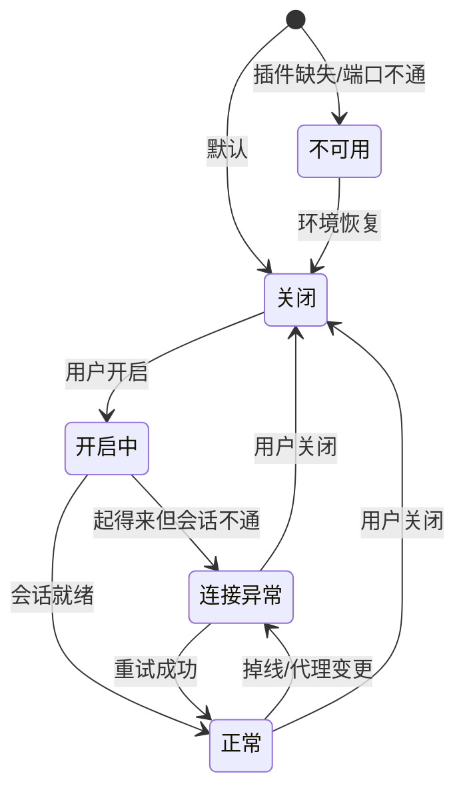

# BUG-095: TG 开关无状态建模（不可用/关闭/开启/连接异常）+ 代理恢复后无重试或重启插件机制

- 状态: open
- 发现日期: 2026-09-21
- 模块: engine+shell
- 严重程度: high

## 结论（主理人拍板，2026-09-21）

三方产出已收口，成员分歧与开放问题按下列裁定执行（括号内为被否定的另一方案）：

1. **状态模型 = 3 主态 + 1 个不可用锁**（用户口径优先）。UI 呈现三态：`关闭` / `开启·正常` / `开启·异常`，
   外加与三者正交的 `不可用` 锁定层。内部可用六态枚举做派生真源，但**界面上只有三态**。（否：六态直出 UI）
2. **不可用 → 开关整体置灰（`disabled`）**，文案「TG 不可用」，**不区分方向**；
   `异常` 态开关**可点**（保留关闭能力）。方向级 (`canTurnOn`/`canTurnOff`) 只作为 resolver 的内部表达，
   不在不可用态下开放"关闭"方向 —— 服务都没起来，改状态没有意义。
3. **Navi：关闭 → 不显示；不可用 → 隐藏；正常/异常 → 显示。**
   即用户原话「TG 关闭(Navi 不显示)」。不可用与关闭在 Navi 上同果（都不显示），
   区别体现在**设置页**：不可用必须给出原因 + 出口。
   与 BUG-094 不矛盾：094 定的是「服务活着但未授权 ⇒ 必须显示」，本条不可用是「服务都没有」。
4. **重试入口常驻**：设置页 TG 模块放「重试连接」；另设独立的「重启 TG 插件」按钮，**带二次确认**。
5. **代理保存成功 → 自动重启一次**（代理只在进程启动时读 env，不重启不可能生效）；
   **不做周期自检**（避免常驻外网探测与噪声，且 BUG-023 反对自造健康判断）。
6. **合成态由前端单一 resolver 负责，前端直读 orig-tg `/api/tg/session`**；
   daemon **不新增** `/api/tg/status` 聚合端点（否：daemon 合成）—— 少一处状态缓存就少一处第四真源。
7. **未登录并入「异常」态**，不单列。Navi 显示，面板内引导登录。
8. **`ensure_tg`（`lib.rs:506/538`）收敛为调 daemon restart**，`tg_save_config`(`lib.rs:470-497`) 复用 —— 
   两条重启路径必须归一，否则网页调试模式与桌面壳行为分叉。
9. **重启前排空**：`?drain=1` 等在途 ≤10s；必 kill 时先落盘快照，恢复失败标 `failed(reason="engine restarted")`，
   **禁静默悬挂**。

### 实施范围

- **P0**：引擎 `health` 字段并入 `/api/tg/session`（内存快照，禁 SQLite）；失败原因写环形日志；
  新增 daemon `POST /api/tg/restart`；前端 `store/tgState.ts` 单一 resolver；
  开关四档呈现（`disabled` + 文案）；Navi 判据改读 resolver；「重试连接」常驻入口。
- **P1**：代理保存后自动重启；orig-tg 内部退避重连（1→30s，±20%）；「重启 TG 插件」按钮 + 二次确认 + 排空。
- **P2**：周期探活（本次不做）。

## 现象

1. 设置 → 通用里的 TG 开关只有"关闭 / 启动中 / 运行中"三档文案（`SettingsPanel.tsx:836-847`），
   **完全不读 `tgAvailability`** —— 服务不可用时它照样显示可点，点了也没反应。
2. 「TG 不可用」与「TG 开启但连不上」在界面上是**同一种表现**，用户分辨不出"我改不了"和"我改了但没通"。
3. 先前因代理切换导致 TG 无连接，**代理恢复后没有任何重试或重启 TG 插件的入口**，只能重启整个应用。
4. 侧栏 TG 导航项在服务不可用时被**整个过滤掉**（`Sidebar.tsx:298`），失败原因与出口一起消失。

## 现状取证（file:line 锚点，实测）

### 前端

| 位置 | 事实 |
|---|---|
| `tauri-shell/src/components/SettingsPanel.tsx:828-855` | `<Switch checked={tgEnabled} onChange={setTgEnabled}/>`：**未传 `disabled`**、无 loading、**无 `data-testid`**；文案三档 `:836-847` 不读 `tgAvailability` |
| `tauri-shell/src/store/useStore.ts:85,135-155` | `tgEnabled` / `tgRunning` / `tgAvailability` 三字段 |
| `tauri-shell/src/types.ts:139-142` | `tgAvailability` 三态 `ok` / `unavailable` / `unreachable` |
| `tauri-shell/src/store/useStore.ts:416-453` | 唯一写者 `refreshTgSession`（读 `GET /api/tg/session`）；**无轮询**，仅开关翻转（`MainLayout.tsx:85-104`，开→最多 5×1.5s）与面板挂载时触发 |
| `tauri-shell/src/components/Sidebar.tsx:298` | `NAV_ITEMS.filter(item => item.id !== 'tg' \|\| tgReady)` → 不可用即**不渲染**，不是置灰 |
| `tauri-shell/src/components/MainLayout.tsx:40-41,224` | `tgReady = tgEnabled && (tgAvailability===null \|\| status!=='unreachable')` |
| `tauri-shell/src/lib/tgRetry.ts:48-67` | `retryTgConnection` → Tauri 命令 `ensureTg`；`isTauriShell()` 探测（`:37-41`）在浏览器模式返回 `'unsupported'`；仅出现在故障面板，**无常驻入口** |
| `tauri-shell/src/store/connState.ts` | BUG-087 抽的连接态唯一真源，只由 `connected(SSE)+daemon.alive` 得出，**不覆盖 TG** |
| `tauri-shell/src/lib/tgReason.ts` | BUG-094 抽的失败原因映射真源，UI 不得直出后端原文 |

### 引擎

| 位置 | 事实 |
|---|---|
| `download-engine/crates/orig-tg/src/state.rs:59-65,82-88` | `Availability` 只有 `Ready` / `Unavailable(String)` 两态 |
| `download-engine/crates/orig-tg/src/login.rs:22-31` | 登录 `phase` 四值 Anonymous/CodeRequired/PasswordRequired/Authorized |
| `download-engine/crates/orig-tg/src/main.rs:73` | 启动期 connect 失败只拼一次 `"MTProto connect failed: {e}"` → **永久 Unavailable，不重试、无退避** |
| `download-engine/crates/orig-tg/src/grammers.rs` | 全文**无** FloodWait / RPC 超时 / retry / backoff 处理（grep 0 命中） |
| `download-engine/crates/orig-tg/src/config.rs:102-106` | 代理只在进程启动时读 env `ORIG_TG_PROXY`，**改代理必须重启进程** |
| `download-engine/crates/orig-daemon/src/routes.rs:663-694` | 只有 `PUT /api/config/tg`（enable→start / disable→stop），**无 restart API** |
| `download-engine/crates/orig-daemon/src/state.rs:18-186` | `tg_port_has_listener`(`:30`) / `tg_is_running`(`:129`) / `tg_start`(`:178`) / `tg_stop`(`:186`) |
| `tauri-shell/src-tauri/src/lib.rs:506-540` | 壳侧 `ensure_tg_inner`：`alive but unavailable` 分支 kill_port_owner + respawn（当前唯一的"重连"语义） |
| `verify_shots/restart_tg.py:11-47` | 绕过托管的旁路脚本，默认注入 `ORIG_TG_OFFLINE=1`；BUG-094 已判定**不能当正式机制** |

## 根因

三层各自缺一块，叠加成"坏了既看不出来、也修不回来"：

1. **引擎层**：可用性与登录相位是两个字段，但**"已登录但链路异常"没有任何字段**——
   client 一旦建成 `availability` 恒 `Ready`，链路坏了无人改写；且失败后无重连器。
2. **数据层**：代理只在进程启动时注入 env，**运行期改代理不可能生效**，而恰又不存在「重启插件」API。
3. **呈现层**：开关不读可用性（`SettingsPanel.tsx:836-847` 是纯 `tgEnabled/tgRunning` 推导），
   Navi 用"过滤"代替"置灰"，失败即整体消失（BUG-093 同类坑）。

## 状态模型（产品侧 · 许清楚）

判定：用户口径的"3 个状态"是**开关主态**，"TG 不可用"是正交的**前置锁定层**，不是并列第四态。
两者在用户视角的区别——**不可用 = 我改不了**（能力/环境问题，重试也无意义）；**连接异常 = 我改了但没通**（运行期问题，必须给重试出口）。

| 状态 | 含义 | 开关 | Navi | 重试 |
|---|---|---|---|---|
| 不可用 | 插件/进程不可达 | **灰、不可点** | 置灰可见 | 无（改环境） |
| 关闭 | 用户显式关闭 | 可点 | **不显示** | — |
| 开启·正常 | 会话就绪 | 可点 | 显示 | — |
| 开启·异常 | 进程活着但会话不通 | 可点（保留关闭能力） | 置灰可见 | **常驻重试** |

**重试/重启的产品语义**：
- 手动重试常驻，反馈三段式：进行中（loading）→ 成功（转正常）→ 仍失败（保留异常态 + 原因，不反复弹窗）。
- 自动重试只做**轻量重连**（探活 + 重连会话），**不做静默进程重启**；触发点 = 代理保存成功 / 面板打开 / 回前台；必须前台提示，不得静默。
- **需要独立的「重启 TG 插件」按钮**：比重试重，会打断在途缓存任务，必须用户主动触发。
- 升级阈值：重试 2 次仍失败、或探活显示进程僵死 → 提示"建议重启"，**不自动重启**。

## 技术方案（架构侧 · 高见远）

### 1. 状态真源：正交存储 + 服务端下发派生枚举

> 「派生逻辑多处各写必错成不同值」（BUG-087）——只给正交字段等于把派生权下放给每个组件，故服务端必须额外下发派生 `state` 作 UI 唯一真源。

- `phase`（已有）、`availability`（**二态不动**，改它破坏 BUG-023 的 503 契约）；
- **新增 `health`**：`Connected | Degraded(reason) | Offline(reason)`，运行期轻量探测写入，**内存快照不碰 SQLite**。这正填补"已登录但链路异常"的空缺。
- 下发点：扩展 `GET /api/tg/session`（`routes.rs:159`）与 `/api/tg/diag`（`routes.rs:191`），增 `health / health_reason / last_ok_at` + 派生 `state`。
- daemon **不聚合** TG 状态，只管进程启停——避免第四处真源。

| state | 含义 | 计算方 |
|---|---|---|
| `stopped` | 开关关闭 | 前端由 `tgEnabled` 派生 |
| `unreachable` | 连不到 orig-tg 进程 | 前端 fetch 失败（唯一合成点） |
| `unavailable` | 进程在但无 MTProto 能力 | orig-tg |
| `signin_required` | 可用但未登录 | orig-tg |
| `degraded` | 已登录、链路异常 | orig-tg（health） |
| `ready` | 已登录且健康 | orig-tg |

### 2. 改造点

**必须改**：
- orig-tg：`state.rs:59-65` 增 `Health` + `AppState.health`；`main.rs:73` 启动失败改为登记原因交重连器（不再永久 Unavailable）；`main.rs:195-199` monitor 门控放宽为"ready 或重连中"；`routes.rs:159/191` 出字段；**新增 `reconnect.rs` + `POST /api/tg/reconnect`**；`grammers.rs:126` 起给 RPC 错误分类喂 health。
- orig-daemon：`state.rs:186` 旁新增 `tg_restart_on`（stop → 等端口释放 → start，复用 BUG-091 `tg_port_has_listener` + 进程内互斥锁）；新增 `POST /api/tg/restart`；`resolve_tg_env`（`state.rs:267-292`）重启时重读——**这是代理热生效的唯一途径**。
- 前端 store：`types.ts:139-142` `TgAvailability`→`TgStatus`（含 `state`）；`useStore.ts:416-453` 保持唯一写者；**新增 `store/tgState.ts` 单一 resolver**。
- 前端 UI：`SettingsPanel.tsx:828-855` 加 `disabled` + 四档文案 + 重试；`Sidebar.tsx:298`、`MainLayout.tsx:40-41,224` 改读 resolver 的 `navVisible`；`lib/tgRetry.ts:48-67` 改走 daemon HTTP。

**可不动**：`Availability` 本体、`unavailable.rs` 503 契约、`connState.ts`、`ensure_tg_inner` 语义、`resolve_tg_env` 取值优先级。

### 3. 重试与重启

- **手动**：新增 daemon `POST /api/tg/restart` 为首选，`ensure_tg` 降级为 fallback。理由：① 网页调试模式无 Tauri invoke，`ensure_tg` 必 reject（BUG-090）；② daemon 已握托管句柄 + 端口探测（BUG-091），重启语义天然归它；③ BUG-094 正在改壳侧所有权，新链路压壳上会冲突。
- **两级恢复**：先进程内 `POST /api/tg/reconnect`（不丢会话、不打断在途任务），8s 未回 `ready` 再升级 restart（或用户点独立"重启插件"）。
- **自动重连放 orig-tg 内部**，不做外部看门狗（外部只能杀进程）：2s 起、×2 指数、上限 60s、抖动 ±20%；只改 health，不销毁 client；**不新增轮询**。
- **在途任务**：reconnect 无冲突；restart 须 quiesce（等 running 落定 ≤5s，超时强杀）+ UI 明示会中断缓存任务，并 `mark_stale_cache_tasks` 避免任务永久悬挂 `running`。
- **不与 BUG-091 打架**：重启序列固定 stop → 轮询 `tg_port_has_listener==false`（≤3s）→ start，加互斥锁。
- **代理恢复 = 事件触发，不做周期自检**（周期自检 = 常驻外网探测 + 噪声，且 BUG-023 反对自造健康判断）：设置保存代理成功后前端即刻调一次 restart，因果明确、一次代价。
- 唯一读端点仍是 orig-tg `/api/tg/session`。

### 4. 前端消费

新增 `store/tgState.ts`：`resolveTgSwitch({tgEnabled, tgStatus, connState}) → {disabled, labelKey, dotTone, navVisible, showRetry}`。
与 `connState.ts` 是**分层不是合并**：connState 管传输层（daemon+SSE），tgState 管能力层，且单向依赖（daemon offline ⇒ TG 必 unreachable），不产生第三个真源。

判据表：关闭→可点/"已关闭"/Navi 隐藏；`unreachable`→**置灰**/"TG 不可用"/无 Navi；`unavailable`、`degraded`→可点/"连接异常"/重试/Navi **仍显示**；`signin_required`→"待登录"/Navi 显示；`ready`→"运行中"。**只有 unreachable 置灰**——其余再置灰就成了"坏了修不回来"。

### 5. 任务分解

| 任务 | 内容 | 依赖 | 优先级 |
|---|---|---|---|
| T01 | 引擎状态模型：`state.rs`/`routes.rs`/`main.rs` + 新增 `reconnect.rs` 与 `/api/tg/reconnect` | — | P0 |
| T02 | daemon 重启：`tg_restart_on` + 互斥 + `POST /api/tg/restart` | T01 字段约定（可并行编码） | P0 |
| T03 | 前端真源：`types.ts` + `refreshTgSession` + 新增 `store/tgState.ts` + `tgRetry.ts` 改走 daemon | T02 接口 | P0 |
| T04 | UI 呈现：SettingsPanel / Sidebar / MainLayout 改接 resolver | T03 | P1 |
| T05 | 代理保存后自动重启 + i18n + `npm run verify:ui` 真实渲染证据与反向证伪 | T02/T04 | P1 |

### 6. 架构二版补充意见与两版分歧（待拍板）

第二版架构评审（arch-gao2）在骨架上一致（新增 `health`、daemon restart API、单一 resolver、内部退避），
但给出 5 处**不同决策**，其中第 1、2 条会改变实现路径：

| # | 分歧点 | 一版（arch-gao） | 二版（arch-gao2） |
|---|---|---|---|
| 1 | 合成态由谁下发 | 前端直读 orig-tg `/api/tg/session`（daemon 不聚合，避免第四真源） | daemon 新增 `GET /api/tg/status` 合成（可达性 + session 快照，内存快照禁 SQLite） |
| 2 | 未登录是否独立成态 | 独立 `signin_required` | **并入 `degraded`**（Navi 可见、可进入登录），避免第五态 |
| 3 | `health` 取值 | `Connected \| Degraded \| Offline` | `connecting \| connected \| degraded`，`connecting` 并入 degraded |
| 4 | 退避参数 | 2s 起 ×2、上限 60s、±20% | 1s→2s→4s…上限 30s、±20%；daemon 仅进程死亡才 respawn（2/4/8s） |
| 5 | `ensure_tg` 归属 | 降级为 fallback，壳侧可不动 | **必改**：`lib.rs:506/538` 收敛为调 daemon restart，`tg_save_config`(`lib.rs:470-497`) 复用 |

二版另有两处值得直接采纳的细化：

- **方向级禁用**（精确落地用户"按钮灰色"）：resolver 返回 `canTurnOn` / `canTurnOff`——
  `unavailable` → `canTurnOn=false, canTurnOff=true`（灰的是"打开"方向，不是整个开关）；
  `disabled` → `canTurnOn=true, canTurnOff=false`；`degraded`/`ready` → 双向可点。
- **重启排空**：`POST /api/tg/restart?drain=1` 等在途 ≤10s；必 kill 时先落盘快照，
  恢复失败标 `failed(reason="engine restarted")`，**禁静默悬挂**（呼应 QA 硬约束 3）。

## 验收可测性（QA 侧 · 严过关）

硬约束（违反则验收为假绿）：

1. **新状态标识不得复用 `unavailable` 旧字符串**——现有 `tgAvailability.status='unavailable'` 的语义是「进程活着但连不上 TG」，恰恰是本方案的"连接异常"态；与架构枚举里的 `unavailable`（进程在但无 MTProto 能力）**同名反义**，沿用会让首条判据即假。
2. **`degraded` 是硬阻塞**：引擎无该字段 ⇒ 前端无源可测。必须先落引擎字段并并入 `/api/tg/session` 的**内存快照**（不得为读它查 SQLite）。
3. **重启会丢内存态**：kill+respawn 后 `cache_tasks` / `cache_worker_alive` 尽失，在跑的缓存任务可能永久悬挂 `running`；验收必须覆盖"重启后任务状态"，禁止静默。
4. **判据要断 `data-state` / `aria-disabled` 与真实端口态**，不能断译后中文，也不能只断"三处一致"（一致性会掩盖齐刷刷的错值）。
5. **开关必须先补 `data-testid`**（现状无）。

反向证伪（至少 3 条）：把状态换成另一态必须 FAIL；换错误地址必须 FAIL（死端口 exit 2 / 白屏 exit 1）；`degraded` 下断言 `ready` 的判据必须 FAIL。
造态手段：`ORIG_TG_PROXY` 指向黑洞 socks5（`127.0.0.1:1`）造启动期失败；运行期断网造 degraded；`ORIG_TG_OFFLINE=1` 造离线短路（注意 `main.rs:119` 的 debug 短路会吞掉新状态，验收脚本必须带 `ORIG_TG_ONLINE=1`）。

## 待拍板（已按「结论」章节裁定，保留决策记录）

### 分歧一：不可用时 Navi 隐藏还是置灰可见

- **PM 倾向置灰可见**：隐藏会让用户失去"这里出过事"的线索（BUG-093 已踩过），置灰 + tooltip 给出可行动路径。代价：需额外设计灰项 tooltip 与点击反馈。
- **架构倾向隐藏**：只有 `unreachable` 置灰隐藏，`unavailable`/`degraded` 一律显示；理由是"其余再置灰就成了坏了修不回来"。
- 用户原话只明确"TG 关闭 → Navi 不显示"，**未定义不可用时** ⇒ 需裁定。

### 分歧二：状态枚举用"3 态 + 不可用锁"还是六态

- PM：开关 3 态 × 1 个 disabled 修饰（贴合用户"3 个状态"口径）。
- 架构：六态枚举 `stopped/unreachable/unavailable/signin_required/degraded/ready`（服务端派生下发，避免前端各处各写）。
- 二者可共存（六态是内部真源，3 态是对外呈现），但**需明确命名映射**，否则出现第三处分叉。

### 其余项

3. **自动重连能否无提示重启进程？** PM：不能（会打断在途缓存任务）。代价：用户多点一次确认。
4. **代理改动是自动重启还是提示手动？** 架构：自动"轻量重连"，失败后才提示手动重启。代价：需区分"重连"与"重启"两条路径。
5. **"连接异常"是否区分"未登录"与"已登录断连"？** PM：必须区分（引擎已有 `phase` 四值）。代价：前端需合并 phase 与 availability，推导更复杂。
6. **重启前是否 quiesce + 二次确认，还是接受中断并提示？** 架构待拍板。
7. **TG 进程所有权是否最终归一到 daemon？**（BUG-094 在改壳侧所有权，`spawn_tg` 可能被下线）重启路径需两种所有权下都成立。
8. **"不可用"由谁周期探活并解除？** PM 倾向 daemon 周期探活；架构倾向事件触发、不做周期自检（避免常驻外网探测与噪声）。二者需择一。

## 关联

- BUG-023（连接失败静默退化 dummy，503 契约不可破）
- BUG-063（代理自检误报；本条环境正是"代理活着但上游 TLS EOF"，**只探 TCP 端口会误判**）
- BUG-074（离线短路 + 离线态渲染）、BUG-090（浏览器模式恒 offline）
- BUG-087（连接态三处不一致 → 抽唯一真源，本条不得制造第四处）
- BUG-091（`tg_start` 端口探测，重启序列须与其兼容）
- BUG-093（Navi TG 项消失）、BUG-094（数据目录/凭据，**in_progress，本条不得与之冲突**）
