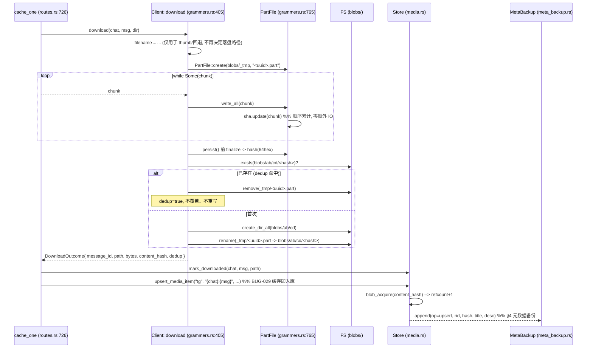
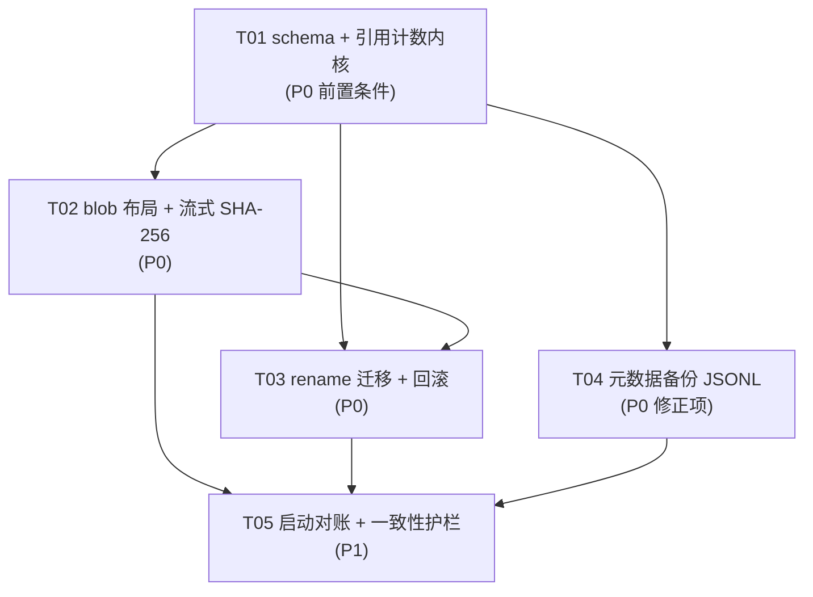

# Blob 存储改造设计（内容寻址 / 引用计数 / 迁移 / 元数据备份）

> 状态：**已拍板，设计定稿，未实现**。本文件不改动任何代码。
> 上游：`docs/design/telegram-cache-storage-redesign.md`（缓存状态与外链建模，本文档不涉及那部分）。
> 约束来源：`AGENTS.md` §5（轮询不碰 DB、单飞 BUG-027、schema 迁移单测 BUG-032、缓存即入库 + 单向删除联动 BUG-029）。

---

## 0. 结论前置

| # | 结论 | 一句话理由 |
|---|---|---|
| C1 | 落盘改内容寻址，`<download_dir>/blobs/ab/cd/<64hex>` | 现有文件名不含 chat/msg，跨频道转发同名字段互相覆盖（§1.1） |
| C2 | 流式 SHA-256，在 `PartFile::write_all` 里累计 | `PartFile` 是单 writer 顺序落盘，无 seek，天然顺序累计，零额外 IO |
| C3 | **不使用 `access_hash`** 作内容标识 | 它是权限令牌不是内容指纹（`grammers.rs:51-53`），且仅 TG 来源才有，本地/导入条目拿不到 |
| C4 | **引用计数是 hash 落地的前置条件，不是优化项** | hash 把「意外撞名」升级为「合法共享」，`purge_item` 无条件 unlink 会制造系统性死链（§2.1） |
| C5 | DB 仍是位置与来源的单一真源，磁盘不存第二份索引 | `media_item.file_path` 继续唯一；`media_blob.refcount` 是可重算的派生值 |
| C6 | **元数据必须备份** —— 字节与位置都可再生，元数据不可再生 | 原论证「目录扫描即可重建索引」只覆盖了位置层，答偏了（§4.1） |
| C7 | 备份形态是**单一追加式 JSONL**，不是 sidecar | sidecar 的键是 blob（位置层），元数据的键是来源（`source:ref`），基数不同（§4.3） |

---

## 1. 内容寻址存储（hash 布局）

### 1.1 现状与根因（精确到分支）

`grammers.rs:419-431` 生成落盘文件名：

```rust
Media::Photo(_)    => format!("photo-{}_{}.jpg", chat_id, message_id),  // 含 chat/msg → 不撞
Media::Document(d) => {
    let name = d.name()...;
    if !name.is_empty() { sanitize_filename(&name) }                    // ← 撞名根因
    else { format!("doc-{}_{}.{}", chat_id, message_id, ext) }          // 含 chat/msg → 不撞
}
```

**撞名只发生在「文档有原始文件名」这一个分支上**。`sanitize_filename`（`grammers.rs:740-755`）只做非法字符替换，不含任何 chat/msg 成分。同一份文件被两个频道转发 → 同名 → 后者 overwrite 前者（`PartFile::persist` 的 `rename` 在 Windows 上覆盖已存在目标，`grammers.rs:790`）。

结果有两种：

1. **内容相同** → 覆盖无害，但 `media_item.file_path` 变成两条指向同一文件（今天的「意外撞名」）。
2. **内容不同**（同名不同片，TG 上极常见）→ 前一条的字节**已经物理丢失**，而它的 `file_path` 还指着幸存者，播放出来是别人的内容。这是最难查的一类不一致。

副问题：所有文件平铺在 `download_dir`（含分类子目录）下，无扇出 → 单目录文件数随缓存量线性增长。

### 1.2 为什么是流式 SHA-256，且不用 `access_hash`

**流式**：`PartFile`（`grammers.rs:765-812`）的写路径只有一处 `write_all`（`grammers.rs:777-783`），由 `download()` 的 `while let Some(chunk)` 顺序驱动（`grammers.rs:458-464`），全程无 `seek`、无回退、无并发写。把 `Sha256` 挂进 `PartFile` 结构体，在 `write_all` 里 `update(buf)`、`persist()` 前 `finalize()`，即可拿到内容指纹 —— **不打断落盘、不增加一次读**。

**不用 `access_hash`**：`grammers.rs:51-53` 的注释已说明它是 `FileLocation` 的一部分、用于取文件的权限令牌。它有三个致命问题：

- 是**权限**凭证不是内容指纹，服务端可轮换；
- 只有 TG 来源的媒体才有，本地导入 / 网盘来源的条目根本没有；
- 同一内容在不同频道、不同消息里 `access_hash` 可能不同 → 起不到去重作用。

**用内容哈希**：与来源无关，本地导入条目同样可算；且它是**位置层的唯一输入**（`hash → 路径`），字节层和位置层因此完全解耦。

依赖：`sha2 = "0.10"` 已在 workspace `Cargo.toml:26`，但 **orig-tg 未声明**，需在 `download-engine/crates/orig-tg/Cargo.toml` 加 `sha2.workspace = true`；`uuid`（`Cargo.toml:33`，workspace 已开 v4）与 `serde_json`（`Cargo.toml:30`）已就位。仓库内无 `hex` crate，hex 编码统一用 `format!("{:x}", digest)`。

### 1.3 路径布局

```
<download_dir>/blobs/ab/cd/<64hex>          -- 正式 blob，无扩展名
<download_dir>/blobs/_tmp/<uuid>.part       -- 落盘中，唯一临时区
```

- **两段分片**：`<hash[0..2]>/<hash[2..4]>/<hash>`。256 × 256 = 65536 个末级目录，100 万文件平均 15 个/目录。
  - 单段（256 目录）：100 万 → 3906 个/目录，NTFS 目录索引仍偏大；
  - 三段（16 M 目录）：目录项本身的元数据开销超过收益。
  两段是「目录扇出」与「目录总数」的均衡点，也是 git / Docker registry 等成熟实现的同款选择。
- **无扩展名**：hash 已是完整内容标识，扩展名属于「显示层」信息（`media_item.kind` + mime），进路径只会带来「同一 blob 两种扩展名」的分裂。投递端 MIME 按 `kind`/mime 判定（`AGENTS.md` §5 投递契约要求按扩展名/MIME 判定，改造后以 `media_item.kind` 为准）。
- **`_tmp` 必须是唯一临时区**，且与 `blobs/` 同卷（rename 跨卷会退化成复制，失去原子性）。

**与现有扫描逻辑的衔接（易漏）**：`is_in_progress`（`cache.rs:292-297`）靠扩展名 `.part`/`.tmp` 排除下载中文件，`scan_cache_files`（`cache.rs:314-342`）依赖它。改造后临时文件搬进 `blobs/_tmp/`，必须：

1. `is_in_progress` 增加「父目录名 == `_tmp`」判定（保留扩展名判定做双保险，因为历史残留的 `.part` 可能还在旧位置）；
2. `scan_cache_files` 在递归时显式跳过 `blobs/_tmp` 整个子树 —— 否则孤儿扫描会把正在下载的文件判成孤儿（当前 ORPHAN_SCAN_LIMIT 截断时更会误判）。

### 1.4 落盘流程改造

`download()`（`grammers.rs:405-472`）改造后：



关键点：

- **`DownloadOutcome`**（定义于 `login.rs`）新增 `content_hash: Option<String>` 与 `dedup: bool` 两字段。`grammers.rs:466-471` 的构造点同步改。
- **dedup 命中时不覆盖**：已存在说明内容字节完全一致（hash 保证），覆盖是纯浪费；同时避免两个并发任务写同一路径。
- **rename 而非 copy**：`_tmp` 与 `blobs/` 同在 `download_dir` 下 → 同卷 → rename 原子且几乎零成本。
- **`dir` 参数语义不变**：`download()` 仍收 `dir`，由它派生 `blobs/`，`resolve_cache_dir`（`routes.rs:697-707`）不用改。

### 1.5 与投递契约的关系

`AGENTS.md` §5 的 `serve_local_file` 契约（无 Range → 200 完整文件、`bytes=S-` → 206 + 32MiB 有界块、恒带 `ETag`/`Last-Modified`）**不受影响**：blob 无扩展名只影响 MIME 判定来源，不影响字节投递。MIME 改为从 `media_item.kind` + `media_message.mime` 取，禁止 `image/jpeg` 兜底。

---

## 2. 引用计数（**前置条件**）

### 2.1 为什么必须先于 hash 落地

现状的共享是**意外**：`media_item` 有 `UNIQUE(source, ref)`（`media.rs:236`），一个来源一条；两条共享 `file_path` 只可能来自文件名撞车，是 bug 态。

hash 之后的共享是**设计意图**：同内容必然落到同一路径，N 条 `media_item` 合法地指向同一个 blob。

此时 `purge_item`（`cache.rs:213-230`）的无条件 `remove_file` + `set_item_file_path(None)` 会变成：清掉 A → B 的 `file_path` 指向已删文件 → B 变死链。

对比危害：

| | 现状 | hash 后无 refcount |
|---|---|---|
| 共享成因 | 意外撞名，偶发 | 设计意图，**系统性** |
| 死链规模 | 个位数，且文件名可人眼对应 | 同内容全部条目同时失效 |
| 可查性 | 文件名还在，能猜 | `<hash>` 无语义，无法人眼定位 |

所以：**refcount 不是「让 hash 更完善」的优化，而是「hash 能不能上线」的准入门槛**。没有它，hash 上线等于把偶发 bug 放大成系统性数据损坏。

### 2.2 表设计与单一真源边界

```sql
-- 新表：整表缺失于旧库，CREATE TABLE IF NOT EXISTS 对旧库安全（BUG-032 允许）
CREATE TABLE IF NOT EXISTS media_blob (
    hash         TEXT PRIMARY KEY,          -- 64 hex
    size         INTEGER NOT NULL,
    refcount     INTEGER NOT NULL DEFAULT 0,
    created_at   INTEGER NOT NULL,
    last_seen_at INTEGER NOT NULL
);
CREATE INDEX IF NOT EXISTS idx_media_blob_refcount ON media_blob(refcount);

-- media_item 新增列：必须走 pragma 探查 + ALTER（见下）
ALTER TABLE media_item ADD COLUMN content_hash TEXT;
CREATE INDEX IF NOT EXISTS idx_media_item_hash ON media_item(content_hash);
```

**BUG-032 铁律提醒**：`content_hash` **不能**写进 `media_item` 的 `CREATE TABLE IF NOT EXISTS`（`media.rs:223-237`）。旧库里该表已存在 → CREATE 被跳过 → 新列永远补不上。必须复用 `media.rs:344-351` 的 `pragma_table_info` 探查 + `ALTER TABLE` 模式。

**单一真源边界**（避免第二份漂移状态）：

| 数据 | 真源 | 是否派生 |
|---|---|---|
| 位置（`file_path`） | `media_item.file_path` | 否，唯一写处是 `set_item_file_path`（`media.rs:935-948`） |
| 引用计数 | `SELECT COUNT(*) FROM media_item WHERE content_hash = ?` | **`media_blob.refcount` 是它的缓存** |
| blob 存在性 | 文件系统 | 否 |

`refcount` 是**可重算的派生值**：任意时刻可由权威算法 `recount()` 校正（`UPDATE media_blob SET refcount = (SELECT COUNT(*) FROM media_item WHERE content_hash = media_blob.hash)`）。启动时对账、迁移收尾、恢复后各跑一次，跑完不一致以权威算法为准，**不报错、不告警**。

这一条直接决定了 refcount **不进元数据备份**（§4）：它是位置层的派生量，DB 重建后一次 `recount()` 就回来了。

### 2.3 计数变更点（漏一个就漂移）

| # | 事件 | 代码位置 | 动作 |
|---|---|---|---|
| 1 | 缓存成功入库 | `upsert_media_item`（`media.rs:888-927`）返回后，由 `import_cached_file`（`routes.rs:776-846`）触发 | `blob_acquire(hash)`：`media_blob` 无行则 insert(refcount=1)；有行则 +1。item 的 `content_hash` 由 NULL → hash 也算一次 acquire |
| 2 | 清缓存（字节回收） | **`set_item_file_path`（`media.rs:935-948`）内部** | `blob_release(old_hash)`：-1；归零则 unlink 字节 + 删 `media_blob` 行 |
| 3 | 重新缓存（NULL → blob） | 同 #1 | acquire |
| 4 | 删媒体库条目 | `routes.rs:1948-1982` `delete_media_item` + store `media.rs:1054` | release 一次（条目没了就少一个引用）；归零则清字节 |
| 5 | 迁移 | §3 | 不逐条 acquire，全批结束后一次 `recount()` |

**为什么 release 挂在 `set_item_file_path` 而不是 `purge_item`（最容易搞错的点之一）**：
`media.rs:929-931` 的注释已经写明 `set_item_file_path` 是「显式写入 `file_path` 的**唯一入口**」。挂在它内部，所有「把 file_path 置空」的路径自动被覆盖；挂在 `purge_item`（`cache.rs:213`）里则只覆盖缓存清理面板那一条路，而 `delete_media_item`（`routes.rs:1962-1965`）是**另一条**直接 `std::fs::remove_file` 的路径 —— 漏掉它 refcount 就只增不减，blob 永不回收 = 静默磁盘泄漏。

具体做法：`set_item_file_path` 改为 `set_item_file_path_with_blob(id, Option<&str>, Option<&str> new_hash)`，内部一个事务里完成「release 旧 hash → acquire 新 hash → 写 `file_path` + `content_hash`」。

### 2.4 `purge_item` 与 `delete_media_item` 改造后语义

```rust
// cache.rs:213 purge_item 改造后
if !inside_dir(dir, &it.file_path) { return skipped; }  // 外部文件：永不删，也不 release
let bytes = metadata(...).map(|m| m.len()).unwrap_or(0);
let orphan = st.store.release_blob(it.content_hash.as_deref()).await;  // -1，返回是否归零
if orphan { let _ = std::fs::remove_file(&it.file_path); }             // 归零才真删字节
let _ = st.store.set_item_file_path_with_blob(it.id, None, None).await;
reset_tg_flag(st, &it.source, &it.ref_key).await;
```

- **位置层无条件置空**（`file_path = NULL`），**字节层按 refcount 决定**。两者分离，语义清晰。
- `delete_media_item`（`routes.rs:1962-1965`）的裸 `remove_file` 替换为 `release_blob` + 归零才删，并删 `media_item` 行前多一次 release（条目本身消失）。

### 2.5 与 BUG-029 单向删除联动的关系

| BUG-029 条款 | 本设计的落点 |
|---|---|
| 缓存成功必须 `upsert_media_item(source="tg", ref="{chat}:{msg}")` | 不变，`import_cached_file`（`routes.rs:828-837`）保持 |
| 清缓存**只回收字节**，条目退回「仅入库」态 | refcount 归零才 unlink；`file_path` 置空、`downloaded` 复位照旧 |
| **禁止**为「清了缓存」回头删 `media_item` | 不变，`purge_item` 仍然不删行 |
| 删 TG 来源条目**必须**连带清字节 | release 后归零即清；不归零（别人还在用）就不清，这是 refcount 存在的意义 |

---

## 3. 迁移方案（rename + `migration_log` + 可回滚）

### 3.1 判定撞名受害者

```sql
SELECT file_path, COUNT(*) c FROM media_item
WHERE file_path IS NOT NULL GROUP BY file_path HAVING c > 1;
```

**归一口径（易错）**：`cache.rs:299-311` 的 `norm_path` 会先 `canonicalize`、失败才退回原串。迁移时文件可能存在也可能已被手删，**同一个文件在不同行的归一口径会突变** → 分组结果不稳定。

迁移专用归一：`统一分隔符（\ → /）` + `Windows 下小写` + `相对路径补全为 download_dir 下的绝对路径`，**不 canonicalize、不依赖文件存在**。

### 3.2 撞名组怎么处理（这是「受害者」的真正含义）

对同一个 `file_path` 分组，迁移时**逐个算 hash**，按结果分岔：

| 情况 | 判定 | 处理 |
|---|---|---|
| 组内所有条目的字节 hash **相同** | 不是受害者，是正常共享 | 全部指向同一 blob，`refcount = N`。记 `action='rename'` |
| 组内 hash **不同** | 真撞名，先前的字节已被覆盖，**物理丢失** | 幸存字节归给 hash 匹配的那一条（`rename`）；其余 N-1 条记 `action='collision_lost'`，`file_path` 置空、`downloaded` 复位，**保留元数据** |

第二条是本方案唯一的「诚实损失」。不要为了让数字好看把 `collision_lost` 的条目也指到幸存 blob 上 —— 那等于让用户以为 A 频道的片子还在，点开放的是 B 频道的内容。这比「条目在、字节待重缓存」糟糕得多：后者是可恢复的降级，前者是静默的内容错配。

`collision_lost` 的条目保留标题/介绍/来源，用户点一下「缓存」即可补回字节（`upsert_media_item` 的 `COALESCE` 语义，`media.rs:905-913`）。

### 3.3 `migration_log`

```sql
CREATE TABLE IF NOT EXISTS migration_log (
    id       INTEGER PRIMARY KEY AUTOINCREMENT,
    batch    TEXT    NOT NULL,   -- 批次 uuid
    item_id  INTEGER,            -- 可空（纯字节迁移）
    old_path TEXT,
    new_path TEXT,
    hash     TEXT,
    action   TEXT    NOT NULL,   -- rename | skip | collision_lost | orphan_unlink
    status   TEXT    NOT NULL,   -- done | rolled_back | failed
    err      TEXT,
    at       INTEGER NOT NULL
);
CREATE INDEX IF NOT EXISTS idx_migration_log_batch ON migration_log(batch);
CREATE INDEX IF NOT EXISTS idx_migration_log_item  ON migration_log(item_id);
```

### 3.4 迁移步骤

1. **前置检查**：`media_blob` 表与 `content_hash` 列已就位（T01 完成）、`blob_layout_version` 不等于 `1`。
2. **单飞窗口**（`AGENTS.md` §5 / BUG-027）：
   - 把所有 `status IN ('queued','running')` 的 `cache_task` 置 `cancelled`；
   - 迁移期间 `POST /api/cache/tasks` 返回 `409`（`store.rs:335-337` 的部分唯一索引只覆盖活跃态，**拦不住新任务**，必须显式挡）；
   - 理由：迁移在 rename 旧文件，同时有 worker 写新布局 → 中间态两套布局并存，且 `PartFile::persist` 可能与 rename 抢同一路径。
3. **分批执行**（每批 500 条，断点续跑）：
   - 读一批 `media_item WHERE file_path IS NOT NULL AND content_hash IS NULL AND id > last_id`；
   - 算 hash（顺序读，64 KiB 缓冲）；
   - `create_dir_all(blobs/ab/cd)` → `rename(old, new)`（同卷，原子）；
   - `UPDATE media_item SET file_path = new, content_hash = hash`；
   - 写一行 `migration_log`。
4. **收尾**：一次 `recount()` 重建 `media_blob`（**不逐条 acquire** —— 逐条会产生 N 次写放大，且中途失败会留下半截计数）。
5. **落闸**：`INSERT OR REPLACE INTO app_setting VALUES ('blob_layout_version','1')`。
6. **`download_dir` 内残留的非 blob 文件**（用户手动放进去的、旧缩略图等）：**不动**，由孤儿扫描（T05）如实报告，不自动删。

**成本坦白**：这一步是 O(总字节数) 的整盘读，是内容寻址的入场费，无法绕过。可优化空间只在「分批 + 可续跑 + 顺序读」，不接受「惰性算 hash」—— 惰性会让 `content_hash` 出现 NULL 的特例分支，而 `content_hash` 是 refcount 的键，NULL 分支就是「第二份会漂移的状态」。

### 3.5 回滚

按 `batch` 倒序扫描 `migration_log`：

- `action='rename'` 且 `status='done'` → `rename(new_path, old_path)`，回写 `media_item.file_path`，`status='rolled_back'`；
- `action='collision_lost'` → **字节无法回滚**（内容在撞名时就已被覆盖），只把 `status` 改 `rolled_back` 并如实计数上报；
- 最后 `DELETE FROM media_blob` 并把 `blob_layout_version` 置回 `0`。

回滚完成后 UI 必须显示「N 条已回滚，M 条因历史撞名无法恢复字节（元数据保留）」。

---

## 4. 元数据备份（**修正项**）

> 本节推翻原方案「hash 布局下目录扫描即可重建索引，所以不需要额外本地备份」的结论。

### 4.1 三层可再生性 —— 原论证答偏在哪

| 层 | 内容 | 可再生性 | 备份策略 |
|---|---|---|---|
| 字节 | blob 本身（`blobs/ab/cd/<hash>` 的内容） | **可再生**：从 Telegram 重拉 | 不备份 |
| 位置 | `blobs/ab/cd/<hash>` 这个路径 | **可算出**：由内容哈希直接得出 | 不备份 |
| **元数据** | 标题 / 介绍（caption）/ 来源频道列表 / 作者 / 日期 / 本地标注（标签、剧集归属） | **不可再生** | **必须备份** |

**原论证只覆盖了位置层**。目录扫描能重建的东西恰好只有「hash → 路径」这一层映射 —— 而这一层本来就能从内容算出来，是最不需要备份的一层。它给不出任何一条标题、任何一段介绍、任何一个来源频道。

**更锋利的一点**：「字节可再生」这个结论本身就依赖元数据不丢。

- 重拉字节的前提是知道 `{chat}:{msg}`。这个引用**本身就是元数据**（来源频道列表）。
- 元数据丢了 → 不知道去哪重拉 → **字节也变得不可再生**。
- 所以元数据不是「与字节并列的一层」，而是**元元数据**：字节层的可再生性由它授予。

用户的原话点破的正是这一层：*"一个视频有标题，介绍，还有来自哪几个频道等等。这些数据是找不回来的。"*

### 4.2 字段分级（`media_item` 现有字段逐个）

`media_item` 基线 schema 见 `media.rs:223-237`，`description` 由 `media.rs:349` 补列；运行时结构 `MediaItem` 见 `media.rs:553-573`。

| 字段 | 层 | 可再生？ | 备份 | 说明 |
|---|---|---|---|---|
| `id` | 锚点 | — | **是**（记为 `rid` 之外的 `iid`） | 作为 `media_item_tag` / `media_episode` 的外键锚点，恢复时必须保持相对关系 |
| `source` | 元数据 | **否** | **是** | 决定「这条从哪来」 |
| `ref` (`{chat}:{msg}`) | 元数据（来源定位） | **否** | **是** | **退订后即不可再生**（§4.2.1） |
| `title` | 元数据 | 部分 | **是** | 由 caption 首行切出（`routes.rs:802-807` 的 `split_caption`）；用户手改过就永久不可再生 |
| `description` | 元数据（介绍） | 部分 | **是** | 同上；早期入库行由 `upsert` 的 COALESCE 回填（`media.rs:913`） |
| `kind` | 位置/派生 | 是 | 否 | 可从扩展名 / mime 重算（`routes.rs:809-821`） |
| `file_path` | 位置 | **是** | 否 | 由 `content_hash` 算出 |
| `content_hash`（新增） | 位置 | **是** | 否 | 读 blob 重算；也是 refcount 的键 |
| `poster` | 字节（派生） | 是 | 否 | 前端抽帧产物，可重抽 |
| `size` / `duration` / `width` / `height` | 元数据-技术 | 是（需 ref 存活） | 顺带写 | 便宜，写进去省一次重缓存；丢失可重新缓存回填 |
| `added_at` | 元数据（本地标注） | **否** | **是** | 本地入库时间，TG 侧没有这个概念 |
| `media_item_tag` 关联 | 元数据（本地标注） | **否** | **是** | 纯本地，TG 侧不存在 |
| `media_episode`（`series_id`/`season`/`episode_no`） | 元数据（本地整理） | **否** | **是** | 纯本地整理结果 |
| `media_blob.refcount` | 位置（派生） | **是** | **否** | `recount()` 可重算（§2.2） |

#### 4.2.1 用户点名的两条「不可再生」

1. **来源频道列表**：`source + ref` 就是它。`chat_id` 还在 ≠ 可再生：
   - 无法枚举「这一份内容曾出现在哪些频道」—— 那需要遍历你订阅过的全部频道的全部消息；
   - **退订的频道不在 dialog 列表里**，连遍历的入口都没有；
   - 即使还在订阅，也无法反查「哪些频道的哪条消息指向这个 hash」。
   → `ref` 必须在备份里。

2. **已被删除的源消息快照**：消息被作者删除后 `get_messages_by_id` 返回空（`grammers.rs:410-417` 的 `MediaNotFound` 分支），caption 永久丢失。而 caption 正是 `title` + `description` 的唯一来源（`routes.rs:802-807`）。
   → caption 切分后的 `title`/`description` 必须在备份里，**不能指望重拉**。

### 4.3 备份形态：为什么不是 sidecar

用户给的两条：

1. **同盘同毁**：sidecar 与 blob 同在 `download_dir`，盘挂了一起没。它只防「DB 没了」，不防「盘没了」，抗损坏能力被高估。
2. **百万级 open+parse 不可接受**：孤儿扫描 / 启动对账要遍历 → 100 万次 `File::open` + `serde_json::from_reader`，Windows 上每次 open 带目录项查找与 4K 随机读，分钟级且抖动大。

补两条更根本的：

3. **键的基数不匹配（这是死穴）**：sidecar 只能挂在 blob 上（每 blob 一个），但**一条 blob 对应 N 个来源频道**（refcount 存在的理由）。一个 `<hash>.json` 里放谁的 caption？放第一个 → 其余 N-1 条的来源永久丢失；放数组 → 就是「每 blob 一份 media_item 子集」，与 DB 重复且必然漂移。
   sidecar 的键属于**位置层**，元数据的键属于**来源层**，两者基数不同 —— 这是设计层面的错配，不是实现细节。
4. **原子性**：一次入库要写 blob + sidecar 两个文件，无事务。DB 写成功、sidecar 写失败 → 立刻产生第二份会漂移的状态（正是用户明令禁止的）。

#### 选定形态：单一追加式 JSONL

```
<download_dir>/meta/ingest-meta.jsonl              -- 当前追加文件
<download_dir>/meta/ingest-meta-YYYYMMDD.jsonl      -- compaction 轮转出的归档
```

| 维度 | sidecar | JSONL |
|---|---|---|
| IO 模式 | 100 万次随机 open | 顺序 append + 顺序 scan |
| 崩溃安全 | 需每文件原子写 | append + fsync；最后一行写半截 → 扫描时按长度校验丢弃尾部残缺行 |
| 共享 blob 的 N:1 来源 | 无处安放 | 天然支持（键是来源，不是 blob） |
| 增量判断 | 无法知道「哪些没备份过」 | 只需记录末尾 offset |
| 恢复 | 遍历目录树 | 顺序读一遍，按 rid 取最后一条 |
| 人工可修 | 需工具 | 一行一条，`grep` 级别可读可修 |
| 与 rename 迁移共存 | 迁移要搬 N+1 个文件 | `meta/` 不在 `blobs/` 下，迁移完全不碰它 |
| 原子 compaction | 无 | 写新文件 → fsync → rename 覆盖 |

### 4.4 格式与键的选择

```jsonc
// 每行一条，永不改写历史行；合并语义 = 按 rid 取最后一条
{"v":1,"ts":1730000000,"op":"upsert","rid":"tg:-1001234567890:42","iid":17,
 "source":"tg","ref":"-1001234567890:42",
 "hash":"ab12...","title":"某某 第03集","desc":"……",
 "kind":"video","size":104857600,"added_at":1730000000,
 "tags":["日更","4K"],"series":{"iid":7,"title":"某某","s":1,"e":3}}

{"v":1,"ts":1730000100,"op":"delete","rid":"tg:-1001234567890:42"}
```

**键的选择是最关键的一条：用 `rid = "{source}:{ref}"`，不用 blob hash。**

- 元数据层的自然主键本来就是来源 —— `media_item` 已经有 `UNIQUE(source, ref)`（`media.rs:236`），DB 和备份共用同一个键，不存在对齐问题。
- `hash` 作为**字段**记录，只作恢复时的对齐锚：DB 重建后按 `hash` 把条目与磁盘上存在的 blob 对上；blob 不在 → 条目 `file_path = NULL`，元数据仍完整。这正是「字节可再生、元数据不可再生」边界的字面体现。
- 若反过来用 `hash` 做键，就重蹈 sidecar 的覆辙（§4.3 第 3 条）。

`op=delete` 是 **tombstone，不做物理删除**：追加一行比改写历史行简单得多，且保留「曾经有过」的痕迹。

### 4.5 导出时机

| 事件 | 触发点 | 形态 |
|---|---|---|
| 入库成功 | `upsert_media_item`（`media.rs:888`）返回后 | 追加 1 行 `op=upsert` |
| 缓存字节落地 | `import_cached_file`（`routes.rs:776`）拿到 `content_hash` 后 | 追加 1 行（补 `hash` 字段） |
| 用户编辑（标题 / 介绍 / 标签 / 剧集归属） | 各 PATCH 端点成功后 | 追加 1 行 |
| 删条目 | `delete_media_item`（`routes.rs:1948`）成功后 | 追加 1 行 `op=delete` |
| 定期 compaction | 启动时 + 每 24h | **全量**：把「按 rid 取最后一条」的结果写成新文件，旧文件轮转为 `-YYYYMMDD.jsonl` |
| 启动对账后 | 对账发现 drift（如 `content_hash` 与实际 blob 不符） | 追加修正行 |

**增量 vs 全量**：日常走增量（append 单行，O(1)）；compaction 走全量（增量日志会无限增长，且恢复时要跑完整 merge）。compaction 是「写新文件 → fsync → rename 覆盖」，不就地改写。

**性能约束（`AGENTS.md` §5）**：

- JSONL 不在被轮询的读路径上，恢复只在显式触发时读它 → 不违反「被轮询的读端点不许碰 DB」。
- append 必须**移出 HTTP 请求关键路径**：在 `tokio::spawn` 的后台任务里做，不在请求里 `fsync`（Windows 下 fsync 可能几十 ms，直接吃掉轮询预算）。落盘策略：每 N 行或每 5s 异步 flush 一次，进程退出时强制 flush。

### 4.6 恢复路径（写给未来的维护者）

```
1. 备份/移除损坏的 store.db（先挪走，不要直接删）
2. 打开空库 —— schema 由 migrate()（media.rs:216）建好，含 media_blob / migration_log
3. 顺序读 meta/*.jsonl（文件名升序 → 保证旧→新）
4. 按 rid 归并，取最后一条；op=delete 的丢弃
5. INSERT INTO media_item (source, ref, title, description, kind, size, added_at, content_hash, file_path)
     file_path = 若 blobs/ab/cd/<hash> 存在 → 该路径；否则 NULL
6. 用备份里的 iid 锚点重建 media_item_tag / media_episode 关联（保持相对关系，不保证 id 逐字相同）
7. recount() 重建 media_blob.refcount（从 media_item.content_hash 算出）
```

**恢复后仍会缺失的（明确边界，不要当成 bug 修）**：

| 缺什么 | 为什么 | 能否补回 |
|---|---|---|
| 字节本身（blob 不在的） | 未备份（设计如此，字节层可再生） | **能**：条目在、`file_path=NULL`，点「缓存」即回 |
| `poster` | 前端抽帧产物，属字节层派生 | **能**：打开条目重新抽帧 |
| `duration` / `width` / `height` | 未强制备份（可再生但需 ref 存活） | **能**：重新缓存一次即回填（`upsert` 的 COALESCE，`media.rs:911-913`） |
| `media_message` 流水表 | 只备份了 `media_item` 层 | 部分：重新同步频道可重建；**已被作者删除的消息永久缺** |
| **已删源消息的 caption** | 备份里有 | **不缺** ← 这正是备份的价值 |
| **退订频道的来源** | 备份里有 | **不缺** ← 同上 |

**一句话边界**：备份保证的是「用户看得见的那些字」（标题 / 介绍 / 来源 / 本地标注），不保证「那些字节」。
字节缺失的表现是「条目在、播不了、点一下缓存就好」—— 可恢复的降级；
元数据缺失的表现是「条目没了，连去哪重拉都不知道」—— 资产灭失。

### 4.7 与 hash 布局 / 引用计数共存，不引入第二份漂移状态

| 防线 | 做法 |
|---|---|
| 不是运行期读路径 | 恢复只在**显式触发**（设置页 / CLI）时读 JSONL；被轮询端点永不碰它 |
| 允许滞后 | DB 是主，JSONL 是只追加的副产品。DB 没丢就不需要它；两者冲突**以 DB 为准** |
| 不存派生量 | refcount、file_path、blob 路径都不进 JSONL（全部可重算）。JSONL 只装「算不出来的东西」 |
| 单一写者 | append 由后台单一任务串行执行，无并发写同一文件 |
| 键与 DB 一致 | `rid = source:ref`，与 `UNIQUE(source, ref)` 同一个键，不需要任何对齐逻辑 |
| 与迁移解耦 | `meta/` 与 `blobs/` 是两个子树，rename 迁移完全不碰 `meta/`；迁移产生的 `content_hash` 变化由下一行 upsert 自然覆盖（后写覆盖前写） |

---

## 5. 任务分解

### 5.1 依赖关系



### 5.2 任务清单

---

#### T01 — schema 与引用计数内核 【**前置条件**】 P0

> **为什么必须先做**：没有它，hash 一上线就会把「偶发撞名」放大成「系统性死链」（§2.1）。本任务可在**当前平铺布局**下独立验收（refcount 对现有路径同样成立），不需要等 hash。

| 项 | 内容 |
|---|---|
| 依赖 | 无 |
| 文件 | `download-engine/crates/orig-tg/src/media.rs`<br/>`download-engine/crates/orig-tg/src/store.rs`<br/>`download-engine/crates/orig-tg/src/cache.rs`<br/>`download-engine/crates/orig-tg/src/routes.rs` |
| 改动 | 1. `media_blob` 表 + `media_item.content_hash` 列（**pragma 探查 + ALTER**，不得写进 CREATE，BUG-032）<br/>2. `blob_acquire` / `release_blob`（归零返回 true）/ `recount()`<br/>3. `set_item_file_path` → `set_item_file_path_with_blob(id, path, hash)`，事务内 release 旧 + acquire 新<br/>4. `purge_item`（`cache.rs:213`）改为「release → 归零才 unlink → 置空 file_path」<br/>5. `delete_media_item`（`routes.rs:1962-1965`）的裸 `remove_file` 改为 release + 归零才删<br/>6. 修 `inside_dir`（`cache.rs:71-85`）canonicalize 失败静默返回 false 的隐患：改为返回 `Result` 或显式区分「不在目录内」与「判定失败」 |
| 测试 | 扩充 `media::tests::legacy_db_migrates_without_failing_open`（`media.rs:2885`）：旧 schema + 旧数据 → `open` 成功 + 数据仍在 + 新表新列已补（**BUG-032 硬性要求**）<br/>refcount：共享/归零/重入/清缓存后另一条仍可读 |

---

#### T02 — blob 布局 + 流式 SHA-256 落盘 — P0

| 项 | 内容 |
|---|---|
| 依赖 | T01 |
| 文件 | `download-engine/crates/orig-tg/Cargo.toml`<br/>`download-engine/crates/orig-tg/src/blob.rs`（**新增**）<br/>`download-engine/crates/orig-tg/src/lib.rs`<br/>`download-engine/crates/orig-tg/src/grammers.rs`<br/>`download-engine/crates/orig-tg/src/login.rs`<br/>`download-engine/crates/orig-tg/src/cache.rs` |
| 改动 | 1. `Cargo.toml` 加 `sha2.workspace = true`（workspace 已有 `sha2 = "0.10"`）<br/>2. `blob.rs`：`BLOB_ROOT`/`TMP_DIR` 常量、`blob_path(hash) -> blobs/ab/cd/<hash>`、`tmp_path() -> blobs/_tmp/<uuid>.part`<br/>3. `lib.rs` 挂 `pub mod blob;`<br/>4. `grammers.rs`：`PartFile` 加 `Sha256` 字段，`write_all` 内 `update`，`persist` 前 `finalize`；`download()`（`:405-472`）改落 `_tmp` → hash → dedup 命中则删 tmp，否则 rename 到 `blobs/ab/cd/<hash>`<br/>5. `login.rs`：`DownloadOutcome` 加 `content_hash: Option<String>`、`dedup: bool`<br/>6. `cache.rs`：`is_in_progress`（`:292`）增「父目录 == `_tmp`」判定；`scan_cache_files`（`:314`）显式跳过 `blobs/_tmp` 子树 |
| 测试 | `blob_path` 两段分片断言；`PartFile` 已有测试（`grammers.rs:1043` / `:1060`）扩 hash 断言；dedup 命中不覆盖、tmp 被清理；投递契约回归（`download-engine/verify/verify_http.py`） |

---

#### T03 — rename 迁移 + `migration_log` + 回滚 — P0

| 项 | 内容 |
|---|---|
| 依赖 | T01、T02 |
| 文件 | `download-engine/crates/orig-tg/src/media.rs`<br/>`download-engine/crates/orig-tg/src/cache.rs`<br/>`download-engine/crates/orig-tg/src/routes.rs`<br/>`download-engine/crates/orig-tg/src/store.rs` |
| 改动 | 1. `migration_log` 表 + `Migrator`（分批 500 / 续跑 / 撞名分组 / 收尾 `recount()`）<br/>2. 迁移专用路径归一：统一分隔符 + Windows 小写 + 相对路径补全，**不 canonicalize**（§3.1）<br/>3. 撞名组：同 hash → 共享 rename；异 hash → `collision_lost`，`file_path` 置空保留元数据（§3.2）<br/>4. 单飞窗口（`AGENTS.md` §5 / BUG-027）：活跃 `cache_task` 置 cancelled、迁移期间 `POST /api/cache/tasks` → 409<br/>5. `POST /api/admin/blob/migrate?mode=dry-run\|execute\|rollback`<br/>6. `app_setting('blob_layout_version')` |
| 测试 | 撞名组两种分岔的判定与结果；回滚后 `old_path` 复原且数据仍在；`collision_lost` 如实计数；迁移中断后续跑不重复 |

---

#### T04 — 元数据备份（JSONL）【**修正项的核心**】 P0

| 项 | 内容 |
|---|---|
| 依赖 | T01（要 `content_hash` 作对齐锚） |
| 文件 | `download-engine/crates/orig-tg/src/meta_backup.rs`（**新增**）<br/>`download-engine/crates/orig-tg/src/lib.rs`<br/>`download-engine/crates/orig-tg/src/media.rs`<br/>`download-engine/crates/orig-tg/src/routes.rs`<br/>`tauri-shell/src/components/SettingsPanel.tsx`（入口，P1） |
| 改动 | 1. `meta_backup.rs`：append（后台串行 + 异步 flush）/ compaction（写新文件 → fsync → rename）/ restore（顺序读 + 按 rid 归并 + 重建关联 + `recount()`）<br/>2. 记录结构按 §4.4，键为 `rid = "{source}:{ref}"`，`hash` 作对齐锚<br/>3. 字段分级按 §4.2：只导出不可再生 + 顺带的 `size`；`poster`/`file_path`/`refcount` **不导出**<br/>4. 挂钩点：`upsert_media_item` 后、`import_cached_file` 后、编辑端点后、`delete_media_item` 后（tombstone）<br/>5. `POST /api/admin/meta/export` \| `/compact` \| `/restore`（恢复为显式触发，不自动跑）<br/>6. 尾部残缺行丢弃（长度校验，不静默吞整行） |
| 测试 | append → compaction → restore 往返一致；tombstone 生效；尾部半截行被丢弃且不污染前一行；恢复后 blob 缺失的条目 `file_path=NULL` 且元数据完整 |

---

#### T05 — 启动对账 + 一致性护栏 + 验收 — P1

| 项 | 内容 |
|---|---|
| 依赖 | T02、T03、T04 |
| 文件 | `download-engine/crates/orig-tg/src/cache.rs`<br/>`download-engine/crates/orig-tg/src/main.rs`<br/>`download-engine/verify/verify_blob_store.py`（**新增**）<br/>`docs/bugs/BUG-XXX.md`（如需登记） |
| 改动 | 1. 启动对账：`recount()` 校正 refcount；孤儿判定改为「blob 不在 `media_item.content_hash` 集合内」；条目 `file_path` 指向的 blob 实际不存在 → 置空（保留元数据）<br/>2. `main.rs` 启动钩子<br/>3. 验收脚本：覆盖撞名、共享、清一条另一条存活、删条目归零回收、迁移往返 |
| 测试 | 对账后 refcount 与权威算法一致；孤儿扫描不误判 `_tmp`；`download-engine/verify/verify_cache_scopes.py` 回归不破 |

### 5.3 实现顺序（硬性）

```
T01 (refcount 内核)  →  T02 (blob 布局)  →  T03 (迁移)  →  T05 (对账验收)
        └──────────────→  T04 (元数据备份，可与 T02/T03 并行)  ──────────┘
```

**前置条件红线**：

1. **T01 未落地，T02 不得上线** —— refcount 是 hash 的准入门槛（§2.1）。
2. **T02 未落地，T03 不得执行** —— 没有 blob 布局就没有迁移目标。
3. **`blob_layout_version != '1'` 期间，落盘必须仍走旧路径** —— 用这个 setting 做开关，保证 T01 单独上线时行为不变。
4. T04 逻辑上依赖 T01 的 `content_hash`，但**文件改动面不重叠**，可与 T02/T03 并行开发，合入顺序在 T01 之后即可。
5. 每个任务合入前：`cargo build` + `cargo test` 通过；schema 变更必带 BUG-032 旧库迁移单测。

---

## 6. 待拍板

| # | 项 | 因果 | 处置 | 请求 |
|---|---|---|---|---|
| P1 | 迁移是否默认自动执行 | 存量库不迁移就一直是旧布局，两套路径并存会让 `inside_dir` / 孤儿扫描长期带分支 | 启动检测到 `blob_layout_version != '1'` 且存量 `file_path` > 0 → 弹一次「立即整理存储（预计读取 N GB）」；dry-run 先行 | 批准自动弹窗 + 用户确认后执行，还是只提供手动入口 |
| P2 | `meta/` 的保留份数 | 每日 compaction 会持续产生归档，不设上限会占满 | 保留最近 7 份，其余删除 | 批准保留 7 份，或改为按总大小上限（如 200 MB） |
| P3 | `size/duration/width/height` 是否入备份 | 可再生但需 ref 存活；写进去每行多 ~80 字节 | 建议写（便宜，省一次重缓存） | 批准写入，或严格按「只存不可再生」裁剪 |

---

## 附录：代码位置索引

| 位置 | 说明 |
|---|---|
| `grammers.rs:51-53` | `access_hash` 是权限令牌的注释（不用它作内容标识的依据） |
| `grammers.rs:405-472` | `Client::download` —— 落盘主流程改造点 |
| `grammers.rs:419-431` | 文件名生成（`:426` `sanitize_filename` 不含 chat/msg = 撞名根因） |
| `grammers.rs:740-755` | `sanitize_filename` |
| `grammers.rs:765-812` | `PartFile`（struct / impl / Drop）—— 流式哈希挂载点 |
| `grammers.rs:1043` / `:1060` | 既有 `PartFile` 测试 |
| `cache.rs:55-66` | `download_dir`（缓存字节唯一可删区） |
| `cache.rs:71-85` | `inside_dir`（`:72-74` canonicalize 失败静默 false，隐患） |
| `cache.rs:213-230` | `purge_item` |
| `cache.rs:292-297` | `is_in_progress`（跳过 `.part`/`.tmp`） |
| `cache.rs:299-311` | `norm_path`（迁移归一不可直接复用） |
| `cache.rs:314-342` | `scan_cache_files`（`:335-337` 跳过 in-progress） |
| `cache.rs:354` | `clear`（缓存清理唯一端点） |
| `cache.rs:546-556` | 孤儿扫描 |
| `store.rs:320-334` | `cache_task` 建表（`dir` 是死列） |
| `store.rs:335-337` | 部分唯一索引，只覆盖 queued/running（拦不住新任务） |
| `store.rs:339` | `crate::media::migrate(&conn)` 调用点 |
| `routes.rs:697-707` | `resolve_cache_dir` |
| `routes.rs:726-774` | `cache_one` |
| `routes.rs:776-846` | `import_cached_file`（缓存即入库） |
| `routes.rs:1948-1982` | `delete_media_item`（删条目连带清字节） |
| `media.rs:216` | `migrate` 入口 |
| `media.rs:223-237` | `media_item` 建表（`UNIQUE(source, ref)`） |
| `media.rs:344-351` | `pragma_table_info` 探查 + ALTER 模式（新列必须照抄） |
| `media.rs:553-573` | `MediaItem` 结构 |
| `media.rs:888-927` | `upsert_media_item` |
| `media.rs:935-948` | `set_item_file_path`（file_path 唯一入口 → release 挂载点） |
| `media.rs:976-996` | `list_cached_items_detail` |
| `media.rs:1054` | `delete_media_item`（store） |
| `media.rs:2885` | `legacy_db_migrates_without_failing_open`（BUG-032 模板） |
| `download-engine/Cargo.toml:26` | `sha2 = "0.10"`（workspace 已有，orig-tg 未声明） |
