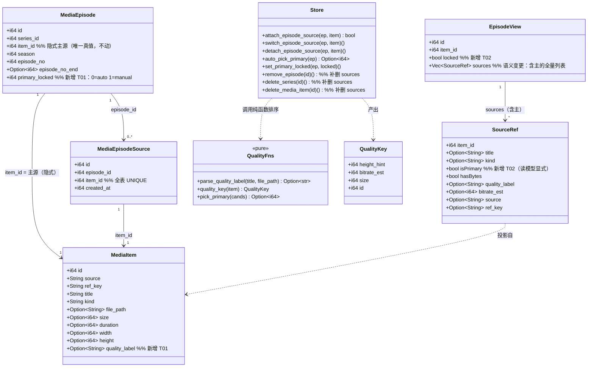
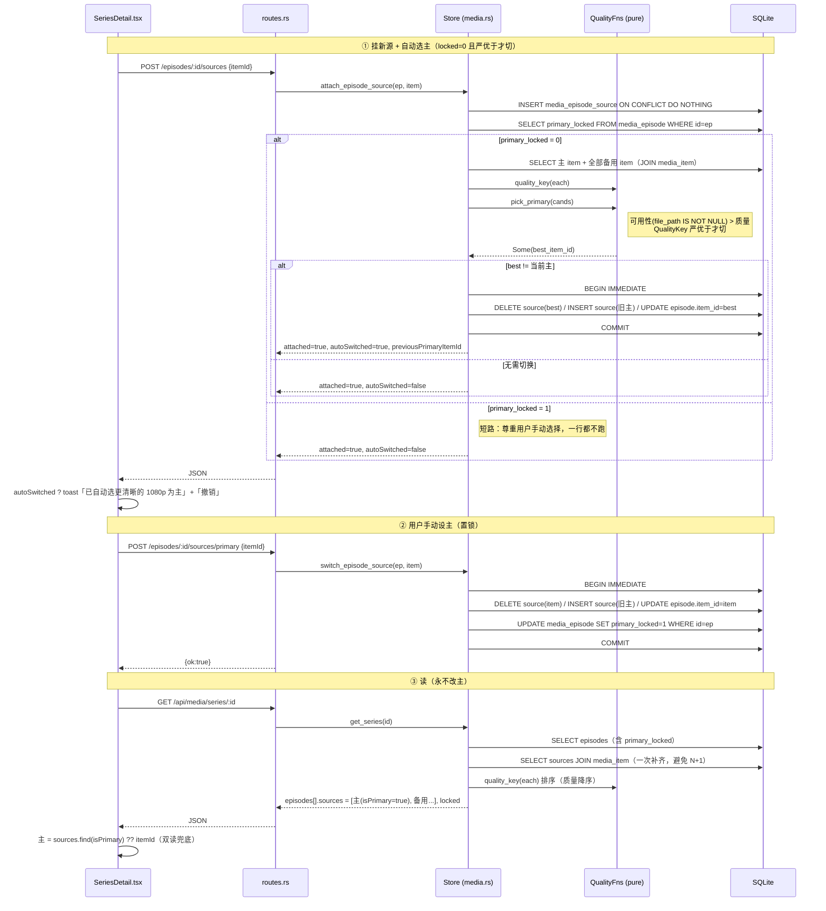
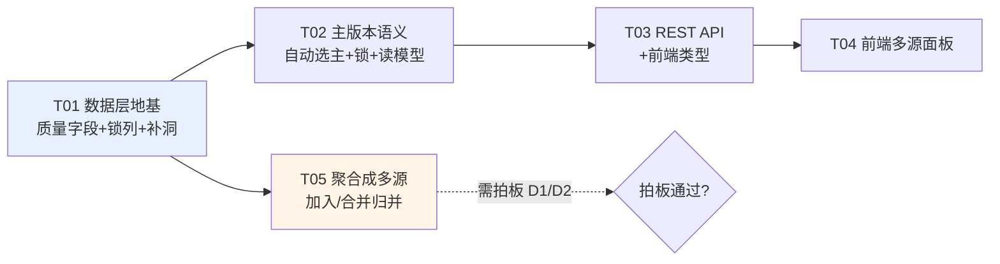

# 单集多视频源（多清晰度 / 多版本）增量设计

- 日期：2026-09-22
- 作者：架构师（高见远）
- 范围：**增量改造**。基于现有 `media_episode_source`（BUG-039）演进，不推倒重来。
- 产品定位（用户 2026-09-22 拍板，本文不违反）：OrigHub 是**离线优先下载工具**；入库即落盘；
  播放默认走本地文件（唯一有背压的通路），在线流只作过渡态兜底。
- 标记约定：**【现状】**= 已复核的既成事实；**【改动】**= 本设计提出；**【待拍板】**= 需所有者裁定；
  **【假设】**= 我未亲自复核的推断。

---

## 0. 取证结论（设计的事实基底）

### 0.1 已亲自复核的事实（附 file:line，可抽查）

| # | 事实 | 证据 |
|---|---|---|
| F1 | `media_episode_source(id, episode_id, item_id UNIQUE, created_at, UNIQUE(episode_id,item_id))`，**无 `is_primary`**、无任何质量/码率字段 | `media.rs:366-376` |
| F2 | 主源是**隐式**的：`media_episode.item_id` 即为主；备用源在 `media_episode_source` | `media.rs:1801-1810`（`switch` 读主就是读 `e.item_id`） |
| F3 | 触发器 `trg_media_episode_source_video_only_ins/upd`：**只接受 kind='video'**；`trg_media_episode_media_only_ins/upd`：`media_episode.item_id` 只接受 video\|photo | `media.rs:485-498` |
| F4 | 读路径：`get_series` 一次补全每集 `sources`，SQL 只投影 `s.episode_id, s.item_id, i.title, i.kind`，`ORDER BY s.created_at ASC, s.id ASC` | `media.rs:1260-1288` |
| F5 | `SourceRef { item_id, title, kind }` —— **不含任何质量信息** | `media.rs:649-653` |
| F6 | REST：`POST .../sources`、`POST .../sources/primary`、`DELETE .../sources/:item_id` | `routes.rs:128-136`、`routes.rs:2847-2890` |
| F7 | 前端唯一消费点：`SeriesDetail.tsx:696-713`，`{n} 源` 按钮盲切 `ep.sources![0]` | 已复核 |
| F8 | `append_episodes_ranged` **只跳过**已收录条目（按 `item_id`），从不产生多源；区间冲突时**回退到末尾** | `media.rs:1746-1760` |
| F9 | `merge_series` 一律**续编新集号**，从不同槽归并；`:1582-1588` 是 BUG-103 止血（只清不搬） | `media.rs:1391-1627` |
| F10 | 自动成剧幂等键：`tg:group:{chat}:{group_id}` 或 `tg:msgs:{chat}:{first_msg}`；落位用 `parse_episode_range(caption)` | `routes.rs:1330-1367`、`media.rs:2617` |
| F11 | `app_setting(key,value)` 存在，已有「一次性迁移键」先例（`EPISODE_TEXT_MIG`） | `media.rs:28/77/213` |
| F12 | 播放走 `episode.itemId`（主），`episodesToItems` 把分集映射成条目列表 | `MediaLibraryPanel.tsx:243-261` |

### 0.2 【关键发现】现有数据**无法**从分辨率判质量

| 项 | 结论 | 证据 |
|---|---|---|
| `media_item.width` / `height` | **生产路径从不写入**。列在建表批里（`media.rs:233-234`），但 `upsert_media_item` 的 INSERT 列清单里没有它们 | `media.rs:905-919`（列清单：source,ref,title,kind,file_path,size,duration,added_at,description） |
| TG 侧元数据 | `classify_media` 只返回 `(media_type, mime, size, file_name, duration)`，**不含 w/h** | `grammers.rs:1144-1152` |
| 唯一写入口 | `update_media_item`（PATCH `/api/media/items/:id`），即**只有前端手改才会填** | `media.rs:1028-1052`、`routes.rs:2093` |
| 实际可用 | **`size` 与 `duration` 是唯二在入库时被真实填写的量化字段** | `routes.rs:931-935`、`routes.rs:938-947` |

> **结论：`width/height` 在真实用户库里恒为 NULL**（【假设】：除非用户手改过；未找到任何自动填充路径）。
> 因此「从 `width/height` 推导清晰度」在当前数据上**不可用**，质量模型必须以 `size / duration / 标题文本` 为输入。

### 0.3 【新发现·未登记的坑】除 `merge_series` 外还有三个入口会造孤儿源行

BUG-103 只修了合并路径。同一病（删 `media_episode` 不清 `media_episode_source` → 孤儿行 →
`item_id` 全表 UNIQUE **永久阻塞**该条目再挂载）在另外三个入口**依然存在**：

| 入口 | 位置 | 现状 | 危害 |
|---|---|---|---|
| `remove_episode`（删单集） | `media.rs:1900-1930` | `:1915` 直接 `DELETE FROM media_episode WHERE id=?1`，**无** source 清理 | **最重**：该集备用源（条目仍在库）被永久锁死，无法再挂到任何集 |
| `delete_series`（删整部剧） | `media.rs:1629-1640` | `:1631` 直接 `DELETE FROM media_episode WHERE series_id=?1`，**无** source 清理 | 同上，范围更大 |
| `delete_media_item`（删内容） | `media.rs:1059-1076` | `:1067` 直接 `DELETE FROM media_episode WHERE item_id=?1`，**无** source 清理 | 中：留下一批指向已删条目的悬空行（条目已不在，不阻塞再挂载，但破坏「源必指向存在条目」的不变量） |

`migrate()` 那次清理（`media.rs:408-413`）**只在启动迁移时跑一次**，运行期无守护。

> 这是「多源」能力铺开前的**必要地基**：否则用户删一集，就把该集所有备用源永久锁死。
> 已列入 T01，建议登记为新 BUG（编号顺延，当前最大已见 BUG-113）。

---

## 1. 质量如何表达

### 1.1 结论：连续量排序 + 单点落地的文本标签，**不新增离散等级列**

| 方案 | 评价 |
|---|---|
| 离散等级列（`quality: 2160p/1080p/...`） | ❌ 需维护枚举与映射表；TG 命名混乱，映射必然失真；等级是**派生物**却落成第二份真值，会与 `size/duration` 漂移（AGENTS.md BUG-080 教训：`has_bytes` 不落列，因为 `file_path IS NOT NULL` 才是真值） |
| 纯连续量（分辨率 + 码率 + 体积） | ✅ 但**当前无分辨率数据**（见 0.2），单独用会全盘退化为 NULL |
| **推荐：连续量排序键（派生，不落库）+ 文本标签（落一列）** | ✅ 分辨率缺失时由标签兜底；将来补上真实 `height` 后排序**自动变准**，无需改枚举 |

### 1.2 字段设计

| 层 | 字段 | 落库？ | 来源 |
|---|---|---|---|
| 分辨率真值 | `media_item.height` | 已有列 | 目前 NULL；将来可由 `width/height` 探测回填（见 1.4） |
| 清晰度标签 | `media_item.quality_label TEXT` | **【改动】新增** | 写入时从 `title` / `file_path` 解析一次 |
| 码率 | 派生 `bitrate_est = size*8/duration` | 不落库 | 现算（`size`/`duration` 已有且真实） |
| 体积 / 时长 | `media_item.size` / `duration` | 已有列 | — |

### 1.3 排序键（Rust 纯函数，可表驱动单测）

```rust
/// 清晰度标签解析（写入时算一次，落 media_item.quality_label）。
/// 风格对齐现有 parse_episode_range（media.rs:2617）：取首行/文件名、大小写不敏感、
/// 数字段带边界防护（防 2024 这类年份被误判为分辨率）。
pub fn parse_quality_label(title: &str, file_path: Option<&str>) -> Option<&'static str>
//  2160p|4k|uhd        -> "2160p"
//  1440p|2k|qhd        -> "1440p"
//  1080p|1080i|fhd|full hd -> "1080p"
//  720p|hd             -> "720p"
//  480p|sd             -> "480p"
//  360p                -> "360p"
//  其它                 -> None

/// 质量排序键（分量越大越好）。四层，逐层退化。
pub struct QualityKey { pub height_hint: i64, pub bitrate_est: i64, pub size: i64, pub id: i64 }

pub fn quality_key(it: &MediaItem) -> QualityKey {
    QualityKey {
        // 真值优先，标签兜底；都缺 = 0（排最后，且不参与「严优于」判定）
        height_hint: it.height.unwrap_or_else(|| label_height(it.quality_label.as_deref())),
        bitrate_est: match (it.size, it.duration) {
            (Some(s), Some(d)) if d > 0 => s.saturating_mul(8) / d,
            _ => 0,
        },
        size: it.size.unwrap_or(0),
        id:   it.id,
    }
}
/// 排序：height_hint DESC, bitrate_est DESC, size DESC, id ASC（末层保证稳定、可复现）
```

**为什么不落 `bitrate` 列**：`size*8/duration` 现算即可，多存一列 = 多一份会漂移的真值。
将来若引入探测得到的**真实**码率（与估算不同源），再单独立列，且必须与估算区分命名。

### 1.4 【待拍板 P2】是否顺手把真实分辨率探测回来

- **因果**：`width/height` 恒 NULL ⇒ 质量只能靠标签猜 + 体积比。`tauri-shell/src/lib/poster.ts:77/122`
  抽帧时**已经**从 `<video>` 拿到了 `width/height/duration`（`resolve({dataUrl, duration, width, height})`），
  目前只用了 `dataUrl`，其余丢弃。
- **处置**：在 `MediaCard.tsx` / `SeriesDetail.tsx` 抽帧成功后，用**已有的** `patchMediaItem`
  （`media.ts:247-248` 已支持 `width`/`height`）回写一次。改动面 = 2 处调用点 + 1 个幂等判断
  （已有值就不覆盖）。无后端改动、无表改动。
- **请求**：批准即并入 T04 一起做；或明确「本轮不做，只靠标签 + 体积」。

---

## 2. 主版本如何表达

### 2.1 三方案代价对比

| 维度 | A. 显式 `is_primary` 列 + 主也进源表（统一源表） | B. 显式 `is_primary` 列，但主仍在 `media_episode` | **C. 维持隐式主 + 锁标记（推荐）** |
|---|---|---|---|
| 迁移成本 | **高**：需 backfill 把每个 `media_episode.item_id` 补一行进 source 表；主位从此有**两份真值** | 中：source 表里没有主行，`is_primary` 无意义（恒 0）→ 实际退化 | **低**：`ALTER TABLE ADD COLUMN` 一列，行语义完全不变 |
| 「恰好一个主」不变量 | 靠部分唯一索引 `UNIQUE(episode_id) WHERE is_primary=1` 表达 —— **把结构保证降级为约束保证** | 无 | **`media_episode.item_id` 是单列，结构上不可能有两个主**（最强保证） |
| 数据不一致风险 | **高**：`add/switch/detach/merge/remove` 五条写路径任一漏改即出现「两个主」或「零个主」；`switch` 从三步事务变四步 | — | 低：主位唯一真值不变；`switch` 逻辑不变，仅多写 `locked=1` |
| 查询复杂度 | 读源列表 = 单表 + CASE 判主；读主需子查询 | 同 A | **读主 = 现有 `e.item_id`（零改动）；读备用 = 现有 source 表（零改动）** |
| 与既有触发器 | 主进源表 ⇒ 主也受 `video_only` 约束（好事），但 `media_episode.item_id` 仍可能是 photo（浏览位），两套约束并存、语义分叉 | — | **不变** |
| 与 BUG-103 / 合并 | 搬运备用源时需额外判主 | — | 不变 |
| 前端 | 主也在 `sources` 里，天然可展示 | — | 需在**读模型**合成（见 2.2） |

### 2.2 推荐：写模型隐式、读模型显式

- **写模型（持久化）**：主 = `media_episode.item_id`，**不动**。
  新增 `media_episode.primary_locked INTEGER NOT NULL DEFAULT 0`（0=自动选主，1=用户已手动指定）。
- **读模型（下发）**：`EpisodeView.sources` 从「只含备用」改为「**含主的全量列表**」，按质量降序，
  每项带 `isPrimary`。前端零心智负担，主与备用在同一列表里比较、点击即设主。

> 这是本次**唯一的破坏性 API 变更**：`sources.length` 从 `n` 变 `n+1`。
> 已复核：全仓只有 `SeriesDetail.tsx:696/701/707/711` 与 `media.ts:101/110` 消费，**改动面可控**。
> 回退策略见 6.5。

### 2.3 为什么 `primary_locked` 放在 `media_episode` 而不是 source 表

锁是「这一集的主版本是否已被用户定死」——是**分集的属性**，不是某条挂载关系的属性。
放在 `media_episode` 上，`remove_episode` / `delete_series` 会随行一起消失，不会产生悬空锁。

---

## 3. 主版本如何产生

### 3.1 规则

| 事件 | 行为 |
|---|---|
| `attach_episode_source`（挂新源） | 若 `primary_locked = 0`：**可用性优先 + 质量严优于** ⇒ 自动切主（旧主降为备用）；响应回 `autoSwitched: true` |
| `switch_episode_source`（用户手动设主） | 切主 **+ 置 `primary_locked = 1`** |
| `detach_episode_source`（摘除） | 摘除后若该集源表为空 ⇒ `primary_locked` 重置为 0（没有多源就无所谓锁） |
| `POST .../sources/auto`（新增端点） | 显式触发一次自动选主，并置 `primary_locked = 0` |
| `PATCH .../primary-lock`（新增端点） | 只改锁，不动主是谁 |
| 缓存完成（字节回填） | 【待拍板】见 3.3 |
| **读路径（`get_series`）** | **永不重算、永不改主**。只排序展示 |

### 3.2 防覆盖设计（用户手动选择被自动重算覆盖 —— 五道闸）

| 闸 | 机制 |
|---|---|
| ①锁列 | `primary_locked = 1` 时，自动选主**整体短路**，一行都不跑 |
| ②只写路径重算 | 自动选主**只在** `attach` / `auto` 两条写路径触发。升级排序规则**不会回溯**改用户已有数据 |
| ③严优于才切 | 仅当新源 `QualityKey` **严格**大于当前主才切。相等不切（防抖动） |
| ④留痕 + 可撤销 | 自动切换回 `autoSwitched: true` + `previousPrimaryItemId`，前端 toast「已自动选更清晰的 1080p 为主版本」+「撤销」按钮（撤销 = 切回 + 置 locked=1） |
| ⑤可用性优先于质量 | 有字节（`file_path IS NOT NULL`）> 无字节。离线优先产品的第一目标是**能播** |

### 3.3 【待拍板 P1】缓存完成后是否允许自动改主

- **因果**：用户口径「播放默认走本地文件」⇒ 主版本理应有字节。若主无字节而备用有，
  点开就撞「未缓存」。不处理 ⇒ 用户每次都要手动切一次。
- **处置**：`mark_downloaded` / 缓存成功路径回调 `auto_pick_primary`（同样受 `locked` 短路）。
  代价：缓存完成是**后台事件**，用户不在场，主可能"悄悄变了"（已有 ④ 的 toast 可缓解）。
- **请求**：批准「缓存完成触发自动选主」，或明确「只在用户主动挂载时自动选」。

### 3.4 历史数据的 `primary_locked` 初值

全部取 0（自动）。**理由**：旧 UI 是「点 `{n} 源` 盲切第一个」，那不是用户基于质量的明确选择，
不应当作"已手动指定"来保护。

> 【假设】我未查到任何历史 `switch_episode_source` 调用日志；若实际存在大量用户手动切换，
> 全 0 会在下次 attach 时改掉他们的主。缓解：④ 的 toast + 撤销，且自动切换只在挂**新**源时发生。

---

## 4. 加入剧集 / 合并剧集时，什么情况聚成同一集的多源

### 4.1 【现状】当前**没有任何路径**会自动产生多源

| 路径 | 现状行为 | 证据 |
|---|---|---|
| 加入剧集（自动成剧） | 同批按 `source_key` 归一部剧；`parse_episode_range` 解析出区间落位；**已收录则跳过**；区间冲突则**回退到末尾** | `routes.rs:1298-1404`、`media.rs:1746-1760` |
| 手动加入 / 追加 | 同 `append_episodes_ranged`，同上 | `media.rs:1696-1771` |
| 合并剧集 | 一律**续编新集号**（BUG-037）；同 `item_id` 同季才跳过；BUG-103 止血只清不搬 | `media.rs:1479-1530`、`media.rs:1576-1588` |

⇒ 用户诉求「加入或者合并剧集后，如果遇到多个视频源」是**要新增的能力**，不是修 bug。

### 4.2 判据：建议**只认集号（区间重叠）**

| 候选判据 | 采纳 | 理由 |
|---|---|---|
| **集号 / 区间重叠**（`parse_episode_range` 已能解析 `EP01`/`第1集`/`EP01-02`） | ✅ **默认** | 可解析、可解释、可复现；与现有落位规则同源（`media.rs:2617`） |
| 槽位冲突（合并时两边 `(season, episode_no)` 完全相同） | ✅ 合并场景用 | 这是 BUG-103 方案 A 的定义 |
| 标题相似度 | ❌ | **标题与文件名都不可靠**（BUG-037 已裁定），勿再引入 |
| 时长 ±5% | ⚠️ 仅作 UI「疑似重复」提示 | 不同集时长相近极常见，自动归并会误判 |
| TG 分组（`group_id`） | ❌ | 分组是**发布批次**，同组 = 同批 ≠ 同集；跨组也完全可能是同一集的不同清晰度 |

### 4.3 归并后的主版本

- 两个来源都是"主"（各自在原剧集里都是主）⇒ 按 `QualityKey` 取优者为主，
  **并置 `primary_locked = 0`**（这是系统归出来的，不是用户选的，允许用户后续改、也允许后续自动优化）。
- 被归并方的原主降为该集备用源。
- `item_id` 全表 UNIQUE 冲突（同一条目已是别集的源）⇒ 记入 `report.skipped` **如实回报**，
  **绝不静默丢弃**（BUG-103 已有此判据）。

### 4.4 【待拍板】

| # | 问题 | 我的建议 | 代价 |
|---|---|---|---|
| **D1（P1，挡住用户）** | 合并时「两边都有第 1 集」→ **A 同槽归并为多源** 还是 **B 续编两集**？ | **A** —— 这正是用户诉求「第 1 集不应该是一条数据」的直接落点，且复用 BUG-039 已有能力 | A：需新增"是否同一集"判定（本设计给的是集号区间重叠）+ 处理"两主谁当主"（3.3 已给）；B：同一内容变两集、连播重复，备用源机制在合并场景永远用不上 |
| **D2（P1）** | 加入剧集时，同批内集号区间冲突 → **归为同集多源** 还是维持**回退到末尾**？ | **归为同集多源** | 改动 `append_episodes_ranged` 的一段分支；风险是"误把两集并成一集"（若 caption 解析错） |
| **D3（P2）** | 集号都解析不出时，是否允许用「同季 + 时长 ±5%」自动归并？ | **否（默认关闭）** | 开了会误判；可留设置开关 |

> D1 与 BUG-103「待拍板」是**同一个问题**，建议一次拍板，并把结论回写 `docs/bugs/BUG-103.md`。

---

## 5. UI 交互

### 5.1 【现状】→【改动】

| 现状（`SeriesDetail.tsx:696-713`） | 改动后 |
|---|---|
| 一个 `{n} 源` 按钮，点击盲切 `sources[0]` | 徽标保留（「2 源」）；**点击展开来源面板**，不再盲切 |
| 看不到质量差异 | 每行显示：`1080p · 2.4 GB · 24:13` 质量三件套 |
| 无法指定主 | 每行「设为主」按钮；当前主行高亮 + 「主」徽标 |
| 锁定状态不可见 | `locked=1` 时主行显示「已锁定 · 自动选主不会再改它」+「解除锁定」 |
| 摘除入口在编辑面板 | 来源面板内直接「摘除」（内容保留在资料库） |

### 5.2 面板字段（每行）

```
[主] 剧名 EP01 1080P  /  1080p · 2.4 GB · 24:13  /  TG · 1234:5678   [设为主] [摘除]
     剧名 EP01 720P   /   720p · 900 MB · 24:15  /  TG · 1234:5679   [设为主] [摘除]
     剧名 EP01 (无字节) /  480p · 300 MB · --:--  /  本地             [设为主] [摘除]
                                                        ↑ 无字节者不参与自动选主竞标
```

- **摘除主**：不允许。主是位置，摘主 = 删集，走现有的「移除分集」。
- **播放**：仍走 `ep.itemId`（主）。副行补一行当前主的质量摘要，让用户知道播的是哪个。
- **副行**（`SeriesDetail.tsx:718-745`）追加质量三件套，与「合并溯源」「文件来源」并列。

---

## 6. 增量改造路线（最小变更）

### 6.1 表变更 SQL（旧库兼容写法）

**硬约束遵守**：这两条**不进** `execute_batch` 建表批（`media.rs:221-277`）——
建表批里只允许出现新旧库都存在的列，否则旧库升级整批失败且回落空库（AGENTS.md BUG-032）。
写法与现有 `origin_series_title` 等列的补列循环（`media.rs:317-337`）**完全一致**。

```sql
-- ① media_item：清晰度标签（写入时从 title/file_path 解析一次）
--    探测（pragma_table_info，SQLite 的 ADD COLUMN 不支持 IF NOT EXISTS）
SELECT 1 FROM pragma_table_info('media_item') WHERE name = 'quality_label';
--    不存在则：
ALTER TABLE media_item ADD COLUMN quality_label TEXT;   -- 可空；NULL = 未识别出

-- ② media_episode：主版本是否被用户手动钉住
SELECT 1 FROM pragma_table_info('media_episode') WHERE name = 'primary_locked';
--    不存在则（NOT NULL + 常量默认值在 SQLite 的 ADD COLUMN 中合法）：
ALTER TABLE media_episode ADD COLUMN primary_locked INTEGER NOT NULL DEFAULT 0;
--    0 = 自动选主（默认）；1 = 用户已手动指定，自动选主短路
```

> **刻意不修改** `CREATE TABLE media_episode` / `media_item` 的建表批：新库也走同一条 ALTER 路径，
> 保证「新库」与「旧库升级」是**同一条代码路径**，不出现分叉（这正是 BUG-032 的病根）。

### 6.2 Backfill

| 列 | backfill | 一次性键 |
|---|---|---|
| `quality_label` | `UPDATE media_item SET quality_label = <parse_quality_label(title, file_path)> WHERE kind='video' AND quality_label IS NULL`（Rust 逐行算，不走 SQL） | 写入 `app_setting('media_quality_label_v1','1')`（沿用 `media.rs:213` 模式） |
| `primary_locked` | **不回填**，DEFAULT 0 即正确语义（见 3.4） | — |

### 6.3 必须先补的三个洞（T01，独立于本需求但**阻塞**本需求）

```sql
-- ① remove_episode（media.rs:1900）在 DELETE media_episode 之前：
DELETE FROM media_episode_source WHERE episode_id = ?1;

-- ② delete_series（media.rs:1629）在 DELETE media_episode 之前：
DELETE FROM media_episode_source
 WHERE episode_id IN (SELECT id FROM media_episode WHERE series_id = ?1);

-- ③ delete_media_item（media.rs:1059）在 DELETE media_episode 之前：
DELETE FROM media_episode_source
 WHERE episode_id IN (SELECT id FROM media_episode WHERE item_id = ?1);
```

与 BUG-103 完全同一病的不同入口。不补 ⇒ 多源铺开后，删一集就把该集所有备用源永久锁死
（`UNIQUE constraint failed: media_episode_source.item_id`，用户无法自愈）。
另建议加一条**全局守护单测**：任意操作序列后 `media_episode_source LEFT JOIN media_episode`
的悬空行数 = 0（防将来新增写路径再犯）。

### 6.4 API 增删

| 方法 | 路径 | 状态 | 说明 |
|---|---|---|---|
| POST | `/api/media/episodes/:id/sources` | 改 | 挂载后：`locked=0` 且新源严优于当前主 ⇒ 自动切主。响应加 `autoSwitched`、`previousPrimaryItemId` |
| POST | `/api/media/episodes/:id/sources/primary` | 改 | 语义不变；**额外置 `primary_locked=1`**；body 加可选 `locked?: bool`（默认 true） |
| DELETE | `/api/media/episodes/:id/sources/:item_id` | 改 | 摘除后若该集源表为空 ⇒ `primary_locked` 重置 0 |
| **POST** | `/api/media/episodes/:id/sources/auto` | **新增** | 手动触发一次自动选主 + 置 `locked=0` |
| **PATCH** | `/api/media/episodes/:id/primary-lock` | **新增** | `{locked: bool}`，只改锁不动主 |
| GET | `/api/media/series/:id` | 改 | `episodes[].sources` 改为**含主**的全量列表（质量降序），新增 `isPrimary`；`EpisodeView` 新增 `locked` |

> 为什么「自动选主」要有独立端点而不是前端自己算：切主是写库行为，且「自动」的定义
> （可用性优先 + 严优于 + locked 短路）**只能有一个实现**，必须留在后端。

### 6.5 迁移期双读 / 回退

| 场景 | 保障 |
|---|---|
| 新代码 + 旧库 | 两列均由 ALTER 补齐；`primary_locked` 有 DEFAULT 0；`quality_label` 有 backfill。**安全** |
| 旧代码 + 新库 | 旧代码 SELECT 用的是显式列名，不引用新列；多余列无害；旧前端 `n+1` 的 `sources` 语义**会多算一个** |
| `sources` 语义切换 | **唯一不可逆点**。缓解：**T03（后端）与 T04（前端）同一次提交内完成**，不做分期发布。若必须分期，先并行下发 `sourcesV2` 一个版本再切换 |
| 前端取主 | `sources?.find(s => s.isPrimary)?.itemId ?? itemId`（`itemId` 保留作兜底，两个版本都对） |
| 单测闸门 | **强制**：造旧 schema + 塞旧数据 → `Store::open` 成功 + 数据仍在（AGENTS.md BUG-032 硬性要求，参照 `media::tests::legacy_db_migrates_without_failing_open`） |

### 6.6 前端改动点

| 文件 | 改动 |
|---|---|
| `tauri-shell/src/api/media.ts` | `EpisodeSourceRef`（:110-114）扩字段；`MediaEpisode` 加 `locked`；`switchEpisodeSource` 加 `locked` 参数；新增 `autoPickPrimary` / `setPrimaryLock` |
| `tauri-shell/src/components/media/SeriesDetail.tsx` | `:696-713` 盲切按钮 → 来源面板；`:718-745` 副行补质量三件套 |
| 新增 `tauri-shell/src/components/media/EpisodeSourcesPanel.tsx` | 来源列表组件（或内嵌展开，由工程师自决） |
| `tauri-shell/src/components/MediaLibraryPanel.tsx` | `episodesToItems`（:243-261）透传 `qualityLabel` / `width` / `height`；逻辑不变 |

---

## 7. 类图（读 / 写模型）



---

## 8. 程序调用流



---

## 9. 任务分解（有序，5 个任务）

| ID | 任务名 | 源文件 | 依赖 | 优先级 |
|---|---|---|---|---|
| **T01** | 数据层地基：质量表达 + 锁列 + 补孤儿洞 | `download-engine/crates/orig-tg/src/media.rs` | — | **P0** |
| **T02** | 主版本语义：自动选主 + 锁 + 读模型统一 | `download-engine/crates/orig-tg/src/media.rs` | T01 | **P0** |
| **T03** | REST API + 前端类型 | `download-engine/crates/orig-tg/src/routes.rs`、`tauri-shell/src/api/media.ts` | T02 | **P0** |
| **T04** | 前端：多源面板 | `tauri-shell/src/components/media/SeriesDetail.tsx`（:696-713 / :718-745）、新增 `EpisodeSourcesPanel.tsx` | T03 | **P0** |
| **T05** | 聚合成多源（加入/合并归并为同集多源） | `media.rs`（`append_episodes_ranged` :1714-1771、`merge_series` :1391-1627）、`routes.rs:2154`（`ranged_items`）、`MediaLibraryPanel.tsx`、回写 `docs/bugs/BUG-103.md` | T01（**不依赖 T02–T04，可并行**）+ **待拍板 D1/D2** | **P1** |

### T01 明细 —— 数据层地基（P0）
1. `migrate()`：两列 ALTER 探测（`quality_label` / `primary_locked`），**不进建表批**。
2. `parse_quality_label()` / `quality_key()` / `pick_primary()` 三个纯函数（放在 `parse_episode_range`（:2617）附近）。
3. `upsert_media_item`（:893）与 `update_media_item`（:1028）写入时计算 `quality_label`。
4. 一次性 backfill `quality_label` + `app_setting` 迁移键。
5. `remove_episode`（:1900）/ `delete_series`（:1629）/ `delete_media_item`（:1059）**三个**入口
   补删 `media_episode_source`（见 6.3）。
6. **单测（强制）**：
   - 旧库→新库迁移：造旧 schema + 旧数据 → `Store::open` 成功 + 数据仍在（AGENTS.md BUG-032 硬性）。
   - `parse_quality_label` 表驱动（含「2024 不被误判为分辨率」负例）。
   - `quality_key` 退化路径（height NULL / duration NULL / 全 NULL）。
   - 三个删除入口各自：悬空源行数 = 0，且被摘的 `item_id` 可重新 `attach` 成功（跨进程重启后仍成立）。

### T02 明细 —— 主版本语义（P0）
1. `switch_episode_source`（:1801）事务内追加 `UPDATE ... primary_locked = 1`。
2. `attach_episode_source`（:1776）返回改为结构 `{attached, autoSwitched, previousPrimaryItemId}`：
   `locked=0` 时按 `pick_primary` 判严优于 ⇒ 切主（复用现有三步事务）。
3. `detach_episode_source`（:1856）：源表空 ⇒ `primary_locked = 0`。
4. 新增 `auto_pick_primary(ep) -> Option<i64>`、`set_primary_locked(ep, bool)`。
5. `get_series`（:1260-1288）：sources 查询改为**含主**（`UNION` 主条目或 Rust 侧合成），
   按 `QualityKey` 降序；`SourceRef` 扩 `isPrimary/hasBytes/qualityLabel/bitrateEst/source/refKey`；
   `EpisodeView` 加 `locked`。
6. **单测**：`locked=1` 时自动选主完全不生效；相等质量不切；无字节让位有字节；摘空解锁；
   合并/删除路径不产生孤儿。

### T03 明细 —— API + 类型（P0）
1. `routes.rs`：改 3 个既有 handler；新增 `sources/auto`、`primary-lock`；路由注册（:128-136）。
2. `media.ts`：`EpisodeSourceRef`（:110-114）扩字段；`MediaEpisode` 加 `locked`；
   `switchEpisodeSource` 加 `locked` 参数；新增 `autoPickPrimary` / `setPrimaryLock`。
3. **与 T04 同一次提交**（`sources` 语义破坏性变更，见 6.5）。

### T04 明细 —— 前端面板（P0）
1. `SeriesDetail.tsx:696-713`：`{n} 源` 盲切 → 展开来源面板。
2. 新增 `EpisodeSourcesPanel.tsx`：列表（质量三件套 / 主徽标 / 锁定态 / 设为主 / 摘除 / 来源）。
3. `:718-745` 副行补质量三件套。
4. `autoSwitched` toast + 撤销（撤销 = 切回 `previousPrimaryItemId` + 置 `locked=1`）。
5. （可选，待拍板 D-P2）抽帧后回写 `width/height`。

### T05 明细 —— 聚合成多源（P1，**待拍板 D1/D2 通过后开工**）
1. `append_episodes_ranged`（:1714-1771）：区间冲突从「回退到末尾」改为「归入同槽为多源」。
2. `merge_series`（:1391-1627）：同 `(season, episode_no, episode_no_end)` ⇒ 同槽归并（BUG-103 方案 A）；
   被归并方原主降为备用源；`item_id` 冲突记入 `report.skipped`，**不静默丢**。
3. 合并时**搬运**源分集的备用源到目标分集（BUG-103 正修第 2 项），替代现有「只清不搬」。
4. `MediaLibraryPanel.tsx:243-261` 透传质量字段。
5. 回写 `docs/bugs/BUG-103.md` 状态与结论。

### 任务依赖图



> T05 只依赖 T01，**可与 T02–T04 并行开发**；但它被「待拍板 D1/D2」挡住，故排在最后。

---

## 10. 共享知识（跨任务约定）

- 主源**唯一真值** = `media_episode.item_id`；`media_episode_source` **只存备用**。读模型才合成 `isPrimary`。
- 自动选主三前提：`primary_locked = 0` **且** 在写路径（attach/auto）**且** 严优于。
- 质量排序唯一实现 = `quality_key()`；前端不得自行排序。
- `QualityKey` 分量：`height_hint = height ?? label_height(quality_label)`；`bitrate_est = size*8/duration`。
- 可用性（`file_path IS NOT NULL`）优先于质量。
- 任何删 `media_episode` 的写路径，**必须先删** `media_episode_source`（`item_id` 全表 UNIQUE，孤儿行永久阻塞）。
- 新增列一律走 `pragma_table_info` 探测 + `ALTER TABLE ADD COLUMN`，**绝不进** `execute_batch` 建表批。
- 表变更必须配「旧库 → 新代码」迁移单测（AGENTS.md BUG-032）。
- 摘除主不允许；主是位置，删集走 `remove_episode`。
- 提交信息全英文、LF（AGENTS.md §2，commit-msg 钩子会拦）。

---

## 11. 回归风险

| # | 风险 | 触发 | 缓解 |
|---|---|---|---|
| R1 | `sources` 语义变「含主」，旧前端 `n+1` 多数一个 | 分期发布 | T03+T04 同一次提交；过渡期前端双读 `isPrimary ?? itemId` |
| R2 | 建表批引用新列 ⇒ 旧库整批失败 ⇒ `Store::open` 回落空库 ⇒ **用户数据全没了**（AGENTS.md BUG-032） | T01 写法错 | 新列**不进**建表批；强制迁移单测 |
| R3 | 自动选主覆盖用户手动选择 | attach 新源 | 五道闸（锁列 / 仅写路径 / 严优于 / toast+撤销 / 可用性优先） |
| R4 | `remove_episode` / `delete_series` 造孤儿源行，永久锁死 `item_id` | 删集 / 删剧 | T01 一并补；加单测断言悬空行 = 0 |
| R5 | 质量排序规则升级后，历史主版本"集体漂移" | 规则变更 | 只在写路径重算；读路径永不改主 |
| R6 | `parse_quality_label` 误判（年份 `2024` 当分辨率、标题里的 `HD` 等） | 解析 | 表驱动负例单测；标签只作兜底，`height` 优先 |
| R7 | T05 归并误把两集合成一集（caption 解析错） | 自动成剧 | 判据只用集号区间；D3（时长归并）默认关闭；归并记入 `report.skipped` 如实回报 |
| R8 | 前端面板引入高频重渲染（AGENTS.md BUG-026） | T04 | 面板只在点击时挂载；不进轮询路径；组件 `memo` + `useEvent` |
| R9 | 新增端点绕过背压（AGENTS.md BUG-033） | — | 本设计**不新增任何投递端点**，播放仍走 `serve_local_file` |
| R10 | `primary_locked` 初值全 0 抹掉历史手动选择（见 3.4 假设） | 升级后首次 attach | toast + 撤销；且只在挂**新**源时触发 |

---

## 12. 待拍板清单（按「挡住用户使用」排序）

### D1（P1）合并剧集遇到「两边都有第 1 集」：同槽归并为多源，还是续编两集？
- **因果**：现状 `merge_series` 一律续编（BUG-037），同一内容的不同清晰度压片合并后**变成两集**，
  连播会重复播放 —— 这正是用户「第 1 集不应该是一条数据」的直接痛点。不改 ⇒ 备用源机制在合并
  场景永远用不上，两套模型长期分叉（BUG-103 已记同一问题）。
- **处置**：`media.rs::merge_series`（:1391-1627）按 `(season, episode_no, episode_no_end)` 完全相同的
  槽位归并，被归并方降为备用源，主按 `QualityKey` 取优（并置 `locked=0`）；同时搬运源分集的备用源
  （替代现有「只清不搬」的止血）。改动面 = 1 个函数 + 单测，无表变更。
- **请求**：选 **A（同槽归并，我的建议）** 还是 **B（维持续编）**？批准 A 即开工 T05。

### D2（P1）加入剧集时，同批内集号区间冲突：归为同集多源，还是维持回退到末尾？
- **因果**：`EP01 1080p` 与 `EP01 720p` 在同一批里，现状是后者被回退编成第 2 集
  （`media.rs:1756-1759`）—— 用户看到的正是「两个清晰度变成了两集」。不改 ⇒ 用户诉求落空。
- **处置**：`append_episodes_ranged` 的冲突分支改为 `attach_episode_source` 归入同槽。
  改动面 = 1 个分支 + 单测。
- **请求**：批准归为多源（我的建议），或维持现状。

### D3（P2）是否顺手把真实分辨率探测回写（`width/height`）？
- **因果**：`width/height` 恒 NULL ⇒ 质量只能靠标签 + 体积猜（见 0.2）。而
  `tauri-shell/src/lib/poster.ts:122` 抽帧时**已经**拿到了 `width/height/duration`，目前丢弃。
- **处置**：抽帧成功后用**已有的** `patchMediaItem`（`media.ts:247-248`）回写一次，已有值不覆盖。
  改动面 = `MediaCard.tsx` / `SeriesDetail.tsx` 各一处，**无后端与表改动**。
- **请求**：批准并入 T04 一起做，还是明确「本轮只靠标签 + 体积」？

---

## 13. 附：本设计中标注为「假设」的项（供抽查）

| # | 假设 | 影响 | 若为假的后果 |
|---|---|---|---|
| A1 | `media_item.width/height` 在真实用户库中恒为 NULL（未找到任何自动填充路径） | 质量模型的兜底设计 | 若其实有填充路径，排序**只会更准**，设计无需改 |
| A2 | 历史上 `switch_episode_source` 调用量不大，全 0 初值可接受 | 3.4 的 `primary_locked` 初值 | 见 R10，有 toast + 撤销兜底 |
| A3 | TG 片源标题普遍带清晰度标记（1080p/720p/4K） | `quality_label` 的命中率 | 命中率低时退化到 `size/duration` 比较，功能不失效 |
| A4 | 全仓 `sources` 只有 `SeriesDetail.tsx` 一处消费（grep 已核） | R1 的改动面评估 | 若另有消费点，T04 需同步改 |
| A5 | 全仓删 `media_episode` 的写路径共 5 处，已全部枚举（`migrate`:402 / `delete_media_item`:1067 / `merge_series`:1593 / `delete_series`:1631 / `remove_episode`:1915） | R4 的覆盖范围 | 若我在新增代码里漏了，同病会再犯；已建议加一条「悬空行 = 0」的守护单测做全局兜底 |
