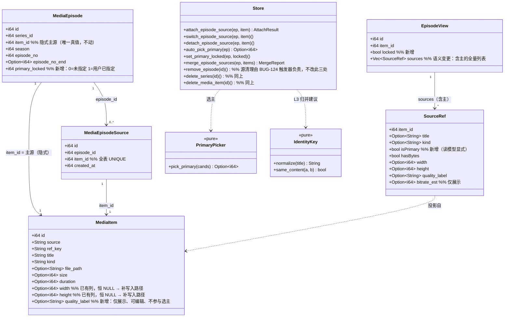
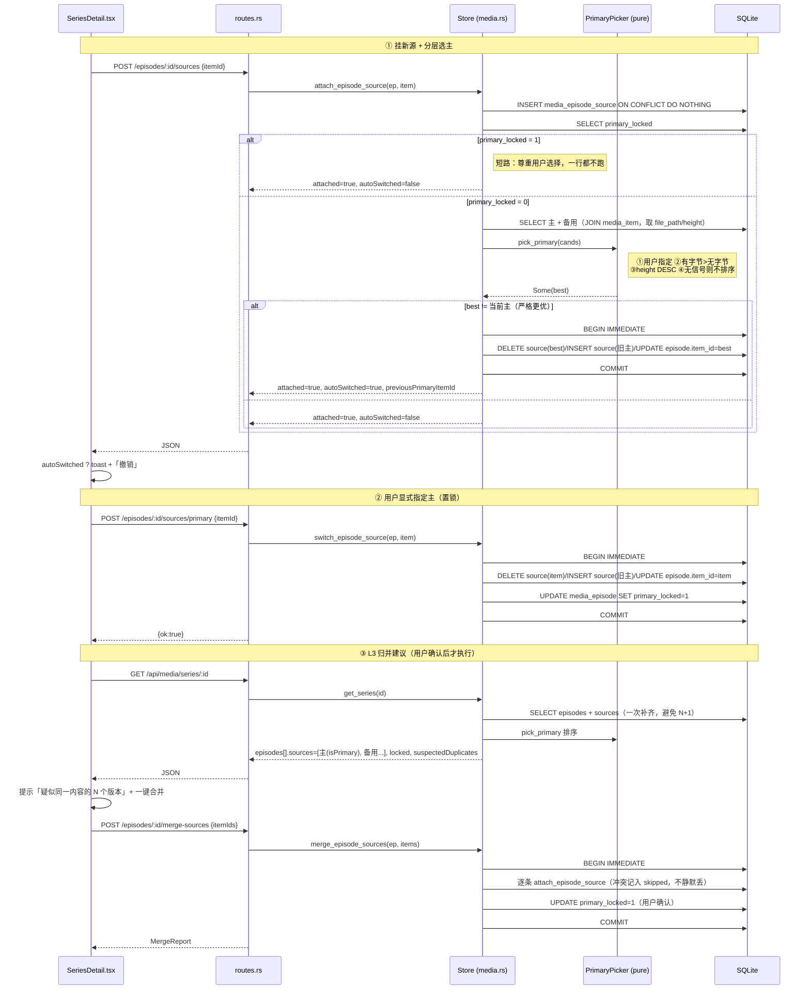
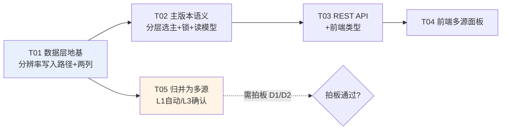

# 单集多视频源（多清晰度 / 多版本）增量设计

- 日期：2026-09-22（v2：按实测否证修订）
- 作者：架构师（高见远）
- 范围：**增量改造**。基于现有 `media_episode_source`（BUG-039）演进，不推倒重来。
- 产品定位（用户 2026-09-22 拍板）：OrigHub 是**离线优先下载工具**；入库即落盘；
  播放默认走本地文件（唯一有背压的通路），在线流只作过渡态兜底。
- 标记约定：**【现状】**= 已复核事实；**【改动】**= 本设计提出；**【待拍板】**= 需裁定；
  **【实测】**= 本文附了可复现的活体取证。

> **v2 修订摘要**
> - v1 的核心假设 A3「TG 标题普遍带清晰度标记」被实测否证（真实内容命中率 **0%**）。
>   已据此重做：① 质量表达（§1）② 主版本产生规则（§3）③ 归并判据 D1（§4）。
> - v1 曾把「三个删除入口造孤儿源行」当作**新发现**并建议逐入口补 `DELETE`。
>   复核后确认：该问题**已登记为 BUG-124 且已用触发器修复**（`media.rs:519-531`），
>   而「逐入口打补丁」正是 BUG-110 记下的反模式。**该建议已全部删除**（§0.6 / §6.3 / T01 / R4 / A5）。
> - 新增三项决定性取证：`width/height` 实测恒 NULL（§0.2）、
>   **grammers 其实提供了分辨率但代码没读**（§0.5）、
>   **真实库里「同一片源 × 14 个版本」已被存成 14 集**（§0.4）。

---

## 0. 取证结论（设计的事实基底）

### 0.1 已复核的代码事实（附 file:line，可抽查）

| # | 事实 | 证据 |
|---|---|---|
| F1 | `media_episode_source(id, episode_id, item_id UNIQUE, created_at, UNIQUE(episode_id,item_id))`，**无 `is_primary`**、无质量/码率字段 | `media.rs:366-376` |
| F2 | 主源是**隐式**的：`media_episode.item_id` 即为主 | `media.rs:1801-1810` |
| F3 | 触发器 `trg_media_episode_source_video_only_ins/upd`：**只接受 kind='video'**；`trg_media_episode_media_only_ins/upd`：分集只接受 video\|photo | `media.rs:485-498` |
| F4 | `get_series` 一次补全每集 `sources`，SQL 只投影 `s.episode_id, s.item_id, i.title, i.kind`，`ORDER BY s.created_at ASC, s.id ASC` | `media.rs:1260-1288` |
| F5 | `SourceRef { item_id, title, kind }` —— **不含任何质量信息** | `media.rs:649-653` |
| F6 | REST：`POST .../sources`、`POST .../sources/primary`、`DELETE .../sources/:item_id` | `routes.rs:128-136`、`routes.rs:2847-2890` |
| F7 | 前端唯一消费点：`SeriesDetail.tsx:696-713`，`{n} 源` 按钮盲切 `ep.sources![0]` | 已复核 |
| F8 | `append_episodes_ranged` **只跳过**已收录条目（按 `item_id`），从不产生多源；区间冲突**回退到末尾** | `media.rs:1746-1760` |
| F9 | `merge_series` 一律**续编新集号**；`:1582-1588` 是 BUG-103 止血（只清不搬） | `media.rs:1391-1627` |
| F10 | 自动成剧幂等键：`tg:group:{chat}:{group_id}` 或 `tg:msgs:{chat}:{first_msg}`；落位用 `parse_episode_range(caption)` | `routes.rs:1330-1367`、`media.rs:2617` |
| F11 | `app_setting(key,value)` 存在，已有「一次性迁移键」先例（`EPISODE_TEXT_MIG`） | `media.rs:28/77/213` |
| F12 | 播放走 `episode.itemId`（主） | `MediaLibraryPanel.tsx:243-261` |

### 0.2 【实测】四个量化列在真实库中的取值（活体 API）

命令与产物：`verify_shots/multisource-probe/probe_cols.py` → `probe_cols.out.txt`
（`GET http://127.0.0.1:9877/api/media/items?limit=500`，返回 115 条）

| 列 | non-null | non-zero | video (85) | photo (30) |
|---|---|---|---|---|
| `size` | 111/115 (97%) | 111 | **85/85** | 26/30 |
| `duration` | 52/115 (44%) | 51 | **50/85 (59%)** | 1/30 |
| `width` | **0/115 (0%)** | **0** | **0/85** | **0/30** |
| `height` | **0/115 (0%)** | **0** | **0/85** | **0/30** |
| `file_path`（有字节） | — | — | **85/85** | 26/30 |

> **结论：`width` / `height` 在真实库中 100% 为 NULL**（v1 的假设 A1 由推断升级为实测）。
> 可用的客观量只有 `size`（97%）与 `duration`（44%，且只覆盖 59% 的视频）。
> 唯一 100% 有值的「可用性」信号是 `file_path IS NOT NULL`。

### 0.3 【实测】标题清晰度命中率：真实内容 **0%**（判据必须用 CJK 区分真实内容）

同一条命令，用清晰度正则 `(2160|1440|1080|720|480|360|4k|2k|8k|uhd|fhd|hd\b)` 扫标题：

| 口径 | 数量 |
|---|---|
| 条目总数 | 115 |
| 正则命中 | **50（43%）** |
| 命中项中含 CJK | **0** |
| 含 CJK 的条目（=真实 TG 内容） | 14 |
| **真实内容命中率** | **0%** |

**43% 是假象**：命中的 50 条**全部**是测试素材文件名 —— `Big_Buck_Bunny_1080_10s_1MB`、
`Jellyfish_720_10s_2MB`、`Sintel_360_10s_5MB`、`format_h264_640x360`、`long_real_footage_720p_12min`
（37 个唯一标题）。而真实 TG 内容**一条都不命中**：

```
🌟🔥🔥《洞洞杂货铺》EP6  原档 内群已更至7集 连载中 ⭐⭐⭐
📱《女友帮我操闺蜜》第5集
TG 图片 #2478
🌟⚡️《一个乖乖女》EP1 新剧首更 原档 连载中 ⭐⭐⭐
```

> **判据（重要，勿再犯）**：「命中」不等于「有信息」。必须用 **CJK** 把真实内容与测试素材分开，
> 否则会得出 43% 的假结论。真实 TG 片源标题里**没有**清晰度标记 —— 中文剧集标题是
> 「剧名 + EP/第N集 + 营销词 + emoji」，清晰度信息不在标题里。
> 该结论与 `docs/bugs/BUG-113.md`「反证」节一致。

### 0.4 【决定性实测】「同一片源的 14 个版本」已经被存成 14 集

`verify_shots/multisource-probe/probe_series.py` → `probe_series.out.txt`

```
series 1  《Big Buck Bunny · 码率阶梯》  episodes=14  episodes_with_sources=0
    S1E1..E5   Big_Buck_Bunny_360_10s_{1,1,2,5,10}MB
    S1E6..E10  Big_Buck_Bunny_720_10s_{1,1,2,5,10}MB
    S1E11..E14 Big_Buck_Bunny_1080_10s_{1,2,5}MB
series 2  《Sintel · 码率阶梯》     episodes=9   sources=0
series 3  《Jellyfish · 码率阶梯》  episodes=9   sources=0
series 4  《自然风光合集》          episodes=5   sources=0
series 5  《城市与科技合集》        episodes=5   sources=0
series 76 《via Mr.Yan》            episodes=1   sources=0
```

两项结论：

1. **用户的诉求已被复现为事实**：「同一个片源的 360p/720p/1080p × 1/2/5/10MB」这一组**同集多版本**，
   系统把它当成了 **14 个不同的集**（S1E1…S1E14）。这正是用户说的
   「总有高质量和低质量的，总有一个为主的」——系统既分不出质量，也没有「一集多源」的表达。
2. **现有备用源能力在真实库中零使用**：全库 `episodes_with_sources = 0`。
   ⇒ 多源路径是**未行使**的能力；真问题是**归并从未发生**，不是归并错了。

### 0.5 【决定性实测】grammers **提供了**分辨率，只是代码没读

| 项 | 结论 | 证据 |
|---|---|---|
| 分辨率可否从 TG 拿到 | **可以**。`grammers_client::media::Document::resolution() -> Option<(i32,i32)>`，返回 `DocumentAttributeVideo.w/h`（也覆盖 `ImageSize`） | cargo registry `grammers-client-0.10.0/src/media/media.rs:373-379` |
| 当前为什么没有 | `classify_media` 返回 **5 元组** `(media_type, mime, size, file_name, duration)`，**没有分辨率** —— 尽管同文件的 `photo_size_dims`（:1181）已经在读缩略图尺寸 | `grammers.rs:1144-1152` |
| 写入路径 | `classify_media` → `message_meta` → `MediaItem` → `routes.rs:938 upsert_media_item`；而 `upsert_media_item` 的 INSERT 列清单**不含** `width/height` | `media.rs:905-919` |

> **⇒ 补齐质量的唯一必要写入路径（1 条，改动很小）**：
> `classify_media` 加 `doc.resolution()` 出参 → 透传到 `upsert_media_item` 的列清单 →
> `media_item.width/height`。**不需要 ffprobe、不需要前端探测、不需要新表。**
> 这条路径落地前，系统**无法**客观判定质量（§1.3）。

### 0.6 孤儿备用源行：**已由 BUG-124 修复**（本设计不再重复处理）

删 `media_episode` 不清 `media_episode_source` 会造孤儿行，因 `item_id` 全表 UNIQUE 而
**永久锁死**该条目再挂载。该病有四个入口：`merge_series`（BUG-103 已止血）、
`remove_episode` / `delete_series` / `delete_media_item`（BUG-124）。

**BUG-124 已落地，且用的是触发器而非逐入口补 DELETE**（`media.rs:504-541`）：

```sql
DROP TRIGGER IF EXISTS trg_media_episode_cleanup_sources;   -- 先 DROP：定义变更时 IF NOT EXISTS 不刷新
CREATE TRIGGER IF NOT EXISTS trg_media_episode_cleanup_sources
     AFTER DELETE ON media_episode
     FOR EACH ROW
     BEGIN
         DELETE FROM media_episode_source WHERE episode_id = OLD.id;
     END;
-- 触发器管将来；这条 DELETE 管过去（触发器不追溯创建前的孤儿行）
DELETE FROM media_episode_source WHERE episode_id NOT IN (SELECT id FROM media_episode);
```

- 触发器语句**单独 `execute`，不放进建表批**（遵守 BUG-032）。
- 退役名必须**显式 DROP**（BUG-044 的教训：`IF NOT EXISTS` 不会让旧定义失效）。
- 已有单测断言触发器在册（`media.rs:3176`）。

> **对 T01 的影响**：本设计**不再包含**任何「补删 source」的改动 —— 逐入口补 DELETE 正是
> BUG-110 记下的「逐点打补丁」反模式，且该不变量已由数据层统一表达。
> 唯一保留的是**回归验证**：T01 的单测里继续断言「任意操作序列后悬空源行 = 0」，
> 作为**守护**而非新功能（防将来新增入口绕过触发器，例如绕过 `media_episode` 直接写 source）。

---

## 1. 质量如何表达

### 1.1 结论（v2 修订）

**当前系统无法客观判定「哪个源质量更高」。** 这不是设计取舍，是数据现状（§0.2 + §1.3 实测反例）。
因此本设计**不虚构**质量排序键，而是：

| 层 | 内容 | 状态 |
|---|---|---|
| **不落库** | 质量排序 = `height` 降序（阶段 1 起生效；阶段 0 无此信号） | 派生 |
| **落库 1 列** | `media_item.quality_label TEXT`（可空）—— **仅展示、用户可编辑**，**选主逻辑不得依赖** | 【改动】 |
| **不落库** | `bitrate_est = size*8/duration` —— 仅供 UI 展示「参考码率」，**不参与选主** | 派生 |

**为什么 `quality_label` 必须降级为「展示字段」**：真实内容命中率 0%（§0.3）。
它唯一的来源是测试素材与用户手填，若让它参与选主，等于「按文件名里偶然出现的数字决定播哪个」——
不可解释、不可预期，正是 BUG-113 要修的东西。

**为什么不落 `bitrate` 列**：`size*8/duration` 现算即可，多存一列 = 多一份会漂移的真值
（AGENTS.md BUG-080 教训）。且实测它不能判质量（§1.3）。

### 1.2 字段设计

| 层 | 字段 | 落库？ | 来源 / 局限 |
|---|---|---|---|
| 分辨率真值 | `media_item.height` / `width` | 已有列，**恒 NULL** | 【改动】由 `doc.resolution()` 补写入路径（§0.5） |
| 清晰度标签 | `media_item.quality_label TEXT` | 【改动】新增，可空 | 写入时从 `title`/`file_path` 解析；**仅展示**，用户可编辑 |
| 参考码率 | 派生 `bitrate_est` | 不落库 | `size*8/duration`；**不参与选主**（§1.3） |
| 可用性 | `file_path IS NOT NULL` | 已有列 | 100% 有值、100% 可靠（§0.2） |

### 1.3 【实测反例】`size` 与 `bitrate_est` 都不能判质量

`verify_shots/multisource-probe/probe_identity.py` → `probe_identity.out.txt`，取
《Big Buck Bunny · 码率阶梯》的 14 条真实数据：

| 分辨率 | 声明体积 | 实际 `size` | `duration` |
|---|---|---|---|
| **360p** | **10MB** | **10,469,273** | None |
| 720p | 10MB | 10,218,838 | None |
| **1080p** | **1MB** | **1,046,987** | 10 |

- **体积最大者（360p/10MB）分辨率最低；体积最小者（1080p/1MB）分辨率最高。**
  ⇒ `size` 单独排序会把 360p 排在 1080p 之前，**与质量相反**。
- 该素材集是**分辨率 × 体积的交叉阶梯**（不是单调阶梯），故 `bitrate_est` 同样非单调：
  360p/10MB → 8.4 Mbps，1080p/1MB → 0.84 Mbps ⇒ 码率更高的反而是低分辨率。
- 且 `duration` 只覆盖 50/85 视频（§0.2），`bitrate_est` 有 41% 无值。

> **结论**：在 `height` 落地之前，**没有任何可用的客观质量排序键**。
> 本设计如实承认这一点，并在 UI 上**不显示「最高质量」徽标**（§5）。

### 1.4 `quality_label` 的定位与用法

- **展示**：来源面板里作为副信息显示（若识别到），但**不排序、不选主**。
- **可编辑**：用户在来源面板里可手工填/改（`PATCH /api/media/items/:id` 已支持 `quality` 类字段的扩展）。
  用户填了之后，它是**用户意图的表达**，优先级等同于「用户显式指定」（§3）。
- **不参与自动判定**：任何自动路径（选主、归并）都不得读它做决策。

---

## 2. 主版本如何表达

### 2.1 三方案代价对比

| 维度 | A. 显式 `is_primary` + 主也进源表（统一源表） | B. 显式 `is_primary`，主仍在 `media_episode` | **C. 维持隐式主 + 锁标记（推荐）** |
|---|---|---|---|
| 迁移成本 | **高**：需 backfill 把每个 `media_episode.item_id` 补一行进 source 表 | 中：source 表无主行，`is_primary` 恒 0，实际退化 | **低**：`ALTER TABLE ADD COLUMN` 一列 |
| 「恰好一个主」不变量 | 靠部分唯一索引表达 —— **把结构保证降级为约束保证** | 无 | **`media_episode.item_id` 是单列，结构上不可能有两个主**（最强保证） |
| 数据不一致风险 | **高**：五条写路径任一漏改即「两个主」或「零个主」 | — | 低：主位唯一真值不变 |
| 查询复杂度 | 读源列表 = 单表 + CASE 判主 | 同 A | **读主 = 现有 `e.item_id`（零改动）** |
| 与既有触发器 | 主进源表 ⇒ 受 `video_only` 约束（好事），但 `media_episode.item_id` 仍可能是 photo，两套约束并存分叉 | — | **不变** |

### 2.2 推荐：写模型隐式、读模型显式

- **写模型**：主 = `media_episode.item_id`，**不动**。新增
  `media_episode.primary_locked INTEGER NOT NULL DEFAULT 0`（0=自动，1=用户已手动指定）。
- **读模型**：`EpisodeView.sources` 从「只含备用」改为「**含主的全量列表**」，每项带 `isPrimary`。

> 这是本次**唯一的破坏性 API 变更**：`sources.length` 从 `n` 变 `n+1`。
> 已复核：全仓只有 `SeriesDetail.tsx:696/701/707/711` 与 `media.ts:101/110` 消费，改动面可控。
> 回退策略见 §6.5。

### 2.3 为什么 `primary_locked` 放在 `media_episode`

锁是「这一集的主版本是否已被用户定死」——是**分集的属性**。放在 `media_episode` 上，
`remove_episode` / `delete_series` 会随行一起消失，不产生悬空锁。

---

## 3. 主版本如何产生（v2 重做）

### 3.1 规则：分层，全部可解释

| 优先级 | 规则 | 依据 | 状态 |
|---|---|---|---|
| **1** | **用户显式指定**（`primary_locked = 1`，或用户手填了 `quality_label`） | 用户意图是最高权威 | 【改动】 |
| **2** | **有字节 > 无字节**（`file_path IS NOT NULL`） | 离线优先产品的第一目标是**能播**；且这是**唯一 100% 有值、100% 可靠**的信号（§0.2） | 【改动】 |
| **3** | **`height` 降序**（真值，非标签） | 阶段 1 起生效（`doc.resolution()` 写入路径落地后，§0.5） | 【改动】 |
| **4** | **无任何信号 → 不排序，主 = 入库最早者**（`created_at ASC, id ASC`），UI 标注「**默认（未指定）**」 | 阶段 0 的现实：真实内容 100% 无质量信号 | 【改动】 |

**对规则 4 的明确说明（回应「不能写成按 created_at 兜底了事」）**：

- 规则 4 **不是**「谁先被缓存谁是主」被包装成质量。它**明确标注为「默认（未指定）」**，
  UI 上**不出现**「最高质量」「最佳版本」这类字样，也**不显示**质量徽标 —— 因为系统确实不知道。
- 它是**可预期、可解释**的：同一批入库顺序稳定 ⇒ 主版本稳定 ⇒ 不会每次刷新都换人；
  用户看一眼就知道「这是默认的，我可以改」，并提供**两个一键动作**表达意图：
  「**设为默认播放**」（= 切主 + 锁）与「**标为高清**」（= 写 `quality_label` + 切主 + 锁）。
- 真正消除「无信号」的手段是 §0.5 的写入路径，不是排序启发式。

### 3.2 触发时机

| 事件 | 行为 |
|---|---|
| `attach_episode_source` | `locked=0` 时按 §3.1 分层比较，**严格更优**才切主；回 `autoSwitched` + `previousPrimaryItemId` |
| `switch_episode_source` | 切主 **+ 置 `locked = 1`** |
| `detach_episode_source` | 摘除后源表为空 ⇒ `primary_locked` 重置 0 |
| `POST .../sources/auto`（新增） | 显式触发一次自动选主 + 置 `locked = 0` |
| `PATCH .../primary-lock`（新增） | 只改锁，不动主 |
| **读路径（`get_series`）** | **永不重算、永不改主**，只排序展示 |

### 3.3 防覆盖设计（五道闸）

| 闸 | 机制 |
|---|---|
| ①锁列 | `primary_locked = 1` ⇒ 自动选主**整体短路** |
| ②只写路径重算 | 自动选主只在 `attach` / `auto` 触发。升级排序规则**不会回溯**改用户数据 |
| ③严优于才切 | 仅当新源**严格**更优才切，相等不切（防抖动） |
| ④留痕 + 可撤销 | `autoSwitched: true` + `previousPrimaryItemId`；前端 toast +「撤销」（切回 + 置 locked=1） |
| ⑤可用性优先 | 有字节 > 无字节 |

### 3.4 【待拍板】缓存完成后是否允许自动改主

- **因果**：用户口径「播放默认走本地文件」⇒ 主版本理应有字节。主无字节而备用有 ⇒ 点开撞「未缓存」。
- **处置**：`mark_downloaded` / 缓存成功路径回调 `auto_pick_primary`（同受 `locked` 短路）。
  代价：后台事件，用户不在场，主可能"悄悄变了"（④ 的 toast 可缓解）。
- **请求**：批准「缓存完成触发自动选主」，或明确「只在用户主动挂载时自动选」。

### 3.5 历史数据的 `primary_locked` 初值

全部取 0。**理由**：旧 UI 是「点 `{n} 源` 盲切第一个」，不是用户基于质量的明确选择。
且实测全库 `episodes_with_sources = 0`（§0.4）——**历史数据里根本不存在备用源**，
故「抹掉历史手动选择」的风险实测为零。

---

## 4. 加入剧集 / 合并剧集时，什么情况聚成同一集的多源（v2 重做）

### 4.1 【现状】当前没有任何路径会自动产生多源

| 路径 | 现状行为 | 证据 |
|---|---|---|
| 加入剧集（自动成剧） | 同批按 `source_key` 归一部剧；集号落位；**已收录则跳过**；区间冲突**回退到末尾** | `routes.rs:1298-1404`、`media.rs:1746-1760` |
| 合并剧集 | 一律**续编新集号**；BUG-103 止血只清不搬 | `media.rs:1479-1530`、`:1576-1588` |

⇒ 实测后果就是 §0.4：同一片源的 14 个版本变成了 14 集。

### 4.2 D1 重做：归并判据分层（按信号强度降序，命中即停）

| 层 | 判据 | 实测表现 | 采纳 |
|---|---|---|---|
| **L1** | **集号区间重叠**（`parse_episode_range`） | 真实内容 **7/14 (50%) 可解析**，且解析结果全部正确：`第5集`、`EP6`、`EP1`、`EP8`、`EP3-4`、`EP5-6` | ✅ **权威** |
| **L2** | **用户显式指定**（加入/合并时勾选「这些是同一集」） | — | ✅ **最高优先级，覆盖 L1** |
| **L3** | **同批 + 标题规范化后同一身份键** | **6/6 剧集命中期望**（3 个「码率阶梯」各自 14/9/9 集正确折叠为 1 集；5+5 个不同内容保持 5 组）；真实 CJK 内容 **14/14 无假并**（§4.3） | ✅ **兜底，需用户确认** |
| **L4** | 以上都不命中 | — | **各自独立成集（现状）+ UI 提示「疑似同一内容的 N 个版本」+ 一键「合并为同一集的多源」** |

**明确不采纳的判据**：

| 判据 | 为什么不采纳 |
|---|---|
| 标题相似度（模糊匹配） | BUG-037 已裁定「标题与文件名都不可靠」；且模糊匹配不可解释 |
| 时长 ±5% | 不同集时长相近极常见；且 `duration` 只覆盖 59% 视频（§0.2） |
| `size` / `bitrate` | 实测非单调，会把低分辨率排在前面（§1.3） |
| TG 分组 `group_id`（单独用） | 分组是**发布批次**，同批 ≠ 同集。它只能作为 L3 的**作用域约束**（同批内才比对身份键），不能单独判「同集」 |
| 同 `chat` 相邻 `message_id`（单独用） | 实测同 chat 内相邻间隔 `[1,5,1,40,7]` —— 相邻只说明「发布得近」，不说明是同一集；相邻的两条完全可以是一集两版本，也完全可以是两集 |

### 4.3 L3 身份键：定义、实测与残余风险

**定义**（顺序敏感，`verify_shots/multisource-probe/probe_identity2.py`）：

```
1. 取标题首行 → 2. 去 emoji/装饰符 → 3. 小写
4. 按序剥离令牌（顺序敏感！）：
   a. \d{3,4}\s*p\b            （1080p / 720P）        ← 必须最先
   b. \d+\s*[xX×]\s*\d+        （1280x720）            ← 必须早于 c
   c. 规范分辨率白名单 {240,360,480,540,576,720,1080,1440,2160,4320}  ← 必须最后
   d. \b[248][kK]\b  (uhd|fhd|hd|sd)  \d+[mMgG][bB]  \d+[kK]bps
      \b(h264|h265|hevc|av1|vp9|x264|x265)\b  \b\d+s\b
5. 分隔符归并（_ - . 空格 → 单空格）→ 6. 去《》【】（）()# 等 → 7. trim
```

**为什么顺序敏感（实测踩过）**：若把「裸分辨率白名单」放在前面，
`1080p` 会先被剥成孤立的 `p`（残留令牌，导致 `1080p` 与 `720p` 撞键），
`1280x720` 会先被剥成 `1280x`。修正顺序后两者都干净。

**实测结果（激进模式 = 剥分辨率令牌）**：

| 剧集 | 条目 | 规范化组数 | 期望 | 结果 |
|---|---|---|---|---|
| 1 Big Buck Bunny · 码率阶梯 | 14 | **1** | 1 | ✅ |
| 2 Sintel · 码率阶梯 | 9 | **1** | 1 | ✅ |
| 3 Jellyfish · 码率阶梯 | 9 | **1** | 1 | ✅ |
| 4 自然风光合集 | 5 | 5 | 5 | ✅ |
| 5 城市与科技合集 | 5 | 5 | 5 | ✅ |
| 76 via Mr.Yan | 1 | 1 | 1 | ✅ |

- **真实 CJK 内容：14 条 → 14 个键，零误并。** 中文剧名 + EP 号 + 营销词各自独立。
- **年份不误剥**（白名单只含规范分辨率）：`2024年新剧 EP1` → `2024年新剧 ep1`；
  `movie.2024.1080p.BluRay` → `movie 2024 bluray`（2024 保留、1080p 剥净）。
- **保守模式（保留分辨率令牌）只有 3/6** —— 会把「360p/720p/1080p」拆成 3 集。
  按用户口径「一集允许多个不同清晰度的源」，**必须用激进模式**。

**残余风险（必须显式约束）**：激进模式在**语义模糊的通用文件名**上会过度归并 ——
实测无 seriesId 的 72 条里，`sample_1280x720` / `sample_640x360` 全部归一成 `sample`（n=11）、
`flower`（n=2）、`mov_bbb`（n=2）。因此 L3 有两条硬约束：

1. **作用域必须限定在同一 `source_key`（同批/同剧集）内**，禁止跨剧集比对；
2. **只作建议，不作自动执行**：UI 上呈现「疑似同一内容的 N 个版本 → 合并为多源」，
   **由用户点击确认**。用户确认即 L2（用户显式指定），落 `primary_locked = 1`。

### 4.4 归并后的主版本

- 两个来源都是"主" ⇒ 按 §3.1 分层规则取优；**置 `primary_locked = 0`**
  （系统归出来的，不是用户选的，允许后续自动优化；但 L3 经用户确认的除外 ⇒ 置 1）。
- 被归并方原主降为该集备用源。
- `item_id` 全表 UNIQUE 冲突 ⇒ 记入 `report.skipped` **如实回报**，绝不静默丢弃（BUG-103 判据）。

### 4.5 【待拍板】

| # | 问题 | 我的建议 | 代价 |
|---|---|---|---|
| **D1（P1，挡住用户）** | 合并遇到「两边都有第 1 集」→ **A 同槽归并为多源** 还是 **B 续编两集**？ | **A** | A：需「是否同一集」判定（本设计给 L1→L3 分层，**已实测可用**）+ 处理「两主谁当主」（§4.4）；B：同一内容变多集、连播重复 —— **实测已发生**（§0.4 的 14 集），且备用源机制在合并场景永远用不上 |
| **D2（P1）** | 加入剧集时同批集号区间冲突 → **归为同集多源** 还是维持**回退到末尾**？ | **归为同集多源**（L1 命中时自动；L3 命中时提示确认） | 改 `append_episodes_ranged` 一段分支；风险是「误把两集并成一集」，由 L1 的 50% 命中率 + L3 的用户确认兜住 |
| **D3（P2）** | 是否补齐 `width/height` 写入路径（`doc.resolution()`）？ | **批准**（§0.5，改动很小） | 不批 ⇒ 质量永远无法客观判定，选主永远停在规则 4（「默认（未指定）」） |

> D1 与 BUG-103「待拍板」是**同一个问题**，建议一次拍板并回写 `docs/bugs/BUG-103.md`。

---

## 5. UI 交互

### 5.1 【现状】→【改动】

| 现状（`SeriesDetail.tsx:696-713`） | 改动后 |
|---|---|
| 一个 `{n} 源` 按钮，点击盲切 `sources[0]` | 徽标保留；**点击展开来源面板**，不再盲切 |
| 看不到差异 | 每行显示：`可用性` + `分辨率（有则显示）` + `体积` + `时长` + `参考码率` |
| 无法指定主 | 每行「设为默认播放」；当前主行高亮 + 「主」徽标 |
| 锁定态不可见 | `locked=1` 显示「已锁定 · 自动选主不会再改它」+「解除锁定」 |
| 无「疑似重复」提示 | 剧集详情顶部提示「疑似同一内容的 N 个版本」+ 一键合并（L3/L4） |

### 5.2 面板字段（每行）

```
[主] 剧名 EP01 1080P  /  1080p · 1.0 GB · 24:13 · ~0.8 Mbps  /  TG · 1234:5678  [设为默认播放] [摘除]
     剧名 EP01 720P   /   720p · 900 MB · 24:15 · ~0.5 Mbps  /  TG · 1234:5679  [设为默认播放] [摘除]
     剧名 EP01        /   未识别 · 300 MB · --:--            /  本地            [设为默认播放] [摘除]
                              ↑ 无分辨率时不显示档位，也不显示「最高质量」徽标
     剧名 EP01（未缓存）/  ——                                  /  TG · 1234:5680  [设为默认播放] [摘除]
                              ↑ 无字节者不参与自动选主竞标（§3.1 规则 2）
```

- **不显示「最高质量」徽标**：系统不知道（§1.3）。只显示客观量。
- **「设为默认播放」** = 切主 + 锁（= 用户显式指定，规则 1）。
- **「标为高清」**（次级动作）= 写 `quality_label` + 切主 + 锁。
- **摘除主不允许**：主是位置，摘主 = 删集，走现有「移除分集」。
- **播放**仍走 `ep.itemId`（主）。副行（`:718-745`）追加客观量摘要，与「合并溯源」「文件来源」并列。

---

## 6. 增量改造路线（最小变更）

### 6.1 表变更 SQL（旧库兼容写法）

**硬约束遵守**：这两条**不进** `execute_batch` 建表批（`media.rs:221-277`）——
建表批里只允许出现新旧库都存在的列，否则旧库升级整批失败且回落空库（AGENTS.md BUG-032）。
写法与现有 `origin_series_title` 等列的补列循环（`media.rs:317-337`）**完全一致**。

```sql
-- ① media_item：清晰度标签（可空、仅展示、用户可编辑；选主不得依赖）
SELECT 1 FROM pragma_table_info('media_item') WHERE name = 'quality_label';
ALTER TABLE media_item ADD COLUMN quality_label TEXT;

-- ② media_episode：主版本是否被用户手动钉住
SELECT 1 FROM pragma_table_info('media_episode') WHERE name = 'primary_locked';
ALTER TABLE media_episode ADD COLUMN primary_locked INTEGER NOT NULL DEFAULT 0;
-- 0 = 未指定（默认）；1 = 用户已手动指定，自动选主短路
```

> **刻意不修改** `CREATE TABLE` 建表批：新库也走同一条 ALTER 路径，
> 保证「新库」与「旧库升级」是**同一条代码路径**，不出现分叉（BUG-032 的病根）。
> `width` / `height` **不需要新增列**（已存在），只需要补写入路径（§6.2）。

### 6.2 必须补的写入路径（`doc.resolution()`）

| 文件 | 改动 |
|---|---|
| `grammers.rs:1144-1152` | `classify_media` 出参加 `Option<(i32,i32)>`（`doc.resolution()`）；同步 `Photo` 分支与 `MediaItem` 构造 |
| `routes.rs:938 / :985 / :2020` | `upsert_media_item` 调用处透传 `width` / `height` |
| `media.rs:893-932` | `upsert_media_item` 列清单加 `width, height`，`ON CONFLICT DO UPDATE` 用 `COALESCE(excluded.width, media_item.width)` 回填（与 `duration` 同语义） |
| `login.rs:197` / `mock.rs:179` / `unavailable.rs:114` | trait 签名同步（若有签名变化） |

> 这是让「质量」从**不可判定**变为**可判定**的唯一必要路径。不补 ⇒ 选主永远停在规则 4。

### 6.3 孤儿源行：**无需改动**（BUG-124 已用触发器统一解决）

见 §0.6。`trg_media_episode_cleanup_sources`（`media.rs:519-531`）已覆盖全部删除入口，
本设计**不新增任何删除路径的补丁**。T01 只保留**守护单测**：

```sql
-- 守护断言（非新功能）：任意操作序列后必须为 0
SELECT COUNT(*) FROM media_episode_source src
  LEFT JOIN media_episode e ON e.id = src.episode_id
 WHERE e.id IS NULL;
```

新增的 `merge_episode_sources`（§6.4）**不要**自己补 DELETE —— 它只写 source 行、不删分集行，
故与触发器不冲突；若将来引入「删分集」的新语义，必须走 `media_episode` 的 DELETE 以复用触发器。

### 6.4 API 增删

| 方法 | 路径 | 状态 | 说明 |
|---|---|---|---|
| POST | `/api/media/episodes/:id/sources` | 改 | 挂载后按 §3.1 分层选主（严优于才切）。响应加 `autoSwitched`、`previousPrimaryItemId` |
| POST | `/api/media/episodes/:id/sources/primary` | 改 | **额外置 `primary_locked=1`**；body 加可选 `locked?: bool`（默认 true） |
| DELETE | `/api/media/episodes/:id/sources/:item_id` | 改 | 摘除后源表空 ⇒ `primary_locked` 重置 0 |
| **POST** | `/api/media/episodes/:id/sources/auto` | **新增** | 手动触发一次自动选主 + 置 `locked=0` |
| **PATCH** | `/api/media/episodes/:id/primary-lock` | **新增** | `{locked: bool}`，只改锁不动主 |
| **POST** | `/api/media/episodes/:id/merge-sources` | **新增** | L3/L4 归并：`{itemIds: [...]}`，把用户确认的同内容多版本归入本集为多源 |
| GET | `/api/media/series/:id` | 改 | `episodes[].sources` 改为**含主**的全量列表，新增 `isPrimary`；`EpisodeView` 加 `locked` |
| GET | `/api/media/series/:id`（响应内） | 改 | 新增 `suspectedDuplicates`（L3 建议，仅提示，不自动执行） |

### 6.5 迁移期双读 / 回退

| 场景 | 保障 |
|---|---|
| 新代码 + 旧库 | 两列 ALTER 补齐；`primary_locked` DEFAULT 0；`quality_label` 可空。**安全** |
| 旧代码 + 新库 | 旧代码用显式列名，不引用新列；旧前端 `n+1` 的 `sources` 语义**会多算一个** |
| `sources` 语义切换 | **唯一不可逆点**。T03（后端）与 T04（前端）**同一次提交**内完成；若必须分期，先并行下发 `sourcesV2` 一个版本再切换 |
| 前端取主 | `sources?.find(s => s.isPrimary)?.itemId ?? itemId`（双读兜底） |
| 单测闸门 | **强制**：造旧 schema + 旧数据 → `Store::open` 成功 + 数据仍在（AGENTS.md BUG-032） |

### 6.6 前端改动点

| 文件 | 改动 |
|---|---|
| `tauri-shell/src/api/media.ts` | `EpisodeSourceRef`（:110-114）扩字段；`MediaEpisode` 加 `locked`；`switchEpisodeSource` 加 `locked`；新增 `autoPickPrimary` / `setPrimaryLock` / `mergeEpisodeSources` |
| `tauri-shell/src/components/media/SeriesDetail.tsx` | `:696-713` 盲切按钮 → 来源面板；`:718-745` 副行补客观量 |
| 新增 `tauri-shell/src/components/media/EpisodeSourcesPanel.tsx` | 来源列表组件 |
| `tauri-shell/src/components/MediaLibraryPanel.tsx` | `episodesToItems`（:243-261）透传 `width`/`height`/`qualityLabel` |

---

## 7. 类图（读 / 写模型）



---

## 8. 程序调用流



---

## 9. 任务分解（有序，5 个任务）

| ID | 任务名 | 源文件 | 依赖 | 优先级 |
|---|---|---|---|---|
| **T01** | 数据层地基：补 `width/height` 写入路径 + `quality_label` 列 + `primary_locked` 列 | `grammers.rs`（`classify_media`）、`media.rs`、`routes.rs:938/985/2020` | — | **P0** |
| **T02** | 主版本语义：分层选主 + 锁 + 读模型统一 | `media.rs` | T01 | **P0** |
| **T03** | REST API + 前端类型 | `routes.rs`、`tauri-shell/src/api/media.ts` | T02 | **P0** |
| **T04** | 前端：多源面板 | `SeriesDetail.tsx`（:696-713 / :718-745）、新增 `EpisodeSourcesPanel.tsx` | T03 | **P0** |
| **T05** | 归并为多源（L1 自动 / L3 提示确认 / 合并路径） | `media.rs`（`append_episodes_ranged` :1714-1771、`merge_series` :1391-1627）、`routes.rs:2154`、`MediaLibraryPanel.tsx`、回写 `docs/bugs/BUG-103.md` | T01（**不依赖 T02–T04，可并行**）+ **待拍板 D1/D2** | **P1** |

### T01 明细 —— 数据层地基（P0）
1. **补 `width/height` 写入路径**（§6.2）：`classify_media` 加 `doc.resolution()` 出参 →
   透传到 `upsert_media_item` 列清单（`COALESCE` 回填）→ 同步 `login.rs` / `mock.rs` / `unavailable.rs` trait。
2. `migrate()`：两列 ALTER 探测（`quality_label` / `primary_locked`），**不进建表批**。
3. `parse_quality_label()`（纯函数，**仅展示用**，不得被选主调用）。
4. **不动**孤儿源行相关代码 —— BUG-124 的触发器已覆盖（§0.6/§6.3），只加守护单测。
5. **单测（强制）**：
   - 旧库→新库迁移：造旧 schema + 旧数据 → `Store::open` 成功 + 数据仍在（BUG-032 硬性）。
   - `classify_media` 对带 `DocumentAttributeVideo` 的样本返回分辨率（含无属性时返回 `None`）。
   - `upsert_media_item` 的 `width/height` 回填语义（首次写入 / 再次入库缺值保留旧值）。
   - **守护（回归，非新功能）**：三个删除入口后悬空源行数 = 0（验证 BUG-124 触发器仍生效，
     且未被本轮的 schema 变更破坏），且被摘的 `item_id` 可重新 `attach` 成功（跨进程重启后仍成立）。

### T02 明细 —— 主版本语义（P0）
1. `switch_episode_source`（:1801）事务内追加 `UPDATE ... primary_locked = 1`。
2. `attach_episode_source`（:1776）返回 `AttachResult { attached, autoSwitched, previousPrimaryItemId }`。
3. `detach_episode_source`（:1856）：源表空 ⇒ `primary_locked = 0`。
4. 新增 `auto_pick_primary(ep)` / `set_primary_locked(ep, bool)`；实现 §3.1 **分层**比较
   （用户指定 > 有字节 > `height` DESC > 无信号不排序），**严格更优**才切。
5. `get_series`（:1260-1288）：sources 查询改为**含主**，按 §3.1 排序；
   `SourceRef` 扩 `isPrimary/hasBytes/width/height/qualityLabel/bitrateEst`；`EpisodeView` 加 `locked`。
6. **单测**：`locked=1` 时自动选主完全不生效；严格更优才切（相等不切）；
   无字节让位有字节；**无信号时不排序**（断言主 = 入库最早者且不被改写）；
   摘空解锁；三删除路径不产生孤儿。

### T03 明细 —— API + 类型（P0）
1. `routes.rs`：改 3 个既有 handler；新增 `sources/auto`、`primary-lock`、`merge-sources`；路由注册。
2. `media.ts`：类型扩字段 + 新增 3 个函数。
3. **与 T04 同一次提交**（`sources` 语义破坏性变更，§6.5）。

### T04 明细 —— 前端面板（P0）
1. `SeriesDetail.tsx:696-713`：`{n} 源` 盲切 → 展开来源面板。
2. 新增 `EpisodeSourcesPanel.tsx`：客观量列（可用性 / 分辨率 / 体积 / 时长 / 参考码率）、
   主徽标、锁定态、「设为默认播放」、「标为高清」、摘除、来源。
3. **不显示「最高质量」徽标**（系统不知道，§1.3）。
4. `autoSwitched` toast + 撤销。
5. `suspectedDuplicates` 提示 + 一键合并（调 `merge-sources`）。

### T05 明细 —— 归并为多源（P1，**待拍板 D1/D2 通过后开工**）
1. 实现 `normalize()` 身份键（§4.3，**顺序敏感**，含规范分辨率白名单与年份防误剥）。
2. `append_episodes_ranged`（:1714-1771）：L1（集号区间重叠）命中 ⇒ 归入同槽为多源；
   L3（同批 + 同身份键）命中 ⇒ 记入建议列表，**不自动执行**。
3. `merge_series`（:1391-1627）：同 `(season, episode_no, episode_no_end)` ⇒ 同槽归并（D1 方案 A）；
   被归并方原主降为备用；`item_id` 冲突记入 `report.skipped`。
4. 合并时**搬运**源分集备用源到目标分集（BUG-103 正修第 2 项），替代「只清不搬」。
5. `MediaLibraryPanel.tsx:243-261` 透传客观量。
6. 回写 `docs/bugs/BUG-103.md` 与 `docs/bugs/BUG-113.md` 结论。

### 任务依赖图



> T05 只依赖 T01，**可与 T02–T04 并行**；被「待拍板 D1/D2」挡住，故排在最后。

---

## 10. 共享知识（跨任务约定）

- 主源**唯一真值** = `media_episode.item_id`；`media_episode_source` **只存备用**。读模型才合成 `isPrimary`。
- **选主分层**：用户指定 > 有字节 > `height` DESC > 无信号不排序（默认 = 入库最早）。
  自动选主三前提：`locked = 0` **且** 在写路径（attach/auto）**且** **严格更优**。
- **`quality_label` 只用于展示，任何自动决策不得读它**（真实内容命中率 0%，§0.3）。
- **`size` / `bitrate_est` 不参与选主**（实测非单调，§1.3）。
- 可用性（`file_path IS NOT NULL`）优先于质量。
- 删 `media_episode` 时**不要**手写 `DELETE FROM media_episode_source` ——
  触发器 `trg_media_episode_cleanup_sources`（BUG-124）已统一处理；
  新增删分集语义必须走 `media_episode` 的 DELETE 以复用触发器。
- 新增列一律走 `pragma_table_info` 探测 + `ALTER TABLE ADD COLUMN`，**绝不进** `execute_batch` 建表批。
- 表变更必须配「旧库 → 新代码」迁移单测（BUG-032）。
- **判「标题里有没有信息」必须用 CJK 区分真实内容与测试素材**（§0.3，否则得 43% 假结论）。
- 身份键令牌剥离**顺序敏感**：`\d+p` → `WxH` → 裸分辨率白名单（§4.3）。
- 摘除主不允许；主是位置，删集走 `remove_episode`。
- 提交信息全英文、LF（AGENTS.md §2）。

---

## 11. 回归风险

| # | 风险 | 触发 | 缓解 |
|---|---|---|---|
| R1 | `sources` 语义变「含主」，旧前端 `n+1` 多数一个 | 分期发布 | T03+T04 同一次提交；过渡期双读 `isPrimary ?? itemId` |
| R2 | 建表批引用新列 ⇒ 旧库整批失败 ⇒ `Store::open` 回落空库 ⇒ **用户数据全没了**（BUG-032） | T01 写法错 | 新列**不进**建表批；强制迁移单测 |
| R3 | 自动选主覆盖用户手动选择 | attach 新源 | 五道闸（§3.3）；且实测历史无备用源（§0.4），当前风险为零 |
| R4 | 三个删除入口造孤儿源行，永久锁死 `item_id` | 删集/删剧/删内容 | **已由 BUG-124 触发器解决**（§0.6）；T01 只加守护单测，**不逐入口补 DELETE**（BUG-110 反模式） |
| R5 | 选主被「无信号」时的不稳定排序搞得每次刷新都换人 | 阶段 0 | **无信号时不排序**，主 = 入库最早者（稳定）；UI 标注「默认（未指定）」 |
| R6 | `parse_quality_label` 误判（年份当分辨率） | 解析 | 表驱动负例单测；且**不参与选主**，误判只影响展示 |
| R7 | L3 身份键过度归并（实测 `sample` n=11） | 自动成剧 | 作用域限定同 `source_key`；**只建议不自动执行**，用户确认才归并 |
| R8 | L1 集号解析误判把两集并成一集 | 自动成剧 | 只用集号区间（真实内容 50% 命中、结果全部正确）；L3 走用户确认 |
| R9 | 前端面板引入高频重渲染（BUG-026） | T04 | 面板只在点击时挂载；不进轮询路径；组件 `memo` + `useEvent` |
| R10 | 新增端点绕过背压（BUG-033） | — | 本设计**不新增任何投递端点**，播放仍走 `serve_local_file` |
| R11 | `classify_media` 签名变更漏改 trait 实现 | T01 | `login.rs:197` / `mock.rs:179` / `unavailable.rs:114` 三处 trait 同步 + 编译门禁 |

---

## 12. 待拍板清单（按「挡住用户使用」排序）

### D1（P1）合并剧集遇到「两边都有第 1 集」：同槽归并为多源，还是续编两集？
- **因果**：现状一律续编（BUG-037）。**实测已发生**：同一片源的 360p/720p/1080p × 4 种体积
  被存成了 **14 集**（§0.4），连播会重复播放。不改 ⇒ 备用源机制在合并场景永远用不上，
  且用户「一集多源」的诉求完全无法表达。
- **处置**：`media.rs::merge_series`（:1391-1627）按槽位相同归并，被归并方降为备用源，
  主按 §3.1 分层取优。判据用 L1（集号区间，实测 50% 命中且结果正确）→ L3（身份键，
  实测 6/6、真实内容零假并）。改动面 = 1 个函数 + 单测，无表变更。
- **请求**：选 **A（同槽归并，我的建议）** 还是 **B（维持续编）**？批准 A 即开工 T05。

### D2（P1）加入剧集时同批集号区间冲突：归为同集多源，还是维持回退到末尾？
- **因果**：`EP01 1080p` 与 `EP01 720p` 同批时，现状把后者回退编成第 2 集（`media.rs:1756-1759`）。
  实测同批内的「同内容多版本」全部被编成了连续多集（§0.4）。
- **处置**：L1 命中 ⇒ 自动归入同槽；L3 命中 ⇒ **只提示，用户确认后**归并。改动面 = 1 个分支 + 单测。
- **请求**：批准归为多源（我的建议），或维持现状。

### D3（P2）是否补齐 `width/height` 写入路径（`doc.resolution()`）？
- **因果**：`width/height` 实测 **0/115（0%）**（§0.2），而 grammers **本来就提供**
  `Document::resolution()`（§0.5），只是 `classify_media` 没读。不补 ⇒ 系统**永远无法**
  客观判定质量，选主永远停在「默认（未指定）」，UI 只能显示体积/时长这类非单调指标。
- **处置**：`classify_media` 加一个出参 → `upsert_media_item` 列清单加两列 → 同步三处 trait 实现。
  改动面 = 4 个文件、无表变更、无新依赖。
- **请求**：批准（我的建议），或明确「本轮不补，选主就停在默认（未指定）」。

---

## 13. 附：本设计中标注为「假设」的项（供抽查）

| # | 假设 | 状态 | 影响 |
|---|---|---|---|
| A1 | `media_item.width/height` 恒为 NULL | **已由实测确认为事实**（0/115，§0.2） | 不再是假设 |
| A2 | 历史 `switch_episode_source` 调用量不大 | **已由实测确认为事实**（全库 `episodes_with_sources = 0`，§0.4） | 不再是假设；`primary_locked` 全 0 无风险 |
| A3 | ~~TG 标题普遍带清晰度标记~~ | **已被实测否证**（真实内容命中率 0%，§0.3） | 质量表达与选主已据此重做 |
| A4 | 全仓 `sources` 只有 `SeriesDetail.tsx` 一处消费（grep 已核） | 假设（静态 grep） | 若另有消费点，T04 需同步改 |
| A5 | ~~删 `media_episode` 的写路径需逐入口补 DELETE~~ | **已作废**：BUG-124 用触发器（`media.rs:519-531`）统一覆盖，本设计不再逐入口补（§0.6） | 无需再枚举写路径；改为「悬空行 = 0」守护单测 |
| A6 | `doc.resolution()` 对真实 TG 视频能返回非 None（测试素材未走 TG 通道，无法从现有库验证） | 假设（读了 grammers 源码，未跑真实 TG 拉取） | 若返回 None，则 T01 后 `height` 仍可能为空；缓解：T01 的单测覆盖「有属性 / 无属性」两种，并在真实缓存后抽查一次 |

> **A6 是本设计唯一未能在活体上验证的关键假设**（其余均已实测）。
> 建议 T01 落地后，用一次真实 TG 缓存回读 `width/height` 做实证；若为 None，
> 则需退到前端 `<video>` 抽帧回写（`tauri-shell/src/lib/poster.ts:122` 已拿到 `width/height`）。
