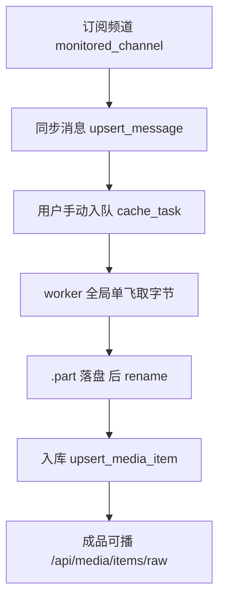

# 入库流水线评估：流程与存储（2026-09-21）

> 状态：**评估完成，未实施**。
> 触发：项目所有者提出「整套流程需要详细评估，出流程设计图……功能上没大问题，但是文件的存储和流程上可能有问题」，并指出 TG 页面出现 **2 个「入库流水线」**。
> 结论前置：**主干流程是对的**（订阅 → 同步 → 手动入队 → 取字节 → 入库 → 播放），问题集中在**文件命名与磁盘真值判定**两处——前者会造成「清一条、另一条变死链」，后者会让「已缓存」与「能播放」长期脱节。另有 7 处资源泄漏/账目问题与 10 处流程一致性问题。全部结论均已落到 `文件:行号`。

---

## 1. 主干流程

关键事实：

- **不存在自动缓存**。`monitor::sync_once` 只 `upsert_message`（`orig-tg/src/monitor.rs:63-84`）；`autoCache / auto_cache / 自动缓存 / autoDownload` 全库零命中。入库必须由用户点击触发。
- **字节就是成品本体，无第二份拷贝**。媒体库播放读 `media_item.file_path`，TG 端点读 `media_message.file_path`，指向同一文件（`orig-tg/src/routes.rs:2101-2136` / `:617-625`）。
- **三张表在同一个 SQLite 文件**：`cache_task`、`media_item`、`media_message` 同库（`orig-tg/src/store.rs:279` + `:343` 调 `media::migrate`），库路径由 `ORIG_TG_DB` 决定。
- **图片不落盘**：走 `import_photo_item`，`file_path = NULL`（`routes.rs:854`）。图片条目天然没有字节，回收语义与视频不同。

### 触发入口清单（全部入队走 `POST /api/tg/cache/tasks`）

| 位置 | 粒度 | 备注 |
|---|---|---|
| `tauri-shell/src/components/TgPanel.tsx:1712-1719` | 单条 | 消息行「缓存」 |
| `TgPanel.tsx:1937-1943` | 整组 | 相册组，带 `groupId` |
| `TgPanel.tsx:1703-1707` | 单条 | 图片「加入媒体库」，**不走缓存端点**，直接入库 |
| `MediaCard.tsx:217-227` / `MediaLibraryPanel.tsx:354-367` | 单条 | 「重新缓存」 |
| `SeriesDetail.tsx:154` / `:660` | 单集 | 「重新缓存」 |

---

## 2. 存储布局与落盘规则

**目录判定**（`orig-tg/src/routes.rs:697-707`）：请求 `dir` > DB `app_setting.download_dir` > `config.download_dir`（env `ORIGIG_TG_DOWNLOAD_DIR`，默认 `~/Downloads`，`config.rs:52-60`）。

**文件名**（`orig-tg/src/grammers.rs:419-431`），全部平铺、无子目录：

- 图片：`photo-{chat}_{msg}.jpg`（`:421`）
- 有文档名：`sanitize_filename(&name)`（`:426`）——**不含 chat/msg**
- 无文档名：`doc-{chat}_{msg}.{ext}`（`:430`）

**写入过程**：`PartFile::create` 写 `{filename}.part`（`:773`）→ 完成 `persist()` rename（`:798`）→ 未 persist 被 Drop 则删半成品（`:806-810`）。

**清理判定**：`inside_dir`（`cache.rs:71-85`）只认「生效下载目录内」的文件，外部导入文件永不删（`cache.rs:12` 铁律）。

---

## 3. 问题清单

### P0 · 会造成数据或体验事故

**3.1 文件名撞车 → 两个条目共享同一份字节**（最严重）
`sanitize_filename(&name)`（`grammers.rs:426`）生成的名字**不带消息标识**，且落盘层**无幂等**——同名文档直接 rename 覆盖（`grammers.rs:798`）。
后果：两个不同 `(chat,msg)` 的 `media_item` 指向同一 `file_path`。清掉其中一条 → 文件被 unlink，另一条变死链，但 `reset_tg_flag` 只复位自己那条（`cache.rs:575-582`）→ **界面显示「已缓存」，点开 404**。

**3.2 判定「能不能播」看数据库字段，不看磁盘**
`hasBytes` 后端按 `file_path IS NOT NULL`（`api/media.ts:103-106`），不是 stat 磁盘。
后果：手工删掉文件后仍判可播 → 点开 404，且不出现「重新缓存」入口，用户无从恢复。

### P1 · 资源泄漏与账目错

| # | 问题 | 证据 | 后果 |
|---|---|---|---|
| 3.3 | `.part` 残留不可回收 | 孤儿扫描**显式跳过** `.part` / `.tmp`（`cache.rs:292-297`、`:335-337`） | 强杀/断电后残留永久留盘，既不删也不报，不计入任何统计 |
| 3.4 | 改过下载目录 → 旧字节永不删 | `cache_task.dir` 是**死列**（建表 `store.rs:320-334` 有，SELECT 清单 `store.rs:133-152` 无）；worker 读当前设置 `routes.rs:1082` | 旧目录文件不再满足 `inside_dir` → `purge_item`（`cache.rs:214-219`）与 `delete_media_item`（`routes.rs:1963-1966`）双双跳过 |
| 3.5 | 目录不存在 → 清理全线静默失效 | `inside_dir` 首行 canonicalize 失败即返回 false（`cache.rs:72-74`） | 所有条目瞬间变 `external`，`POST /api/cache/clear` 返回 `removed=0` 却 `ok:true`，用户以为清干净了 |
| 3.6 | 磁盘账三套口径 | `stats` 只遍历 `media_item WHERE file_path IS NOT NULL`（`cache.rs:733-757`）；四档清理的 `bytesFreed` 是另一套口径；真实目录占用第三套 | 显示占用 < 实际占用，孤儿与 `.part` 完全不计 |
| 3.7 | 退订频道不清任何东西 | `remove_monitor_channel`（`routes.rs:1400-1408`）只删 `monitored_channel` + `sync_cursor`（`store.rs:420-434`） | 字节与条目全残留，唯一暴露面是无标题的裸 `chatId`（`cache.rs:241-246`、`:527-531`） |
| 3.8 | 清理契约不对称 | `clear_downloaded`（`store.rs:1060`）无条件 `remove_file`，**没有 `inside_dir` 守卫** | 与 `cache.rs:12` 铁律「外部文件永不删除」分家 |
| 3.9 | 默认下载目录两份 | `ORIG_TG_DOWNLOAD_DIR` **只有 Tauri 注入**（`tauri-shell/src-tauri/src/lib.rs:418`、`:438` = `…/tg/downloads`）；daemon 从不注入（`orig-daemon/src/state.rs:145-172`） | 两种启动方式默认把字节写到不同目录，与 DB 里的 `download_dir` 设置互相纠缠（**推测**：这是「存储有问题」最直观的体感来源） |

### P2 · 流程与一致性

| # | 问题 | 证据 |
|---|---|---|
| 3.10 | 任务去重只在活跃态：部分唯一索引只覆盖 `queued/running`（`store.rs:335-337`），终态后再次入队会 INSERT 新行（`store.rs:691-728`） | 记录增生 |
| 3.11 | **两个一模一样的「入库流水线」入口**（见 §4） | 纯重复 |
| 3.12 | 入库成功后媒体库不刷新：仅在挂载/切视图重取（`MediaLibraryPanel.tsx:200-209`），`invalidateCache` 只在自身写操作后调（`:406`） | 用户停在媒体库时新成品不出现，切走再回才可见（**推测**） |
| 3.13 | 失败原因两处口径不同：面板显示 `task.error` 英文原文（`CacheManagerDialog.tsx:258-262`），feed 侧有中文映射（`TgPanel.tsx:637-642`） | 同一失败两种说法 |
| 3.14 | 端点命名空间分裂：入队/取消走 `/api/tg/cache/tasks*`（`api/tg.ts:309`、`:335`），重试/删记录/清档走 `/api/cache/tasks*`（`:343`、`:351`、`:381`） | 同一张表两个域 |
| 3.15 | 回溯能力基本缺失：媒体库网格/编辑弹窗/播放器均不显示 `source` / `ref`，仅剧集分集行有小徽标（`SeriesDetail.tsx:733-736`） | 成品无法回溯到订阅源 |
| 3.16 | 组任务直达只覆盖首条 `messageIds[0]`（`CacheManagerDialog.tsx:497`）；`libRefCache` 存 `null` 后不复查（`:500-508`） | 命中后仍长期报「尚未入库」（**推测**） |
| 3.17 | 回收能力两套 UI：`CacheBytesPanel` 与 `ItemEditDialog.tsx:185-193`（后者文案**硬编码中文**，不走 i18n） | 违反 `SettingsPanel.tsx:988-992` 注释亲自警告的反模式 |
| 3.18 | 轮询缺失败退避：`CacheManagerDialog.tsx:449-453` 5s 周期，`load` catch 只 setErr、不减速 | 违反 AGENTS.md §5「失败退避」 |
| 3.19 | 文案残留：`tg.download`="缓存"、`tg.caching`="缓存中"、`tg.statusRunning`="缓存中"（用于流水线徽标 `CacheManagerDialog.tsx:52`）、`tg.cacheTaskHint` 一句内「缓存」「入库」混用；设置页入口仍叫「清除缓存文件」却打开标题「入库流水线」的面板 | 概念回潮 |
| 3.20 | TgPanel 挂 dialog 时未传 `onTasksChanged`（`:1607-1613`），仅设置页传了（`SettingsPanel.tsx:997`） | 联动不一致 |

---

## 4. 关于「为什么有 2 个入库流水线」

`TgPanel.tsx:1050-1072`（顶栏常驻，`data-testid="tg-cache-manager-entry"`）与 `TgPanel.tsx:1479-1500`（频道详情头部）是**两个一模一样的按钮**：

- SVG path 逐字相同（`:1068` vs `:1496`）
- 文案键同为 `tg.cacheManager`
- onClick 同为 `setCacheManagerOpen(true)`，均无 disabled、无参数
- 两处都渲染 `:1607-1613` 的同一个 dialog，未传 `initialView`

**唯一差异**是 `title`：顶栏用 `tg.cacheManagerHint`（明写「与当前选中的频道无关」），详情头用 `tg.cacheManager`。

即：**零 scoping 差异，纯重复**。但用户会自然读成「全局 vs 本频道」两个不同东西——顶栏那个 `tgServiceUp` 时常驻，详情头那个只在选中频道时出现。

设置页确有第三个入口 `SettingsPanel.tsx:889`，但它传 `initialView="bytes"`（`:993-999`），落在回收页签，目标不同，**不算重复**。

---

## 5. 与既有设计文档的关系

`docs/design/telegram-cache-storage-redesign.md`（196 行，状态「设计分析，未实现」）提出过 `cache_status` / `cache_progress` / `external_ref` / `link_url` / `media_link` 表。

- **已被取代的部分**：它第 2 节写的「缓存无进度、无状态」已被 `cache_task` 表 + 流水线面板解决（`store.rs:320-334`、提交 `9bee7b8`）。
- **仍然成立的部分**：`external_ref` / `link_url` 的缺失，正是本次 §3.15「回溯能力缺失」的根源。两份文档在这一条上**结论一致**，不冲突。
- 实施时应以本文件为准更新那份文档的 §1 现状表。

`docs/TG_MEDIA_LIFECYCLE_DESIGN.md` 未在本次复核范围内，实施前需确认是否也已过期。

---

## 6. 建议的处理顺序（待拍板）

1. **先修 P0 两条**：文件名带 `(chat,msg)` 唯一化 + 播放前/列表渲染前校验文件存在。这两条是唯一会造成「用户看到已缓存却播不了」的。
2. **再收 P1 的资源账**：`.part` 纳入孤儿扫描、`dir` 死列启用或废弃、`inside_dir` 失败改为显式报错而非静默 0、统一磁盘账口径。
3. **最后清 P2 的一致性**：删重复入口、统一文案、补失败退避、接 `onTasksChanged`。

每一项都是独立可提交的改动，不互相阻塞。
