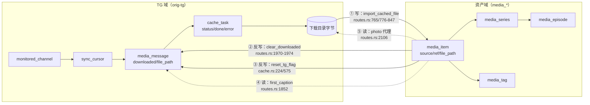

# 入库流水线 → 媒体库 重构评估（2026-09-21）

> **状态：评估完成，未实施。** 本文是本次评估的**完整载体**（需求边界 + 技术评估 + 裁定 + 待拍板）。
> **参与**：许清楚（PM，需求边界）、高见远（架构师，技术评估）；齐活林（主理人）编排、抽查、仲裁与汇编。
> **不重复的兄弟文档**（勿混）：
> - `docs/bugs/BUG-098.md` —— 缺陷登记（评估档，精炼版结论 + 验收口径）
> - `docs/bugs/BUG-103.md` —— 本次评估过程中**已实测复现**的具体缺陷（含止血实施记录）
> - `docs/design/ingest-pipeline-assessment.md` —— 另一条线：**文件命名撞车 / 磁盘真值判定 / `.part` 残留**（亦未实施）

---

## 0. 结论前置

**不需要推倒重来，做四处增量。** 域边界其实已经存在（`cache.rs:12` 注释明写「缓存模块不得认剧集」），
TG 域与资产域之间只有**一个契约** `(source="tg", ref="{chat}:{msg}")`（`media.rs:236` `UNIQUE(source, ref)`），
契约没散，改造可收口。

真正需要所有者拍板的是**一项策略选择**（入库时机 + 未就绪条目可见性）；其余三项（状态、来源、事件）是补缺。

**根因一句话**：不是「两套状态没打通」，而是**资产域根本没有自己的状态**——`media_item` 的行存在被绑死在
`file_path` 上，「登记」与「就绪」被压成同一个动作（`import_cached_file`）。

---

## 1. 需求边界（PM 许清楚）

### 1.1 诉求拆解：三条真缺口 + 两处「以为没有其实已有」

| # | 所有者原话（产品语言） | 现状事实 | 判定 |
|---|---|---|---|
| 1 | 元数据登记与字节就绪应分离 | **方向相反**：字节先落盘，条目才建立（`routes.rs:765→776`）。唯一例外是图片（`import_photo_item:854`，BUG-049 无字节也入库） | 未满足（**真缺口** P0） |
| 2 | 媒体库应有独立资产状态；TG 完成后通知更新 | 媒体库**无状态列**（`media.rs:223` DDL），`has_bytes` 由 `file_path IS NOT NULL` 派生（BUG-080）且对 TG 图片有例外分支；**无事件总线**，`push_log` 只是日志 | 未满足（**真缺口** P0） |
| 3 | 入库后流水线记录应可清空删除 | `cache_task` 可删（终态）；**`media_message` 全仓无任何清理入口**（`remove_channel` `store.rs:420-434` 只删频道+游标，消息行原地残留） | 部分（**真缺口** P1） |
| 4 | 媒体库应记录来源（频道/消息）以追溯跳转 | **已有** `source`+`ref`+`UNIQUE(source,ref)`；`monitored_channel.username` 也在。缺的是①人类可读快照②多来源扩展位③跳转判据 | **错位**：不是没有，是不可扩展（P1） |
| 5 | 媒体库应支持完全删除 | **单条已完整支持**（`routes.rs:1951-1986`：删下载目录内字节 + `clear_downloaded` + 删标签/分集 + prune 空剧集）。批量是前端 `for` 串行调单条（`MediaLibraryPanel.tsx:421`），**无批量端点** | **错位**：缺的是批量 + 冲突规则（P1） |

### 1.2 边界划分

| 维度 | 流水线域（TG） | 资产域（媒体库） |
|---|---|---|
| 职责 | 发现 + 传输 + 重试 | 编目 + 呈现 + 生命周期 |
| 状态机 | `cache_task.status`（过程态） | **应有**：`registered` / `ready` / `missing`（**不设 `deleted`**——硬删即删行） |
| 产出物 | 字节（下载目录内）、一次性传输记录 | `media_item` + 剧集/标签编排 |
| 归属 | `cache_task` 归流水线，终态可自清 | `media_item` 及其字节归媒体库，**只有媒体库能删条目** |

三条关键裁定：
- **「入库」必须拆成两个动作**：`登记`（写 source/ref/元数据，媒体库主导，**可无字节**）＋ `就绪`（字节到位，流水线回调）。
  现在二者耦合在 `import_cached_file` 一处 —— 这是诉求 1 的根因。
- **字节未就绪的条目应当存在且可辨识**（与 BUG-049 图片条目现有体验一致，不要另起一套）。
- **`media_message` 的处置权归媒体库裁决** —— 它既是流水线订阅索引，又是诉求 4 的跳转依据，「清了就跳不动」是资产域的代价。

### 1.3 多来源抽象要求

来源模型需携带**四者分离**的信息：① `source_type`（枚举）② 结构化 locator ③ 展示名快照（脱机可显示）
④ 跳转能力。**「跳转」是来源的能力，不是条目的字段。**

> ⚠️ 本节中 PM 提出的「只有 TG 可跳转、其余降级为定位提示」分级，**已被所有者澄清推翻**，见 §3.1。

### 1.4 清理/删除功能分级

| 级别 | 做什么 | 不做什么 | 代价 |
|---|---|---|---|
| **L0（现状）** | 单条完全删除、`cache_task` 终态清理、清字节保留条目 | 批量、条件筛选、策略配置 | 无；批量只能前端循环调单条，无原子性、无影响面预览 |
| **L1（推荐目标档）** | 多选删除 + 按筛选删除（来源/kind/无字节/时间）+ 删除前影响面预览（N 条目 / M 剧集 / K 字节） | 不改删除语义、不做自动化 | 中；需批量端点 + 预演接口 |
| **L2** | 删除策略可配置（字节处置/剧集处置/TG 索引处置） | 不做定时、不做回收站 | 中高；状态组合变多，必须有明确默认值 |
| **L3** | 生命周期自动化（回收站/软删+保留期、磁盘水位自动清字节） | — | 高；需状态列+定时+恢复语义，数据风险最高。**本期不做** |

### 1.5 冲突点（对应所有者说的「和下载的内容、分类有冲突」）

| # | 冲突 | 现状行为 | 建议默认 |
|---|---|---|---|
| C1 | 删条目后剧集空壳 | `prune_empty_series`（`media.rs:1088`）**无条件** prune | 自动成剧（`source_key` 非空）可 prune；**手工剧集保留空壳** |
| C2 | 外部导入文件删不删 | `inside_dir(下载目录, path)` 为真才删（`routes.rs:1962-1967`） | **沿用**：只删自己产出的字节 |
| C3 | 在途下载任务关联的条目被删 | 任务完成后 `upsert_media_item` 会把条目「复活」 | 删条目时先取消在途 `cache_task` |
| C4 | 清字节后还能否重新获取 | TG 可以（ref 在）；本地扫描来源**不可** | 「清字节」仅对可重取来源开放 |
| C5 | 图片（`file_path=NULL`）的完全删除删什么 | 无字节可删，只删行 | 文案区分「删除字节」与「移除条目」 |
| C6 | 清 `media_message` 索引 vs 保留跳转 | 无清理入口 | 与诉求 4 直接冲突 → 见 §4 |

---

## 2. 技术评估（架构师 高见远）

### 2.1 现状耦合：不是「一个调用点」，而是一个契约 + 5 条跨界调用

5 条调用全部建立在 `(source="tg", ref="{chat}:{msg}")` 上 —— 这是好消息：**契约没散，改造可以收口在一处**。

### 2.2 逐条评估

| # | 现状判定 | 结构性根因 | 结论 |
|---|---|---|---|
| 1 | 错位：实际顺序是「TG 元数据 → 媒体库**不可见** → 用户点缓存 → 字节 → 才建条目」 | 条目存在被绑死在 `file_path`，两域之间**没有「未就绪」这个状态** | 增量：补状态 + 可见性策略 |
| 2 | 确实缺口（P0） | 状态分散编码在三处且无权威约定 | 增量：补 `asset_state` |
| 3 | 部分符合 | 「流水线内容」含两层，第二层是重缓存坐标，删了会失联 | 增量，**删前需确认已入库** |
| 4 | 部分符合 | 资产域没有承载「来源」的结构，只有两个字符串列 | 增量：加一层，不删旧列 |
| 5 | 单条已有，批量缺 | `kind` 一身二用；photo 无字节 → 「完全删除图片」只删行；清字节留条目与「删」混在同一 UI | 增量：三层分离 |

**「元数据先行入库」会带来什么**（针对诉求 1，务必先知）：
- **满屏空条目**：`monitor.rs:18` 每频道每轮 `SYNC_LIMIT=100` 且整窗口幂等 upsert → 媒体库被未缓存内容淹没；
- **图片例外分支稀释**：`import_photo_item` 是唯一「无字节也入库」路径，一旦全面先行，`file_path=NULL` 从例外变常态；
- **空条目会被编进剧集**：自动成剧的门是触发器 `trg_media_episode_*`（`media.rs:472-495`），**只卡 `kind` 不卡字节**
  → 出现「有集数、无内容」，而 `has_bytes` 目前只挂在 `EpisodeView`（`media.rs:643`），网格没有；
- **重新缓存的幂等不受影响**：`COALESCE(excluded.file_path, …)`（`media.rs:907`）与 `set_item_file_path(None)`（`media.rs:935`）配合正确。

### 2.3 目标结构（四处增量）

1. **状态机**：`media_item.asset_state`（`pending` / `ready` / `missing`；**不设 `deleted` 终态**）。
   - `asset_state` = **权威**（只有资产域写）；`media_message.downloaded` 与 `cache_task.status` = **镜像**（仅作通知源）。
   - **关键约束**：必须可由「`file_path` + 磁盘 stat」重算（`reconcile_asset_state`）——「权威但可自愈」是事件丢失不永久错乱的唯一保障。
   - 现有派生的 `has_bytes` 保留为只读，语义改为 `asset_state='ready'` 且**以 stat 为准**（顺带修「看 DB 不看磁盘」）。
2. **来源模型**：**不推倒 `source`/`ref`，加一层** `media_origin(item_id, kind, locator, channel_id, message_id, account, url, captured_at)`。
   - `kind` 枚举 `tg|local|s3|oss|webdav|netdisk`；**易变部分（endpoint/region/bucket）进 `account`，不进 `locator`**；
   - 存量按 `source='tg'` + `ref LIKE '%:%'` 回填，`locator` 复制 `ref`；
   - 频道名**不复制进 `media_item`**（会过期），前端按 `channel_id` 查 `monitored_channel`（`store.rs:283-288`）；
   - **同内容多源**不是放宽 `UNIQUE(source, ref)`，而是走已存在的 `media_episode_source`（`media.rs:367`）。
3. **通知**：进程内 `broadcast` 总线（容量 256，允许慢消费者丢事件）+ 新增 `GET /api/tg/events`（SSE）。
   - **事件是加速信号，不是唯一真相**：收到→立刻刷新那一块；没收到→5s 轮询兜底；**不缩短轮询**（BUG-030 上限不变）；
   - SSE 每次（重）连成功触发 `reconcile_asset_state()` 全量对账；
   - `push_log` **保留**：日志给人看、事件给机器读，并行不悖。
4. **清理三层**：L1 `cache_task` 台账（已有）/ L1′ `media_message` **已入库行**（新增）/ L2 字节（已有）/ L3 `media_item` 条目（单条已有，**批量新增**）。
   - **L2 永不写 L3，L3 可写 L2** —— 与 BUG-096 单向不变量不冲突；新增的 L1′ 是第三向，与两者都不冲突。

### 2.4 任务分解

| ID | 任务 | 文件 | 依赖 |
|---|---|---|---|
| T01 | `asset_state` 列 + 迁移 + 全写路径收口 + `reconcile_asset_state` | `orig-tg/src/media.rs`、`routes.rs`、`cache.rs` | 拍板① |
| T02 | `media_origin` 表 + 回填 + 来源查询端点 + 迁移单测 | `orig-tg/src/media.rs`、`routes.rs` | 无（建议 T01 后合，避免同批 schema 冲突） |
| T03 | broadcast 总线 + `/api/tg/events` + 前端订阅 + 断线回落 + 重连对账 | `orig-tg/src/state.rs`、`routes.rs`、`tauri-shell/src/api/tg.ts`、`store/useStore.ts` | T01、拍板③ |
| T04 | 批量删条目 + `media_message` 已入库清理 + UI 三层分离 | `orig-tg/src/routes.rs`、`cache.rs`、`CacheBytesPanel.tsx`、`MediaLibraryPanel.tsx` | T01、拍板② |
| T05 | 可见性策略 + 无字节条目呈现 + i18n 文案统一 | `MediaLibraryPanel.tsx`、`MediaCard.tsx`、`src/i18n/` | T01、T02 |

### 2.5 反例与踩坑预警（实施时逐条避让）

1. 加 `asset_state` 列但**只在新链路写** → `import_photo_item`、`import_media_items`、扫描三条老链路不写 → 状态说谎。**必须收口到唯一写入函数**。
2. 把 `has_bytes` 换成列并删掉派生 → 派生值天然自愈；换成列就引入「磁盘被手工删但状态没更新」的**永久谎言**。**保留派生**。
3. 为「来源」给 `media_item` 加 `channel_id`/`message_id` 列 → 把 TG 概念灌进资产域，将来每加一种来源多一列 → 列爆炸且稀释 `UNIQUE(source, ref)`。走独立表。
4. `monitor.rs` 里直接 `upsert_media_item` 做元数据先行 → 满屏空条目 + 空条目进剧集（见 §2.2）。
5. 直接 `DELETE FROM media_message` 无条件清空 → `cached_path`（`routes.rs:718`）失去幂等坐标。
6. 给 `POST /api/cache/clear` 加 `deleteItems=true` 复用端点 → 「清字节」与「删条目」混成一端点，突破 BUG-096 单向边界。**必须独立端点**。
7. 把引用新列的 `CREATE INDEX`/`UPDATE` 放进 `execute_batch` → BUG-032，整批失败 → `Store::open` 失败 → 表现像「用户数据全没了」。
8. 上了 SSE 就删掉轮询 → SSE 静默断线时 UI 永久冻结。
9. 为「删除」新增正向级联（删 `cache_task` → 删 `media_item`）→ 直接违反 `AGENTS.md` §5 的 BUG-096 铁律，**禁止**。
10. 把事件当唯一写入路径 → 事件丢失即状态错乱。事件只通知，状态仍由写路径落库 + `reconcile` 兜底。

---

## 3. 所有者澄清（优先级高于上述评估）

### 3.1 来源模型统一，跳转能力不是区分点

> 「网盘/OSS/S3 跳转」和 TG 一样都是「来源 → 入库」。

据此**推翻** PM 的分级判断（§1.3 的警示）：四类来源在入库模型上**完全同构**，差异只在各自携带的定位字段。
目标流程统一为 `来源 → 登记（media_item + media_origin）→ 取字节 → 就绪 → 呈现`。
`media_origin` 的价值回归为「**承载非 TG 来源的定位信息 + 存量 ref 回填**」。

### 3.2 `remote` 本期不做

状态机收缩为三态：`pending` / `ready` / `missing`。`remote`（无本地字节、按需从源站取）不进本期状态机，
也不为 photo 特设（photo 继续沿用 `file_path=NULL` + BUG-049 代理链路）。

### 3.3 同一内容多来源/多版本，剧集一集可对应多个视频且要有主次

> 「一部视频可能来自不同频道，也可能有不同码率/压片版本；剧集里第 1 集可能对应多个视频，要有主次。」

**核查结论：该能力已完整实现（BUG-039），属第三处「以为没有其实已有」的错位。**

- 主版本 = `media_episode.item_id`；备用来源 = `media_episode_source(episode_id, item_id)`
  （`media.rs:366-376`，注释即「同一 (season, episode_no) 槽位的**主条目之外的备用来源**」；`item_id` **全表 UNIQUE**）。
- 主备切换 `switch_episode_source`（`media.rs:1719`）用 `BEGIN IMMEDIATE` 事务包住「删备用行 + 原主降级为备用 + 主位换新」，
  注释明确不留「两个主」。
- 前端已暴露：`SeriesDetail.tsx:695-708` 渲染同槽备用来源，点击即切主；`media.ts:375/383` 提供
  `attachEpisodeSource` / `switchEpisodeSource`。
- 已知边界：备用源**只接受 video**（触发器 `media.rs:485-495`，BUG-044 不变量）。

**由此收窄范围**：多版本/主次不需要新建能力。但 **`merge_series` 与这套语义分叉**，且分叉已造成实测缺陷 —— 见 §5。

---

## 4. 主理人仲裁与待拍板

### 4.1 已仲裁（如无异议即按此实施）

补充取证两项后收口：

- **证据 1（清空 `media_message` 的真实代价比「失联」轻）**：`first_caption`（`routes.rs:1852`）是**唯一**
  从 `media_message` 反查 caption 的读路径，且只在**导入/重新入库**时调用，已有 `derived.unwrap_or(title)` 兜底；
  已入库条目的 `title`/`description` **已落进 `media_item`**。故后果是「再次导入时拿不到真实 caption」，
  不是「内容失联」。
- **证据 2（三处轮询确为 5s）**：`CacheManagerDialog.tsx:451`、`MainLayout.tsx:64-67`、`TgPanel.tsx:582`
  均为 `setInterval(…, 5000)`。SSE 的收益是「瞬时刷新 + 无事降频」，不是修一个已坏的东西。

| # | 议题 | 仲裁 | 理由 |
|---|---|---|---|
| ① | 未就绪条目可见性 | **采纳架构师方案**：默认**不进媒体库主网格**，走独立「待获取」视图；**但媒体库顶部常驻「待获取 N 条」入口** | 满屏空条目 + 空条目进剧集是不可接受的回归（§2.2）；同时用「可发现」而非「混排」回应 PM 的顾虑 |
| ② | `media_message` 清空 | **两方方案合并**：只清「已入库」行且**保留 `downloaded=1` 行**（架构师约束）＋ 清空前把 `channel_id`/`message_id`/频道名/username/消息时间 写入 `media_origin`（PM 快照，**由 T02 顺带承载，零额外表**） | 结合证据 1，快照最小集合即 `media_origin` 既有列，无需给 `media_item` 加列（避免踩坑 3） |
| ③ | 本期是否上 SSE | **本期不做，先补状态** | 诉求 2 的痛点是「没有状态」而非「更新慢」；SSE 要额外处理断线重连与对账。**前提**：T01 的 `asset_state` 必须「权威但可自愈」 |

### 4.2 待拍板

| # | 议题 | 选项 | 推荐 |
|---|---|---|---|
| P1 | 合并同集两来源：同槽归并 vs 续编成两集 | A 同槽归并（一集两来源、有主次）/ B 维持续编 | **A**（契合 BUG-039 已有能力与所有者直觉）；代价：需新增「是否同一集」的判定与「谁当主」的规则。**此项阻塞 BUG-103 正修** |
| P2 | 批量删除范围 | A 仅多选 / B 多选 + 按筛选 / C 再加全量清空 | **B** |
| P3 | 删条目的字节处置默认 | A 只删下载目录内 / B 连带删外部文件 / C 每次弹窗 | **A** |
| P4 | 剧集空壳：自动成剧删、手工剧集留 | A 按 `source_key` 区分 / B 一律保留 | **A** |

---

## 5. 本次评估过程中已发现的缺陷

| 编号 | 标题 | 状态 |
|---|---|---|
| **BUG-103** | 合并剧集丢失分集备用源，且孤儿行永久阻塞该条目再挂载 | **in_progress**：止血已实施并通过独立验证；正修待 P1 拍板 |

**BUG-103 摘要**：`merge_series`（`media.rs:1386-1545`）全程不碰 `media_episode_source`（该区间零命中），
`:1511` 删源分集后备用源行 `episode_id` 悬空；该表 `item_id` 全表 UNIQUE，孤儿行占住后
`attach_episode_source` 报 `UNIQUE constraint failed`（`ON CONFLICT` 只覆盖组合约束，不走 DO NOTHING），
跨重启仍残留、用户无法自愈。**根因是两套多来源语义分叉**：BUG-039 备用源（同槽多来源）vs BUG-037 合并（续编成新集号）。

---

## 6. 交付状态与未提交改动（重要）

**本轮为评估 + 文档，未实施 §2.4 的任何任务。** 工作区存在两类改动，且**与并行会话的改动同处一批文件**：

| 文件 | 内容 | 状态 |
|---|---|---|
| `docs/bugs/BUG-098.md` | 评估档（新建） | 未提交 |
| `docs/bugs/BUG-103.md` | 缺陷档（新建） | 未提交 |
| `docs/bugs/README.md` | 上述两条索引行 | 未提交 |
| `docs/design/ingest-pipeline-redesign-assessment.md` | 本文 | 未提交 |
| `download-engine/crates/orig-tg/src/media.rs` | **BUG-103 止血代码**（`:1508-1530`）+ 测试改写（`:4049`） | 未提交 |

⚠️ **`media.rs` 同时含并行会话的改动**。直接 `git add media.rs` 会把他人改动卷入本主题的提交 —— 提交前必须先分离
（或等并行会话落地后再提交）。

**止血代码的验证状态**（已完成，可放心保留）：
- `cargo test -p orig-tg media::tests` = **27 passed / 0 failed**；
- **反向证伪通过**：注释掉 `:1524-1530` 后测试 FAIL（`media.rs:4105` `left: 1, right: 0`）→ 测试真守护、非假绿；
- 边界抽查：目标剧集自带备用源合并后**原样保留**，排除「`?1` 误绑 `target_id`」这一最危险错法。

---

## 7. 抽查记录（主理人对成员结论的复核）

| 来源 | 引用 | 复核结果 |
|---|---|---|
| 架构师 | `media_episode_source` 存在（`media.rs:367`） | ✅ 属实 |
| 架构师 | `SYNC_LIMIT = 100`（`monitor.rs:18`） | ✅ 属实 |
| 架构师 | `UNIQUE(source, ref)`（`media.rs:236`） | ✅ 属实 |
| 架构师 | 「自动成剧只卡 kind 不卡字节」引用 `media.rs:401-413` | ⚠️ **行号不准**：该处是**迁移清理逻辑**；论断仍成立，真正的门是触发器 `trg_media_episode_*`（`media.rs:472-495`） |
| PM | `remove_channel` 只删频道+游标（`store.rs:420-434`） | ✅ 属实（消息行原地残留） |
| PM | `prune_empty_series` 无条件 prune（`media.rs:1088`） | ✅ 属实（不区分自动成剧/手工剧集） |
| PM | 非 TG 来源默认 `source="local"`（`routes.rs:1809`） | ✅ 属实 |
| 架构师 | 三处轮询均为 5s | ✅ 属实（`CacheManagerDialog.tsx:451`、`MainLayout.tsx:64-67`、`TgPanel.tsx:582`） |

---

## 8. 下一步

1. **拍板 §4.2 的 P1**（阻塞 BUG-103 正修）—— 其余 P2/P3/P4 可并行拍。
2. 拍板后按 §2.4 开工：**T02 不依赖任何拍板项**，可最先做。
3. 提交前先解决 §6 的「同文件混改动」问题。
