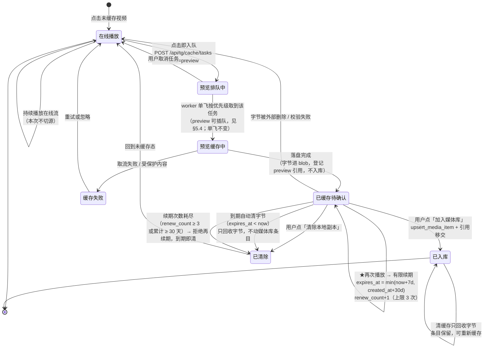
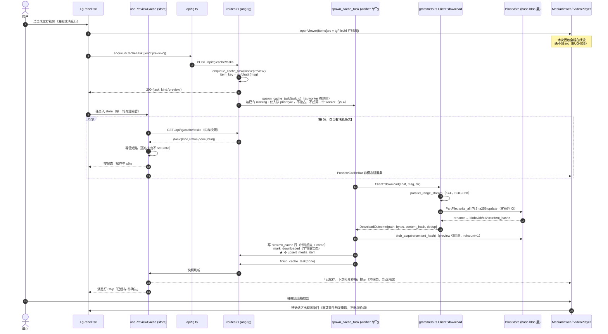
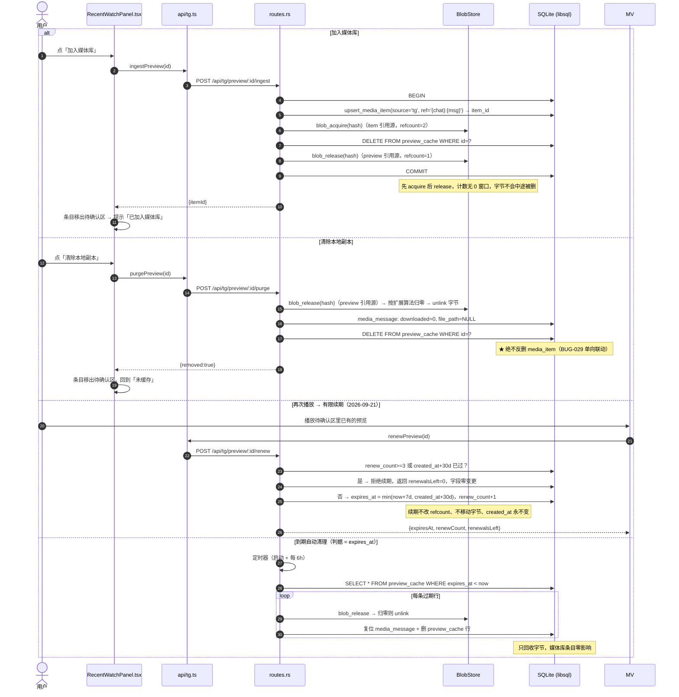
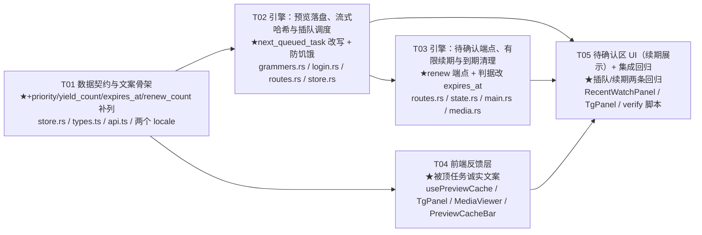

# 方案⑤「预览缓存 + 待确认入库」设计与任务分解

> 状态：**设计定稿，待实现**。
> 触发：用户质疑「点了视频没有入库、也不自动缓存，我就是想先看一下」。
> 裁定：点击即入队 `kind=preview` 的缓存任务；**本次播放不切源**；落盘后进入「最近观看（N）」待确认区；7 天未确认自动清字节（不动媒体库条目）。
> 硬约束：本文档**不修改任何代码**，只定义契约与任务。
> 关联：`docs/design/telegram-cache-storage-redesign.md`（hash blob 存储改造，并行进行中）、AGENTS.md §5（BUG-027/028/029/030/031/032/033）。
>
> **2026-09-21 拍板（原 §11 两项待拍板已决议，本文已按决议改写）**
> 1. **预览任务允许插队**：`cache_task` 加 `priority` / `yield_count`，`next_queued_task` 改为「优先级 → 防饥饿提升 → FIFO」。**原「FIFO 零改动」承诺作废**，单飞（BUG-027）不变。见 §5.1、§5.4。
> 2. **7 天倒计时改为有限续期**：再次播放刷新 7 天，封顶 **≤3 次续期 / 累计 ≤30 天**。见 §4.2、§5.2。

---

## 1. 用户故事与要解决的问题

### 1.1 原始诉求

> 「不存在自动缓存这点有点异议，比如一个视频我点击了，这时候没有入库，但是其实是想播放先看下。这样的流程如何处理，不做自动缓存吗？我点了下应该就要开始缓存了吧？」

### 1.2 拆成用户故事

| # | 作为… | 我想… | 这样我就能… |
|---|---|---|---|
| US-1 | 浏览频道的人 | 点开一个没缓存的视频就能立刻看 | 不用先等一次完整下载 |
| US-2 | 同上 | 点开之后后台就开始缓存 | 关掉窗口也留得下痕迹，下次能秒播 |
| US-3 | 同上 | 在看的当下看到「正在缓存 x%」 | 知道系统确实在干活，而不是点了没反应 |
| US-4 | 同上 | 看完后在「最近观看」里决定留还是删 | 不让我「只是瞄一眼」的东西灌进媒体库 |
| US-5 | 同上 | 落盘完成后收到一句「已缓存，下次打开秒播」 | 知道这次点击有了结果 |
| US-6 | 收尾的人 | 7 天不管的内容自动清掉本地字节（再次播放可续期，但次数封顶） | 磁盘不会被「瞄一眼」慢慢吃光，也不会「偶尔看一眼」就永不回收 |

### 1.3 现状（代码事实，对应各条故事）

| 故事 | 现状 | 证据 |
|---|---|---|
| US-1 | ✅ 能播。`TgPanel` 未缓存时 `src = tgFileUrl(...)` 走在线流 | `TgPanel.tsx:873-874` |
| US-2 | ❌ **在线播放零痕迹**：`openViewer` 只喂在线 URL，不发任何缓存请求 | `TgPanel.tsx:864-877` |
| US-2' | ⚠️ 消息行「缓存」按钮会入队，但**点了不播**（只是入队） | `TgPanel.tsx:931` `doDownload` / `:1712-1719` |
| US-3 | ❌ 播放器页**完全没有**进度条；气泡内海报只有一个转圈 + `tg.caching` | `TgPanel.tsx:2083-2088` |
| US-4 | ❌ 没有「待确认」中间态：要么不缓存，要么缓存即入库 | `routes.rs:726` `cache_one` 无条件 `import_cached_file` |
| US-5 | ❌ 无落盘完成提示 | — |
| US-6 | ❌ 无自动清理 | — |

**结论**：真正的缺口不是「不缓存」，而是**点了之后在播放器这条路径上零反馈、零痕迹**。方案⑤精准补这一环。

---

## 2. 两条必须守住的设计边界

### 2.1 「点了就该开始缓存」≠「点了就该永久入库」

用户的直觉里有一半是对的、一半需要修正，两侧都要在代码里体现出来：

| | 用户直觉 | 判定 | 落法 |
|---|---|---|---|
| 对的一半 | 「点了零反馈零痕迹是真缺陷，我要的是**可回溯 + 可继续**」 | ✅ 采纳 | 点击即入队 `kind=preview`；进度条 + 按钮态 + 落盘提示；任务落库（`cache_task`），刷新/关窗都不丢 |
| 要修正的一半 | 「点了就该永久入库」 | ❌ 不采纳 | 若点击即 `upsert_media_item`，媒体库会被「我只是瞄一眼」的内容灌满——**这正是当初要把「缓存」从「入库」里独立出来的原因**（BUG-029 把缓存定位为「订阅内容 → 媒体库」的**入库准备物**） |

**一句话口径**：点击 ⇒ 开始**准备字节**；确认 ⇒ 才**成为藏品**。字节可以在那儿躺着，但媒体库只收你点头过的东西。

### 2.2 preview 的「字节」与「入库」解耦（单向删除联动）

- **字节**在 blob 层：`<download_dir>/blobs/ab/cd/<64hex>`（路径由并行进行中的 hash blob 存储改造定稿，本文档只约定调用契约，见 §3）。
- **入库**是一个独立动作：`upsert_media_item(source="tg", ref="{chat}:{msg}", ...)`（`media.rs:888`）。
- 删除联动**单向**（AGENTS.md §5 BUG-029 / BUG-051 边界）：
  - 清预览字节 ⇒ 只回收字节 + 删 `preview_cache` 行 + 复位 `media_message.downloaded/file_path`；**绝不反查并删除 `media_item`**。
  - 历史教训：为「清了缓存就回头删条目」写过的 `delete_media_item_by_ref` 已因零调用被移除（BUG-096），**不要让它复活**。
  - 反向仍然成立：删 TG 来源条目必须连带清字节（`routes.rs:1951`），否则按 `source+ref` 幂等的 upsert 会把条目「复活」。

---

## 3. 与 hash blob 存储改造的衔接（不另发明路径）

> **对齐基准**：`docs/design/blob-store-design.md`（hash blob 存储改造，已定稿）。本节**不重新定义** blob 布局/表结构，只声明预览缓存在这套布局上的**调用契约**与**新增的引用源**。

### 3.1 契约而非实现

预览缓存落盘**复用正式入库任务的同一条落盘路径**，不新建第二条写盘通道。零新增写盘逻辑：

- `Client::download`（`grammers.rs:405-472`）仍是唯一 TG 落盘入口，`dir` 参数语义不变，`resolve_cache_dir`（`routes.rs:697-707`）不用改，`blobs/` 由 `dir` 派生。
- 预览任务与入库任务的差别**只在落盘之后**：入库走 `import_cached_file`，预览走「登记 `preview_cache` + acquire 一次引用」。

### 3.2 预览任务如何拿到 hash（流式 SHA-256，挂载点已由 blob 设计定死）

- 挂载点 = **`PartFile`**（`grammers.rs:765-812`）：结构体加 `Sha256` 字段，`write_all` 内 `update`，`persist` 前 `finalize`。`PartFile` 是单 writer 顺序落盘、无 seek，天然顺序累计，**零额外 IO**。
- `DownloadOutcome`（`login.rs:106-118`）新增两个字段：**`content_hash: Option<String>`** 与 **`dedup: bool`**（构造点 `grammers.rs:466-471` 同步改）。本文档统一称 `content_hash`，**不另造 `sha256` 字段名**。
- 落盘去向：`blobs/_tmp/<uuid>.part` → `blobs/ab/cd/<64hex>`（rename，同卷原子）；dedup 命中则删 tmp 不覆盖。
- **硬要求**：禁止「先落盘、再读一遍算 hash」。预览任务因此**自动获得**与入库任务完全一致的 hash（同内容同 hash），这是「加入媒体库时无需重新下载」的前提。

### 3.3 待确认区条目与 blob 的引用关系（预览是第二路引用源）

blob 设计的权威算法是 `refcount(hash) = SELECT COUNT(*) FROM media_item WHERE content_hash = ?`（`blob-store-design.md` §2.2），`media_blob.refcount` 是它的可重算缓存。
**预览字节没有 `media_item` 行**，因此必须把权威算法扩展为**两路引用源之和**：

```sql
-- 扩展后的权威算法（recount() 与 blob_release 的归零判定都必须用它）
refcount(hash) = (SELECT COUNT(*) FROM media_item    WHERE content_hash = ?)
               + (SELECT COUNT(*) FROM preview_cache WHERE blob_hash    = ?)
```

- `media_blob.refcount` 的含义不变：**这个和的缓存**，仍可由 `recount()` 校正、`blob_acquire` / `blob_release` 增量维护。
- 变更点必须补两条（对应 `blob-store-design.md` §2.3 的「漏一个就漂移」清单）：

| # | 事件 | 代码位置 | 动作 |
|---|---|---|---|
| 6 | preview 落盘完成 | `run_one_cache_task` 的 preview 分支 | `blob_acquire(content_hash)` → refcount 1 |
| 7 | 清除预览字节 / 7 天自动 | `POST /api/tg/preview/:id/purge` + 定时器 | `blob_release(hash)`：**按扩展后算法**判定归零才 unlink |

四个动作的引用语义：

| 动作 | 字节 | refcount | `preview_cache` | `media_item` |
|---|---|---|---|---|
| preview 落盘完成 | 写入 | **+1**（preview 源） | 新增行（计时起点） | **不写** |
| 加入媒体库 | 保留 | **+1（item 源）−1（preview 源）= 恒 1** | 删除行 | `upsert_media_item` |
| 清除本地副本 / 7 天自动 | 归零 → unlink | −1（preview 源） | 删除行 | **不动** |
| 已入库后清缓存（既有路径） | 归零 → unlink | −1（item 源，挂在 `set_item_file_path`） | — | **条目保留** |

> ⚠️ **实施要点**：「加入媒体库」必须做成 `upsert_media_item` → acquire(item) → release(preview) 的**同一事务**，中间态 refcount = 2，**绝不能**先 release 再 acquire（否则存在计数为 0 的窗口，`blob_release` 会把字节删掉）。

### 3.4 给 blob 改造的补充要求（预览态特有，三条）

1. **预览字节的 MIME 真源是 `preview_cache.mime`。**
   blob 无扩展名，投递端 MIME 按 `media_item.kind` / `media_message.mime` 判定（`blob-store-design.md` §1.3）。预览态**两个都没有 `media_item`**，只能靠 `preview_cache.mime`（落盘时从 `media_message.mime_type` 抄下来）。
   要求：`serve_local_file`（`routes.rs:2188-2215`）的 MIME 判定顺序改为 **`mime_hint` 优先 → 扩展名 → `kind`**，禁止落到 `image/jpeg` / `video/mp4` 这类兜底值（AGENTS.md §5 BUG-031）。`/api/tg/local/:chat/:msg` 与 `/api/media/items/:id/raw` **两条路径同步传入**（BUG-031：必须共用同一实现）。
2. **孤儿扫描必须把预览字节排除出「孤儿」集合（易漏，会静默清掉预览）。**
   现状 orphan 判定的 known 集合 = `list_cached_items_detail()`（即 **`media_item.file_path`**，`cache.rs:408` / `:545`）。预览字节只写在 `media_message.file_path`，**不在** `media_item` → 会被 `?scope=orphan`（回收孤儿文件）判成孤儿并 unlink，而 `media_message.downloaded` 仍为 1 → 变成「显示已缓存、文件却没了」的谎言状态。
   要求：known 集合并入 **`media_message.file_path` ∪ `preview_cache` 推导出的 blob 路径**；或等价地，让 `scan_cache_files` 的孤儿判定显式跳过 `blobs/` 子树中仍有 `preview_cache` 行的 hash。
3. **`is_in_progress` 的 `_tmp` 判定要覆盖预览任务。**
   `is_in_progress`（`cache.rs:292-297`）当前只认 `.part`/`.tmp` 后缀。blob 改造已要求补「父目录名 == `_tmp`」判定并让 `scan_cache_files` 跳过 `blobs/_tmp` 子树（`blob-store-design.md` §1.3）。预览任务复用同一 `download()`，**自动受益，无需额外改动**——但验收时必须确认预览落盘中不会被孤儿扫描打断。

---

## 4. 状态机



### 4.1 状态判定（前端与后端共用同一套口径）

| 状态 | 判定依据（**唯一真源**） |
|---|---|
| 在线播放 | 无 `preview_cache` 行 且 `media_message.downloaded = 0` |
| 预览排队中 / 预览缓存中 | `cache_task` 有活跃行（`queued`/`running`）且 `kind='preview'` |
| 已缓存待确认 | `preview_cache` 有行（且 `media_item` 按 `tg:{chat}:{msg}` 查不到） |
| 已入库 | `media_item` 按 `source='tg' AND ref='{chat}:{msg}'` **查得到** |

> ⚠️ **口径陷阱（高频错误点）**：`cache_task.status='done'` **不等于**已入库——preview 任务 done 只表示字节落盘。判「已入库」必须查 `media_item`，禁止用任务状态代替。

### 4.2 到期与有限续期规则（2026-09-21 决议：由「绝不续期」改为「有限续期」）

**三个时间字段（都在 `preview_cache`，见 §5.2）**

| 字段 | 含义 | 是否可变 |
|---|---|---|
| `created_at` | 首次落盘时刻 = **30 天硬上限起点** | **永不更新** |
| `expires_at` | 当前到期时刻，初始 = `created_at + 7d` | 续期时前移 |
| `renew_count` | 已续期次数，初始 0 | 每次成功续期 +1，上限 3 |

- **续期触发**：待确认区条目被**再次播放**时（前端调 `POST /api/tg/preview/:id/renew`）。**仅打开面板 / 浏览列表不续期**——否则「翻一翻」就等于无限续期。
- **续期算法**（服务端，幂等，同一天内重复调用不消耗次数）：

```
if renew_count >= 3                     -> 拒绝续期，返回 renewalsLeft=0，到期照清
new_expires = min(now + 7d, created_at + 30d)
if new_expires <= expires_at            -> 不回拨（不缩短），保持原值，不消耗次数
else expires_at = new_expires; renew_count += 1
```

  即两个上限**取先到者**：**续期次数 ≤ 3** 且 **自首次落盘起累计 ≤ 30 天**。
- **清理判据改为 `expires_at < now`**，不再是 `created_at < now - 7d`。
- 触发时机不变：进程启动扫一次 + 之后每 6 小时扫一次（`main.rs` 定时器）。建议 `CREATE INDEX IF NOT EXISTS idx_preview_cache_expires ON preview_cache(expires_at)`。
- 清理动作不变：`blob_release` → 按 §3.3 **扩展算法**归零才 unlink → 复位 `media_message.downloaded=0 / file_path=NULL` → 删 `preview_cache` 行 → **绝不动 `media_item`**（§2.2 单向联动 / BUG-029）。
- **续期与引用计数无关**：续期只改两个整型字段，字节原地不动，`media_blob.refcount` **零变化**。
- **已入库条目不参与到期清理**：`upsert_media_item` 时 `preview_cache` 行即被删除（§3.3），到期扫描根本扫不到它——「已入库不受影响」是结构性保证，不靠扫描时过滤。

---

## 5. 数据模型变更

### 5.1 `cache_task` 新增 3 列（`store.rs:320`）

```
kind        TEXT    NOT NULL DEFAULT 'ingest'   -- 'preview' | 'ingest'（业务分流：落盘后 import 还是 preview 登记）
priority    INTEGER NOT NULL DEFAULT 0          -- 0 = 常规（默认）；1 = 用户正在观看，可插队（§5.4.1）
yield_count INTEGER NOT NULL DEFAULT 0          -- 被 preview 插队让位的次数，防饥饿阈值 MAX_YIELD=3（§5.4.4）
```

- **只设 0/1 两档优先级**，不做连续分值：插队要回答的是「是不是用户眼下在等」，不是「谁更重要」；多档只会引入调参和不可复现的排序。
- **新增列而非复用既有字段**：`kind` 只表达业务分流（落盘后走哪条分支），不能兼作排序键——否则「用户正在看的 ingest 任务」（例如从媒体库点开已入库视频触发的重下）会被误判成可插队。优先级必须独立成列。
- 幂等补列：SQLite `ADD COLUMN` 不支持 `IF NOT EXISTS`，须先 `PRAGMA table_info` 判列再 `ALTER`（先例：`migrate_media_message`）。
- **BUG-032 铁律**：建表批（`execute_batch`）里只允许出现新旧库都存在的列——**`kind` / `priority` / `yield_count` 三列一律走补列分支，禁止写进 `CREATE TABLE`**（旧库 `cache_task` 已存在，`CREATE TABLE IF NOT EXISTS` 会被整批跳过，新列永远补不上）。
- 必须配「旧库 → 新代码」迁移单测（先例：`media::tests::legacy_db_migrates_without_failing_open`）：用只含旧列的 `cache_task` 建库 → 打开 → 断言三列均已补上且 `priority` / `yield_count` 默认 0；再插入一行不指定这两列的行，断言读出 0（老前端 / 老代码路径语义不变）。

### 5.2 新增 1 张表（`store.rs` 迁移批内 `CREATE TABLE IF NOT EXISTS`）

```
preview_cache
  id          INTEGER PRIMARY KEY AUTOINCREMENT
  chat_id     INTEGER NOT NULL
  message_id  INTEGER NOT NULL
  blob_hash   TEXT    NOT NULL            -- = media_blob.hash，第二路引用源的登记处
  size        INTEGER NOT NULL
  mime        TEXT                        -- 预览态的 MIME 真源（§3.4 要求 1）
  title       TEXT
  duration    INTEGER
  task_id     INTEGER                     -- 产出它的 cache_task.id（可空）
  created_at  INTEGER NOT NULL            -- 首次落盘时刻 = 30 天硬上限起点，★永不更新
  expires_at  INTEGER NOT NULL            -- 当前到期时刻 = min(上次到期 +7d, created_at +30d)；★清理判据
  renew_count INTEGER NOT NULL DEFAULT 0  -- 已续期次数，上限 3（§4.2）
  UNIQUE(chat_id, message_id)
```

`media_blob` 表与 `media_item.content_hash` 列**由 blob 改造建**，本文档不重复定义（`blob-store-design.md` §2.2）；预览只往 `media_blob.refcount` 上增减（§3.3）。

- **三个时间字段的语义分工**（§4.2）：`created_at` 定死「最多活 30 天」，`expires_at` 定「当前哪天到期」，`renew_count` 定「还能续几次」。**不要把 `created_at` 改写成"上次续期时间"**——那样 30 天硬上限就失效了。
- **BUG-032 迁移规约**：`preview_cache` 是**新表**，三列可一次性写进 `CREATE TABLE IF NOT EXISTS`；但开发期中间版本可能已建出**缺列**的表，因此仍需一段 `pragma_table_info` + `ALTER TABLE ADD COLUMN` 的幂等补列分支，并对补出来的列 backfill（`expires_at = created_at + 604800`、`renew_count = 0`）。**补列分支同样不能写进建表批**，且要配一条「缺列旧库 → 新代码」迁移单测（断言补列后 `expires_at` 非空、到期扫描不会把整表误判为已过期）。

### 5.3 不改动的部分

- `media_item` 的**业务列** / `media_series` / `media_episode`：**零改动**（`content_hash` 列由 blob 改造加，预览不写它——未入库就没有 item 行）。
- `media_message`：**零结构改动**，只复用既有 `downloaded` / `file_path` 表达「字节在不在本地」。

### 5.4 插队规则与 `next_queued_task` 语义（2026-09-21 决议）

> **决议**：预览任务**允许插队**。**原 §5.3「`next_queued_task` FIFO 零改动」的承诺作废**（该行已删除），改为 §5.4.3 的新语义。

#### 5.4.1 优先级取值与生命周期

| `priority` | 含义 | 谁设置 | 何时 |
|---|---|---|---|
| `0` | 常规（默认） | 所有既有入库路径、缓存管理器批量入库 | 建任务时 |
| `1` | **用户正在观看** | 播放入口（`openViewer` 路径，即「入队 + 播放」） | 点击播放、并发 `kind=preview` 任务的**同一事务**内置 1 |

- **提升时机**：只在「用户点了播放」这一个动作上提升。点击消息行「缓存」按钮（只入队不播）**不提升**——那不是「我在等」。
- **回落**：任务进终态（`done` / `failed` / `canceled`）后已不在候选集，`priority` 无需回落；**仅在「取消后重新入队 / 失败重试重建任务」时重置为 0**，避免残留特权累积。
- **不新增 `is_preview` / `sort_key` 等第二套开关**：排序只认 `priority` 一列，`kind` 只负责业务分流。

#### 5.4.2 与 BUG-027（单飞）的关系：两件事，不冲突

| | 约束的对象 | 本次是否改变 |
|---|---|---|
| BUG-027 单飞 | **同一时刻至多一个 worker 在跑** | ❌ **不变**。`spawn_cache_task` 的「已有 `running` 则只排队、不起第二个 worker」逻辑一行不动 |
| 本次插队 | **下一个取谁来跑**（`next_queued_task` 的排序） | ✅ 改变 |

一句话：**单飞管"能不能起"，插队管"下一个选谁"**。插队**不会**产生第二个 worker，也**不抢占/不中断**当前正在跑的任务：用户点播放时若已有 `running` 任务，新的 preview 任务只是 `priority=1` 入队，等当前任务跑完后由 `next_queued_task` 自然优先取到。

#### 5.4.3 `next_queued_task`（`store.rs:976`）语义改写

旧：`SELECT ... WHERE status='queued' ORDER BY id ASC LIMIT 1`（纯 FIFO）
新：仍是**单行选取**、仍是**单飞**，只是排序键改变：

```sql
SELECT * FROM cache_task
WHERE status = 'queued'
ORDER BY
  CASE WHEN priority >= 1
        AND (:window_budget_left > 0 OR yield_slot_forced)   -- ② 60s 窗口预算未耗尽
       THEN 1 ELSE 0 END DESC,                               -- ① 插队优先
  (yield_count >= :MAX_YIELD OR waited > 30min) DESC,        -- ③ 防饥饿强制提升
  yield_count DESC,                                          -- ④ 被顶得多的排前面
  id ASC                                                     -- ⑤ 同级仍 FIFO
LIMIT 1
```

配套规则：

- **每次选取后**，本次被跳过的所有 `queued` 任务 `yield_count += 1`（**落库计数，不是内存计数**，重启不丢）。这是防饥饿与 UI 显示的共同真源。
- **同级仍 FIFO**：两个 preview 同时排队按 `id ASC`，晚点的不会反过来顶掉早点的。
- 排序逻辑**只在服务端**，前端不实现任何本地队列挑选（否则会破坏单飞）。

#### 5.4.4 防饥饿兜底（**硬性，三条必须同时实现**）

> 没有兜底的插队 ≡ 后台批量入库永远排不上队。以下三条**缺一不可**：

| # | 兜底 | 规则 | 效果 |
|---|---|---|---|
| 1 | **让位计数上限** | 同一 `cache_task` 每被一个 preview 插队 `yield_count += 1`；**`yield_count >= MAX_YIELD(3)` 时强制视为 `priority = 1`**，下一个必选它，直到它跑完或进终态。**每条被顶任务独立计数，不共享额度** | 「连点 5 个视频」也顶不掉第 4 个之后的入库任务 |
| 2 | **时间窗上限** | 单个 **60s 窗口**内，因插队而优先的 preview 任务**最多 3 个**；超出部分当次按 `priority = 0` 参与排序（回落 FIFO） | 防止短时间的点击风暴整体锁死队列 |
| 3 | **绝对时效兜底** | `queued` 任务等待超过 **30 min**（`created_at < now - 30min`）时**无条件提升为最优先**，不再让位 | 前两条都失效时的最后保险，保证任何任务 30 分钟内必被调度 |

- 三条都是**提升**（把被顶者拉上来），**不是「禁止插队」**——预览任务永远可以插队，只是不能让同一批入库任务无限期饿死。
- 常量集中于 `MAX_YIELD = 3` / `PREVIEW_WINDOW_SEC = 60` / `PREVIEW_WINDOW_MAX = 3` / `STARVE_AFTER_SEC = 1800`，便于后续调参，禁止散落魔数。

#### 5.4.5 UI 诚实性（被延后的正式任务必须如实显示）

- 被 preview 顶掉的 ingest 任务，任务面板 / 消息行**继续显示「排队中」**，并附加让位说明：`排队中 · 已让位预览 {n} 次`（`tg.cacheDeferred`）。
- **禁止**显示成「已暂停 / 失败 / 无进展」，**禁止**为了让数字好看而谎报进度（例如把 ingest 的百分比说成在涨）。
- 达到 `MAX_YIELD` 时文案切换为 `排队中 · 下一个就是你`（`tg.cacheDeferredNext`），让用户明确知道它没被丢弃。
- `GET /api/tg/cache/tasks` 响应增 `priority` / `yieldCount`，前端**只渲染**服务端下发的值，不自行推算顺序。

---

## 6. API 契约

| # | 端点 | 变化 | 说明 |
|---|---|---|---|
| 1 | `POST /api/tg/cache/tasks`（`routes.rs:932`） | **改**：body 新增 `kind?: 'preview' \| 'ingest'`（缺省 `'ingest'`） | 点击即入队。去重键 `m:{chat}:{msg}` 不变 |
| 2 | `GET /api/tg/cache/tasks`（`routes.rs:972`） | **改**：响应 `task` 增 `kind` / `priority` / `yieldCount` 字段 | 仍是「当前唯一任务」单飞模型；**内存快照不碰 DB**。前端既有 5s 轮询零改动即可读到预览进度与让位次数（§5.4.5） |
| 3 | `GET /api/tg/preview/pending` | **新增** | 「最近观看（N）」待确认列表。**内存快照，禁止碰 DB**（轮询三律）。条目增 `renewCount` / `renewalsLeft` / `expiresAt` |
| 4 | `POST /api/tg/preview/:id/ingest` | **新增** | 加入媒体库：`upsert_media_item` + `blob_ref` 移交 + 删 `preview_cache` 行（同一事务） |
| 5 | `POST /api/tg/preview/:id/purge` | **新增** | 清除本地副本：`drop_ref` + 复位 `media_message` + 删 `preview_cache` 行 |
| 6 | `POST /api/tg/preview/:id/renew` | **新增**（2026-09-21） | **再次播放时有限续期**：`expires_at` 前移 7d、`renew_count +1`，受 §4.2 双上限约束。返回 `{expiresAt, renewCount, renewalsLeft}`；到达上限时返回 `renewalsLeft = 0` 且**不改任何字段**。幂等：**不碰 refcount、不碰字节** |

### 6.1 请求 / 响应示例

```http
POST /api/tg/cache/tasks
{ "chatId": 1234, "messageIds": [5678], "kind": "preview" }
→ 200 { "id": 91, "kind": "preview", "priority": 1, "yieldCount": 0,
        "status": "queued", "total": 1, "done": 0, ... }
```

```http
GET /api/tg/preview/pending
→ 200 {
  "items": [
    { "id": 7, "chatId": 1234, "messageId": 5678, "title": "...",
      "size": 104857600, "duration": 732, "createdAt": 1758000000,
      "expiresAt": 1758604800, "renewCount": 1, "renewalsLeft": 2,
      "inLibrary": false }
  ],
  "retentionDays": 7,
  "maxRenewals": 3,
  "maxTotalDays": 30
}
```

```http
POST /api/tg/preview/7/renew
→ 200 { "expiresAt": 1759209600, "renewCount": 2, "renewalsLeft": 1 }
→ 200 { "expiresAt": 1759209600, "renewCount": 3, "renewalsLeft": 0 }   // 已封顶，后续调用不再变化
```

### 6.2 前端文件 `tauri-shell/src/api/tg.ts` 增补

```
enqueueCacheTask({ chatId, messageIds, groupId?, dir?, kind? })   // 已有，加 kind
listPreviewPending(): Promise<{ items: PreviewCacheEntry[]; retentionDays: number;
                               maxRenewals: number; maxTotalDays: number }>
ingestPreview(id: number): Promise<{ itemId: number }>
purgePreview(id: number): Promise<{ removed: boolean }>
renewPreview(id: number): Promise<{ expiresAt: number; renewCount: number; renewalsLeft: number }>
```

> `PreviewCacheEntry` 增 `renewCount` / `renewalsLeft`（`types.ts` 同步）。**续期调用点只有一处**：待确认区条目被点击播放时；列表渲染、面板打开**不得**调用。

---

## 7. 时序图

### 7.1 主流程：点击 → 入队 → 不切源播放 → 落盘 → 提示 → 待确认



### 7.2 收尾三条路径：加入媒体库 / 清除本地副本 / 再次播放续期（含到期自动清理）



---

## 8. 前端改动点（文件相对路径）

| 文件 | 改动 |
|---|---|
| `tauri-shell/src/types.ts` | `TgCacheTask` 增 `kind`；新增 `PreviewCacheEntry`。`types.ts:223` 处注释同步 |
| `tauri-shell/src/api/tg.ts` | `enqueueCacheTask` 加 `kind`（`:314-323`）；新增 `listPreviewPending` / `ingestPreview` / `purgePreview` |
| `tauri-shell/src/store/usePreviewCache.ts` | **新增**。持有**唯一** `cache/tasks` 轮询源（迁移自 `TgPanel.tsx:580-584`）+ 待确认列表 |
| `tauri-shell/src/components/TgPanel.tsx` | ① 播放入口点击即入队 `kind=preview`（`:864-877` `toViewerItems`、`:1015-1030` `onBubblePreview/onAlbumPreview`、`:2055-2061` 海报点击改为「入队 + 播放」而非「只入队」）<br/>② 消息行按钮三态（`tg.download` / `tg.cachingPercent` / `tg.play`，`:1712-1719`）<br/>③ 相册组 `:1937-1943` 同构<br/>④ 本地 `cacheTask` 轮询迁出（改订阅 store slice）<br/>⑤ 挂载待确认区 |
| `tauri-shell/src/components/MediaViewer.tsx` | 新增可选 prop `footer?: React.ReactNode`，渲染在媒体区下方、caption 之上（`:39-49` 附近）。组件仍保持模块无关 |
| `tauri-shell/src/components/tg/PreviewCacheBar.tsx` | **新增**。非模态进度条：排队中 / 缓存中 x% / 已完成提示 / 失败可重试。自持 `Progress smoothMs≈5000` 视觉平滑 |
| `tauri-shell/src/components/tg/RecentWatchPanel.tsx` | **新增**。最近观看（N）待确认区：两按钮 + 剩余天数 |
| `tauri-shell/src/i18n/locales/zh-CN.json` | 新增文案键（§9） |
| `tauri-shell/src/i18n/locales/en-US.json` | 同上，**必须同键同步** |

### 8.1 AGENTS.md §5 合规检查表（实施者逐条打勾）

- [ ] **轮询三律**：`usePreviewCache` 只在有活跃任务时轮（终态即停）；快照签名未变不 `setState`；失败指数退避。
- [ ] **频率上限 5s**：不新增任何 <5s 的定时器；进度条靠 `smoothMs` 平滑，不靠缩短轮询。
- [ ] **单一轮询源**：`cache/tasks` 全仓只允许 `usePreviewCache` 一个源。`TgPanel.tsx:580-584` 的本地轮询**必须迁走**，不得与新 slice 并存；`cacheManagerOpen` 时暂停的规则保留。
- [ ] 待确认列表**不设周期轮询**：仅①面板打开 ②预览任务终态 ③用户操作 三个离散事件触发重取。
- [ ] `GET /api/tg/preview/pending` **禁止碰 DB**（内存快照，唯一写者在 DB 变更后刷新）。
- [ ] 高频路径组件 `memo` 化；回调一律 `useEvent`（`TgPanel.tsx:63` 已有该钩子的说明），禁止内联箭头。
- [ ] **BUG-033**：本次播放**全程不切 `src`**；落盘完成后**不**自动把 `src` 换成 `tgLocalFileUrl`（换 src = reload + 重取 = WebView2 卡死）。秒播只在**下次打开**生效。
- [ ] **BUG-027（按 2026-09-21 决议改写）**：只给正在播放的那一个建任务；**同一时刻仍至多一个 worker**（单飞不变），改的只是「下一个选谁」（§5.4.3）。**不抢占 / 不中断**正在跑的任务；被顶的 ingest 任务如实显示「排队中 · 已让位预览 {n} 次」，**禁止**为了让用户立刻看到进度而起第二个 worker 或谎报进度。
- [ ] **BUG-028**：在线流仍走 `parallel_range_stream`（`grammers.rs:825`），禁止裸串行。
- [ ] **BUG-031**：`serve_local_file` 的 MIME 改为「`mime_hint` 优先 → 扩展名回落」，两条投递路径同步。
- [ ] **BUG-032**：`cache_task` 的 `kind` / `priority` / `yield_count` 与 `preview_cache` 的 `expires_at` / `renew_count` **全部走 `pragma_table_info` + `ALTER TABLE` 补列分支**，一律**禁止**写进 `CREATE TABLE IF NOT EXISTS`（旧库表已存在 → 建表批整批跳过 → 新列永远补不上）；补 `expires_at` 时必须 backfill `created_at + 604800`；两组新列各配一条旧库迁移单测。
- [ ] **BUG-031**：`serve_local_file` 的 MIME 改为「`mime_hint` 优先 → 扩展名 → `kind`」，两条投递路径同步传入；预览态 `mime_hint` 取自 `preview_cache.mime`。
- [ ] **BUG-029**：preview 落盘**不** `upsert_media_item`；清预览**不**删 `media_item`；**到期清理与续期也都不得触碰 `media_item`**。
- [ ] **防饥饿（三条都要，缺一不可）**：`yield_count >= MAX_YIELD(3)` 强制提升；60s 窗口内插队 preview ≤ 3 个；`queued` 等待 > 30min 无条件提升。单测：1 个 ingest + 连排 10 个 preview，断言 ingest 在第 4 次选取前必被选中。
- [ ] **有限续期**：`renew_count >= 3` 或 `created_at + 30d` 已过时拒绝续期且字段零变更；`created_at` **永不更新**；到期判据是 `expires_at < now`（**不是** `created_at`）；续期**不碰** `media_blob.refcount`、不移动字节；**只有「播放」能触发续期**，打开面板 / 渲染列表不能。
- [ ] **引用计数**：`recount()` 与 `blob_release` 的归零判定都用 §3.3 的**扩展算法**（item + preview 两路）；`ingest` 必须**先 acquire 后 release**，无 0 窗口。
- [ ] **孤儿扫描**：预览字节不得被 `?scope=orphan` 判成孤儿（§3.4 要求 2）。

---

## 9. 新增文案键清单

> i18n 为**扁平点号键**（`tg.*` 命名空间，现 183 键）。`zh-CN.json` 与 `en-US.json` **必须同批、同键**新增，缺一即视为未完成。

| 键 | zh-CN | en-US |
|---|---|---|
| `tg.previewQueued` | 排队缓存中 | Queued for caching |
| `tg.previewCaching` | 缓存中 {p}% | Caching {p}% |
| `tg.previewCachingItem` | 缓存中 {done}/{total} | Caching {done}/{total} |
| `tg.previewBarHint` | 正在后台缓存，本次播放在线流 | Caching in the background; this playback streams online |
| `tg.previewReady` | 已缓存，下次打开秒播 | Cached — instant playback next time |
| `tg.previewReadyChip` | 已缓存 · 待确认 | Cached · to confirm |
| `tg.previewFailed` | 缓存失败，可重试或继续在线播放 | Caching failed. Retry, or keep streaming online |
| `tg.previewRetry` | 重试缓存 | Retry caching |
| `tg.playAndCache` | 播放并缓存 | Play & cache |
| `tg.recentTitle` | 最近观看（{n}） | Recently watched ({n}) |
| `tg.recentSectionHint` | 看完的内容先放在这里，确认后才进媒体库 | Watched items stay here until you confirm them into the library |
| `tg.recentPending` | 待确认 | To confirm |
| `tg.recentIngest` | 加入媒体库 | Add to library |
| `tg.recentPurge` | 清除本地副本 | Delete local copy |
| `tg.recentAutoPurgeHint` | {days} 天未确认将自动清除本地副本（不影响已入库内容） | Unconfirmed for {days} days: the local copy is deleted automatically (library entries are unaffected) |
| `tg.recentCountdownDays` | 还剩 {days} 天 | {days} days left |
| `tg.recentCountdownToday` | 今天到期 | Expires today |
| `tg.recentEmpty` | 暂无待确认的预览缓存 | Nothing waiting for confirmation |
| `tg.recentIngestDone` | 已加入媒体库 | Added to the library |
| `tg.recentPurged` | 本地副本已清除 | Local copy deleted |
| `tg.recentPurgeConfirm` | 确定清除本地副本？媒体库条目不受影响。 | Delete the local copy? Library entries are unaffected. |
| `tg.recentIngested` | 已入库 | In library |
| `tg.recentGoLibrary` | 去媒体库查看 | View in library |
| `tg.cacheDeferred` | 排队中 · 已让位预览 {n} 次 | Queued · yielded to preview {n} times |
| `tg.cacheDeferredNext` | 排队中 · 下一个就是你 | Queued · you're next |
| `tg.cacheDeferredHint` | 你正在看的视频已插到前面，这个任务稍后继续 | The video you're watching jumped ahead; this task resumes right after |
| `tg.renewDone` | 已续期至 {date}（{n}/{max}） | Renewed until {date} ({n}/{max}) |
| `tg.renewExhausted` | 续期次数已用完，到期将自动清除本地副本 | No renewals left — the local copy will be cleared when due |
| `tg.recentRenewHint` | 再次播放可续期 {days} 天（还能续 {n} 次） | Playing again renews it for {days} days ({n} renewals left) |

> 复用现有键、不新增：`tg.cancel`、`tg.close`、`tg.cacheRetry`（= `tg.previewRetry` 可复用其一，二选一即可）、`tg.statusQueued`、`tg.statusRunning`。

---

## 10. 任务分解

> 有序任务列表。**T01 为基础设施/契约层**，其后按「引擎落盘 → 引擎端点 → 前端反馈 → 前端收尾」推进。
>
> **2026-09-21 拍板对工作量影响**：T01 **+1**（新增 4 列 + 2 组迁移单测）；T02 **+1**（`next_queued_task` 改写 + 让位计数 + 三条防饥饿规则及单测）；T03 **+0.5**（`renew` 端点 + 到期判据改 `expires_at`）；T04 **+0.5**（被顶任务的诚实文案）；T05 **+0.5**（续期展示与回归）。**任务数量与依赖边不变**，仍是 T01→T05 五条。

### T01 · 数据契约与文案骨架

- **优先级**：P0
- **依赖**：无
- **涉及文件**
  - `download-engine/crates/orig-tg/src/store.rs` — `cache_task` 三列**幂等补列**（`kind` / `priority` / `yield_count`，§5.1，**禁止**写进 `CREATE TABLE`）；`preview_cache` 建表（含 `created_at` / `expires_at` / `renew_count`，§5.2，同样配缺列补列 + backfill 分支）；`enqueue_cache_task` 写 `kind` + `priority`；store 方法骨架（`insert_preview_cache` / `list_preview_pending` / `delete_preview_cache` / **`renew_preview_cache`** / **`bump_yield_counts`**）
    > 依赖：blob 改造的 T02/T03 需先落地（`media_blob` 表 + `content_hash` 列 + `PartFile` 哈希）。若未落地，本任务只做 schema 骨架，T02 无法接通。
  - `tauri-shell/src/types.ts` — `TgCacheTask` 增 `kind` / `priority` / `yieldCount`；`PreviewCacheEntry` 增 `renewCount` / `renewalsLeft`
  - `tauri-shell/src/api/tg.ts` — `enqueueCacheTask` 加 `kind`；四个 preview 端点封装（含 `renewPreview`）
  - `tauri-shell/src/i18n/locales/zh-CN.json` — §9 全部键（**含新增 6 条**：`tg.cacheDeferred*` ×3、`tg.renewDone`、`tg.renewExhausted`、`tg.recentRenewHint`）
  - `tauri-shell/src/i18n/locales/en-US.json` — 同上
- **完成判据**：旧库打开不失败（配 `legacy_db_migrates_without_failing_open` 同款迁移单测，**并新增**「缺 `priority`/`yield_count` 的旧 `cache_task`」「缺 `expires_at`/`renew_count` 的旧 `preview_cache`」两条用例，断言补列后默认值与 backfill 正确）；前端 `npm run build` 通过；两 locale 键集合差集为空。

### T02 · 引擎：预览落盘、流式哈希与插队调度

- **优先级**：P0
- **依赖**：T01
- **涉及文件**
  - `download-engine/crates/orig-tg/src/grammers.rs` — 确认复用 `PartFile` 的流式 SHA-256（`:765-812`）与 `blobs/_tmp → blobs/ab/cd/<hash>` rename 落盘（blob 改造 T02 交付）；**预览侧不新增写盘逻辑**
  - `download-engine/crates/orig-tg/src/routes.rs` — `EnqueueCacheReq` 收 `kind`；`run_one_cache_task`（`:1072`）按 `kind` 分流：preview 分支落盘后**只** `mark_downloaded` + 写 `preview_cache`（含 `mime` + `expires_at`）+ `blob_acquire`，**跳过** `import_cached_file`（`:776`）
  - `download-engine/crates/orig-tg/src/store.rs` — **★`next_queued_task`（`:976`）按 §5.4.3 改写排序**；选取后对被跳过的 `queued` 任务 `yield_count += 1`（`bump_yield_counts`）；`MAX_YIELD` / `PREVIEW_WINDOW_*` / `STARVE_AFTER_SEC` 常量集中定义
  - `download-engine/crates/orig-tg/src/cache.rs` — 孤儿判定 known 集合并入 `media_message.file_path`（§3.4 要求 2）
- **完成判据**：同一条消息连下两次，`media_blob.refcount` 不重复增；preview 任务 done 后 `media_item` 查不到该 `tg:{chat}:{msg}`；预览落盘期间跑一次 `?scope=orphan` 不会删掉预览字节；**单飞不变**（并发断言：任何时刻 `running` 行数 ≤ 1）；**防饥饿单测通过**（1 ingest + 10 preview，ingest 在第 4 次选取前必被选中；等待 30min 的任务无条件提升）；`cargo build` 通过。

### T03 · 引擎：待确认区端点、有限续期与到期清理

- **优先级**：P0
- **依赖**：T01、T02
- **涉及文件**
  - `download-engine/crates/orig-tg/src/routes.rs` — 新增 `GET /api/tg/preview/pending`、`POST /api/tg/preview/:id/ingest`、`POST /api/tg/preview/:id/purge`、**`POST /api/tg/preview/:id/renew`（§4.2 双上限算法，幂等，到顶返回 `renewalsLeft=0` 且字段零变更）**
  - `download-engine/crates/orig-tg/src/state.rs` — 预览内存快照（唯一写者在 DB 变更后刷新，`renew` 后同样刷新）；`BlobStore` 句柄挂 `AppState`
  - `download-engine/crates/orig-tg/src/main.rs` — 启动扫 `preview_cache` 建快照 + 每 6h 过期清理定时器；**清理判据改为 `expires_at < now`**（不再是 `created_at < now-7d`）
  - `download-engine/crates/orig-tg/src/media.rs` — 复用 `upsert_media_item`（`:888`）+ 引用移交（同一事务）；`blob_release` 的归零判定改用 §3.3 扩展算法
- **完成判据**：`pending` 端点不碰 DB（走快照）且返回 `renewCount` / `renewalsLeft`；`ingest` 后字节仍在且 refcount = 1（中途无 0 窗口）；`purge` 后 `media_item` **从不因清理而减少**；**续期单测**：第 4 次续期被拒且 `expires_at` 不变、`created_at` 全程不变、`renew` 前后 `media_blob.refcount` 相等；到期清理单测覆盖（已入库条目不在扫描结果内）；`recount()` 对含 preview 的 hash 结果与扩展算法一致。

### T04 · 前端：反馈层（点击即入队 + 进度条 + 按钮态 + 让位诚实文案）

- **优先级**：P0
- **依赖**：T01
- **涉及文件**
  - `tauri-shell/src/store/usePreviewCache.ts` — **新增**：唯一 `cache/tasks` 轮询源（5s / 有活才轮 / 等值短路 / 失败退避）+ 待确认列表（离散事件触发）
  - `tauri-shell/src/components/TgPanel.tsx` — 播放入口点击即入队 `kind=preview`（**播放入口才置 `priority=1`**）并**同时**播放在线流（`:864-877`、`:1015-1030`、`:2055-2061`）；消息行按钮三态（`:1712-1719`）与相册组（`:1937-1943`）；本地 `cacheTask` 轮询迁出（`:580-584`）；**被顶的 ingest 任务渲染「排队中 · 已让位预览 {n} 次」/「下一个就是你」（§5.4.5，只渲染服务端下发的 `yieldCount`，不本地推算顺序）**
  - `tauri-shell/src/components/MediaViewer.tsx` — 新增 `footer?: React.ReactNode` slot
  - `tauri-shell/src/components/tg/PreviewCacheBar.tsx` — **新增**：非模态进度条（排队 / x% / 完成提示 / 失败重试），`smoothMs≈5000`
- **完成判据**：点击后 300ms 内按钮进入「排队中/缓存中」；播放全程 `<video>` 的 `src` 属性**零变化**（用 `diag_rate_storm.cjs` 验证无 reload 风暴）；全仓 `cache/tasks` 轮询源数量为 1；把某个 ingest 任务的 `yieldCount` 改成 3，界面文案切到「下一个就是你」且不显示为失败/暂停。

### T05 · 前端：最近观看待确认区（含续期展示）+ 集成回归

- **优先级**：P1
- **依赖**：T02、T03、T04
- **涉及文件**
  - `tauri-shell/src/components/tg/RecentWatchPanel.tsx` — **新增**：最近观看（N）列表 + `加入媒体库` / `清除本地副本` + 剩余天数（按 `expiresAt` 算） + **续期次数 `{n}/{max}`**；条目被**再次播放**时调 `renewPreview`（唯一调用点，列表渲染不得调）
  - `tauri-shell/src/components/TgPanel.tsx` — 挂载待确认区；任务终态触发列表重取
  - `tauri-shell/verify/preview_to_ingest.cjs` — **新增**验收脚本：点击→入队→进度→落盘→待确认→入库/清除 全链路断言；**增补两条**：① 连续插队 10 个 preview，断言队首 ingest 未被饿死且界面显示让位次数；② 连续续期 4 次，断言第 4 次被拒、`expiresAt` 不变、已入库条目不受到期清理影响
- **完成判据**：入库后条目出现在媒体库且字节保留；清除后字节回收、条目不受影响；续期后剩余天数刷新且 `media_item` 数量不变；两 locale 无缺失键；`npm run build` 通过。

### 10.1 任务依赖图

> 依赖边**未因拍板改变**（仍是 5 条任务、7 条边），仅任务内容增重（见 §10 开头的工作量说明）。



---

## 11. 已决议项（2026-09-21）

> 本节原为「待拍板项」，两项均已于 **2026-09-21** 由用户拍板；本文对应章节已按决议改写。此处只留决议台账，不再是需要请求的开放问题。

### 决议 1：预览任务**允许插队**（采纳原方案 B）

- **决议内容**：点击播放产生的 preview 任务置 `cache_task.priority = 1`，在 `next_queued_task` 选取时优先于 `priority = 0` 的正式入库任务。**单飞（BUG-027）保持不变**——同一时刻仍至多一个 worker，改的只是「下一个选谁」（§5.4.2）。
- **作废的旧承诺**：§5.3「`next_queued_task` FIFO 语义零改动」、§8.1「不得为了立刻有进度去插队」两句已按新口径改写。**插队 ≠ 起第二个 worker**，后者仍是红线。
- **必须同时实现防饥饿兜底**（§5.4.4，三条缺一不可）：`yield_count >= MAX_YIELD(3)` 强制提升 / 60s 窗口内插队 preview ≤ 3 个 / 等待超 30min 无条件提升。
- **UI 必须诚实**（§5.4.5）：被延后的 ingest 任务显示「排队中 · 已让位预览 {n} 次」，不得伪装成暂停、失败或无进展。
- **落地章节**：§5.1（三列）、§5.4（规则）、§6（API 字段）、§7.1（时序）、§8.1（合规项）、§9（文案）、T01 / T02 / T04 / T05。

### 决议 2：7 天倒计时改为**有限续期**（采纳原方案 B）

- **决议内容**：待确认区条目被**再次播放**时刷新 7 天，但**封顶**——续期次数 **≤ 3 次**，且自首次落盘起累计 **≤ 30 天**，两个上限取先到者。
- **字段**：`preview_cache.expires_at`（当前到期）+ `renew_count`（已续期次数），`created_at` 仍为首次落盘时刻且**永不更新**（§5.2；迁移遵守 BUG-032 补列规约）。
- **到期行为**：`expires_at < now` → `blob_release`（按 §3.3 扩展算法归零才 unlink）+ 复位 `media_message.downloaded=0 / file_path=NULL` + 删 `preview_cache` 行；**绝不反删 `media_item`**（BUG-029 单向联动，`delete_media_item_by_ref` 不得复活）。已入库条目在入库时 `preview_cache` 行即被删除，**结构性不参与清理**。
- **作废的旧规则**：§4.2「播放、再次打开不续期」及「`created_at < now - 7d`」判据（现为 `expires_at < now`）。
- **落地章节**：§4（状态机两条新边）、§4.2、§5.2、§6（`renew` 端点）、§7.2、§8.1、§9（文案）、T01 / T03 / T05。

---

## 12. Anything UNCLEAR / 假设

1. **与 blob 改造的落地时序**：`docs/design/blob-store-design.md` 已定稿，但 `media_blob` 表 / `media_item.content_hash` / `PartFile` 流式哈希属其 T02–T03。预览侧**依赖它们先落地**（见 T01 备注）。若其最终布局与 §3 假设不同，**只需改 `blob_acquire`/`blob_release` 两个实现**，预览侧其余代码不变。
2. **`temp` 区语义变更的连带影响**：blob 改造把临时文件搬进 `blobs/_tmp/`。预览任务复用同一 `download()`，自动受益；但 `is_in_progress`（`cache.rs:292`）与 `scan_cache_files`（`:314`）的 `_tmp` 判定必须按 `blob-store-design.md` §1.3 补完，否则预览落盘中会被判成孤儿。
3. **图片不走预览缓存**：沿用 BUG-049 规则（图片不缓存，只入库为浏览条目）。方案⑤ 只作用于视频 / 音频 / 文件。
4. **在线播放与预览落盘是两次取流**：本次播放拉一份、落盘任务再拉一份（约 2× TG 流量）。这是「不切源」换流畅度的既定代价；若后续要消除，方向是「落盘任务边下边喂播放器」（BUG-028 流式回源，复杂度高，本期不做）。
5. **`kind` 缺省值**：假设 `'ingest'` 表示既有行为，保证老前端不带 `kind` 时语义不变。`priority` 缺省 0 同理（§5.1 迁移单测已覆盖）。
6. 行号引用（如 `TgPanel.tsx:873`、`store.rs:976`）为本文撰写时快照，实施前请自行核对。
7. **插队常量取值可调，兜底数量不可调**：`MAX_YIELD=3` / `PREVIEW_WINDOW_SEC=60` / `PREVIEW_WINDOW_MAX=3` / `STARVE_AFTER_SEC=1800` 是拍板时的初始取值，可按实测调参；但 §5.4.4 的**三条兜底必须全部存在**，去掉任意一条即视为「防饥饿未实现」。
8. **「再次播放」的严格定义**：指该预览条目被点击并**实际开始播放**（走 `/api/tg/local/...`）时才调 `renewPreview`；打开面板、列表渲染、悬停**都不算**。若实现上难以可靠区分，宁可**不续期**也不要放宽成「打开即续期」——后者会让 30 天硬上限形同虚设。
9. **续期不产生任何 IO**：只改 `preview_cache` 两个整型字段，字节不动、refcount 不动、不触发 `recount()`。若实现时发现续期顺带重写了 `media_message` 或动了 blob，说明理解错了。
